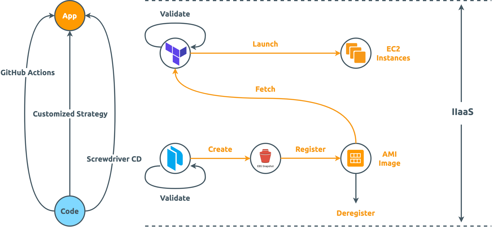

Immutable Infrastructure as a Service (IIaaS)
=============================================

    

[![GitHub Workflow Status][GitHub Workflow Status Badge]][GitHub Workflow Status URL]
![GitHub Last Commit]
[![HashiCorp Packer Badge][HashiCorp Packer Badge]][HashiCorp Packer URL]
[![HashiCorp Terraform Badge][HashiCorp Terraform Badge]][HashiCorp Terraform URL]
[![Screwdriver CD Badge][Screwdriver CD Badge]][Screwdriver CD URL]
[![Discord]](https://discord.com/widget?id=1231237037106008144)
[![Apache License][Apache License Badge]][Apache License URL]

What is IIaaS
-------------

[immutable-infrastructure-as-a-service] is a technology-agnostic framework for general Continuous Delivery/Deployment onto AWS through HashiCorp

The goal of [immutable-infrastructure-as-a-service] is to **empower _individual_ to agnostically deploy and manage applications through the
practice of immutable infrastructure**.

Documentation
-------------

More information about IIaaS can be found at our [documentations][immutable-infrastructure-as-a-service].

License
-------

The use and distribution terms for [immutable-infrastructure-as-a-service] are covered by the
[Apache License, Version 2.0].

[Apache License, Version 2.0]: http://www.apache.org/licenses/LICENSE-2.0.html
[Apache License Badge]: https://img.shields.io/badge/Apache%202.0-F25910.svg?style=for-the-badge&logo=Apache&logoColor=white
[Apache License URL]: https://www.apache.org/licenses/LICENSE-2.0

[Discord]: https://img.shields.io/discord/1231237037106008144?color=5865F2&logo=discord&logoColor=ffffff&style=for-the-badge

[GitHub Last Commit]: https://img.shields.io/github/last-commit/paion-data/immutable-infrastructure-as-a-service/master?logo=github&style=for-the-badge
[GitHub Workflow Status Badge]: https://img.shields.io/github/actions/workflow/status/paion-data/immutable-infrastructure-as-a-service/ci-cd.yml?branch=master&logo=github&style=for-the-badge
[GitHub Workflow Status URL]: https://github.com/paion-data/immutable-infrastructure-as-a-service/actions/workflows/ci-cd.yml

[immutable-infrastructure-as-a-service]: https://immutable-infrastructure.com
[HashiCorp Packer Badge]: https://img.shields.io/badge/Packer-02A8EF?style=for-the-badge&logo=Packer&logoColor=white
[HashiCorp Packer URL]: https://developer.hashicorp.com/packer/docs
[HashiCorp Terraform Badge]: https://img.shields.io/badge/Terraform-7B42BC?style=for-the-badge&logo=terraform&logoColor=white
[HashiCorp Terraform URL]: https://developer.hashicorp.com/terraform/docs

[Screwdriver CD URL]: https://paion-data.github.io/screwdriver-cd-homepage/
[Screwdriver CD Badge]: https://img.shields.io/badge/Screwdriver%20CD-1475BB?style=for-the-badge&logo=data:image/svg+xml;base64,PD94bWwgdmVyc2lvbj0iMS4wIiBlbmNvZGluZz0iaXNvLTg4NTktMSI/Pg0KPCEtLSBVcGxvYWRlZCB0bzogU1ZHIFJlcG8sIHd3dy5zdmdyZXBvLmNvbSwgR2VuZXJhdG9yOiBTVkcgUmVwbyBNaXhlciBUb29scyAtLT4NCjxzdmcgaGVpZ2h0PSI4MDBweCIgd2lkdGg9IjgwMHB4IiB2ZXJzaW9uPSIxLjEiIGlkPSJMYXllcl8xIiB4bWxucz0iaHR0cDovL3d3dy53My5vcmcvMjAwMC9zdmciIHhtbG5zOnhsaW5rPSJodHRwOi8vd3d3LnczLm9yZy8xOTk5L3hsaW5rIiANCgkgdmlld0JveD0iMCAwIDUxMiA1MTIiIHhtbDpzcGFjZT0icHJlc2VydmUiPg0KPHBhdGggc3R5bGU9ImZpbGw6I2ZmZmZmZjsiIGQ9Ik01MDQuNzgzLDc3LjA5MWgtMC4wMDZIMzAzLjQ5NGMtMi4wMzYsMC0zLjk3NywwLjg1OS01LjM0NSwyLjM2Ng0KCWMtMS4zNjgsMS41MDgtMi4wMzgsMy41Mi0xLjg0Miw1LjU0OWwzLjkyNSw0MC42OTNjMC4zNDMsMy41NTIsMy4yMjgsNi4zMiw2Ljc5Miw2LjUxNmw0Mi4wNSwyLjMxNGwtODAuNzM2LDExMi4wMjNMMTgwLjI5Myw3MS4xNDINCglsNjMuNTYzLTIuNDNjMy44NDQtMC4xNDYsNi44OTYtMy4yNzYsNi45NDUtNy4xMjFsMC40NjQtMzYuMzkyYzAuMDIyLTEuOTMyLTAuNzI2LTMuNzkyLTIuMDgyLTUuMTY2DQoJYy0xLjM1Ni0xLjM3Mi0zLjIwNi0yLjE0Ny01LjEzNy0yLjE0N0g3LjIyYy0zLjk4OSwwLTcuMjIsMy4yMzEtNy4yMiw3LjIyMXY0MC41NThjMCwzLjk0NywzLjE3LDcuMTYzLDcuMTE1LDcuMjJsNjYuOTE3LDAuOTY0DQoJbDEyNy4yNTcsMjI0LjQ4OGwtMC41NjgsMTQwLjIwNWwtODguNDgsMy42MzFjLTMuODE3LDAuMTU1LTYuODUsMy4yNTktNi45MjMsNy4wNzdsLTAuNzE2LDM3LjUwNg0KCWMtMC4wMzcsMS45MzksMC43MDksMy44MSwyLjA2OSw1LjE5NmMxLjM1NiwxLjM4MywzLjIxMiwyLjE2MSw1LjE1MSwyLjE2MWgyNzYuNzYyYzEuOTgxLDAsMy44NzUtMC44MTMsNS4yMzktMi4yNDkNCgljMS4zNjMtMS40MzUsMi4wNzgtMy4zNjgsMS45NzQtNS4zNDZsLTEuOTMzLTM3LjEzMmMtMC4xOTItMy42OTItMy4xNC02LjY0MS02LjgzNS02LjgzNGwtNzYuMTI0LTMuOTkybC0xMS4wODItMTM2LjU3DQoJTDQzNi40NzksMTM3LjMzbDU1LjY0LTIuNTNjMy4wNjMtMC4xNDIsNS43MDQtMi4yMDIsNi41ODctNS4xMzlsMTIuOTA5LTQzLjAxOGMwLjI0OC0wLjcyOSwwLjM4NS0xLjUxNiwwLjM4NS0yLjMzMg0KCUM1MTIsODAuMzI1LDUwOC43NzIsNzcuMDkxLDUwNC43ODMsNzcuMDkxeiIvPg0KPC9zdmc+
