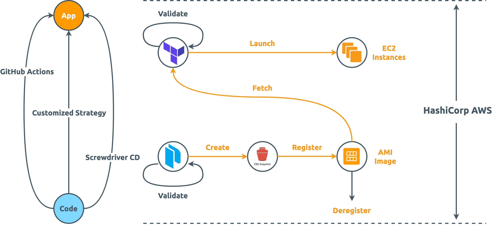

HashiCorp AWS
=============

    

[![GitHub Workflow Status][GitHub Workflow Status Badge]][GitHub Workflow Status URL]
![GitHub Last Commit]
[![HashiCorp Packer Badge][HashiCorp Packer Badge]][HashiCorp Packer URL]
[![HashiCorp Terraform Badge][HashiCorp Terraform Badge]][HashiCorp Terraform URL]
[![Screwdriver pipeline badge][Screwdriver pipeline badge]][Screwdriver pipeline URL]
[![Discord]](https://discord.com/widget?id=1060753787125514332)
[![Apache License][Apache License Badge]][Apache License URL]

What is hashicorp-aws
---------------------

[hashicorp-aws] is a technology-agnostic framework for general Continuous Delivery/Deployment onto AWS through HashiCorp

The goal of [hashicorp-aws] is to **empower _individual_ to agnostically deploy and manage applications through the
practice of immutable infrastructure**.

How the Amazing Story Began
---------------------------

I was researching deploying k8s (an idea which I abandoned later because I believed any production-quality application should not be deployed onto k8s) online and Google came up a concept I was never heard of:
[k8s through AMI](https://github.com/awslabs/amazon-eks-ami). It was this GitHub repo that open up a whole new world to
my career: HashiCorp, AWS AMI, and
[Immutable Infrastructure](https://www.hashicorp.com/resources/what-is-mutable-vs-immutable-infrastructure)

The notion of immutable infrastructure as advanced by HashiCorp grabbed my deep interests so intensively that kept
myself learning and that incubated the most important open source project of my life - [hashicorp-aws]. It condensed my
passion for the best practice of software infrastructure used myself and my company.

Documentation
-------------

More information about [hashicorp-aws] can be found at our [documentation][hashicorp-aws].

License
-------

The use and distribution terms for [hashicorp-aws] are covered by the [Apache License, Version 2.0].

    

[Apache License, Version 2.0]: http://www.apache.org/licenses/LICENSE-2.0.html
[Apache License Badge]: https://img.shields.io/badge/Apache%202.0-F25910.svg?style=for-the-badge&logo=Apache&logoColor=white
[Apache License URL]: https://www.apache.org/licenses/LICENSE-2.0

[Discord]: https://img.shields.io/discord/1060753787125514332?color=5865F2&logo=discord&logoColor=ffffff&style=for-the-badge

[GitHub Last Commit]: https://img.shields.io/github/last-commit/QubitPi/hashicorp-aws/master?logo=github&style=for-the-badge
[GitHub Workflow Status Badge]: https://img.shields.io/github/actions/workflow/status/QubitPi/hashicorp-aws/ci-cd.yml?branch=master&logo=github&style=for-the-badge
[GitHub Workflow Status URL]: https://github.com/QubitPi/hashicorp-aws/actions/workflows/ci-cd.yml

[hashicorp-aws]: https://qubitpi.github.io/hashicorp-aws/
[HashiCorp Packer Badge]: https://img.shields.io/badge/Packer-02A8EF?style=for-the-badge&logo=Packer&logoColor=white
[HashiCorp Packer URL]: https://qubitpi.github.io/hashicorp-packer/packer/docs
[HashiCorp Terraform Badge]: https://img.shields.io/badge/Terraform-7B42BC?style=for-the-badge&logo=terraform&logoColor=white
[HashiCorp Terraform URL]: https://qubitpi.github.io/hashicorp-terraform/terraform/docs

[Screwdriver pipeline URL]: https://ci-cd.hashicorp-aws.com
[Screwdriver pipeline badge]: https://img.shields.io/badge/Screwdriver%20Pipeline-1475BB?style=for-the-badge&logo=data:image/svg+xml;base64,PD94bWwgdmVyc2lvbj0iMS4wIiBlbmNvZGluZz0iaXNvLTg4NTktMSI/Pg0KPCEtLSBVcGxvYWRlZCB0bzogU1ZHIFJlcG8sIHd3dy5zdmdyZXBvLmNvbSwgR2VuZXJhdG9yOiBTVkcgUmVwbyBNaXhlciBUb29scyAtLT4NCjxzdmcgaGVpZ2h0PSI4MDBweCIgd2lkdGg9IjgwMHB4IiB2ZXJzaW9uPSIxLjEiIGlkPSJMYXllcl8xIiB4bWxucz0iaHR0cDovL3d3dy53My5vcmcvMjAwMC9zdmciIHhtbG5zOnhsaW5rPSJodHRwOi8vd3d3LnczLm9yZy8xOTk5L3hsaW5rIiANCgkgdmlld0JveD0iMCAwIDUxMiA1MTIiIHhtbDpzcGFjZT0icHJlc2VydmUiPg0KPHBhdGggc3R5bGU9ImZpbGw6I2ZmZmZmZjsiIGQ9Ik01MDQuNzgzLDc3LjA5MWgtMC4wMDZIMzAzLjQ5NGMtMi4wMzYsMC0zLjk3NywwLjg1OS01LjM0NSwyLjM2Ng0KCWMtMS4zNjgsMS41MDgtMi4wMzgsMy41Mi0xLjg0Miw1LjU0OWwzLjkyNSw0MC42OTNjMC4zNDMsMy41NTIsMy4yMjgsNi4zMiw2Ljc5Miw2LjUxNmw0Mi4wNSwyLjMxNGwtODAuNzM2LDExMi4wMjNMMTgwLjI5Myw3MS4xNDINCglsNjMuNTYzLTIuNDNjMy44NDQtMC4xNDYsNi44OTYtMy4yNzYsNi45NDUtNy4xMjFsMC40NjQtMzYuMzkyYzAuMDIyLTEuOTMyLTAuNzI2LTMuNzkyLTIuMDgyLTUuMTY2DQoJYy0xLjM1Ni0xLjM3Mi0zLjIwNi0yLjE0Ny01LjEzNy0yLjE0N0g3LjIyYy0zLjk4OSwwLTcuMjIsMy4yMzEtNy4yMiw3LjIyMXY0MC41NThjMCwzLjk0NywzLjE3LDcuMTYzLDcuMTE1LDcuMjJsNjYuOTE3LDAuOTY0DQoJbDEyNy4yNTcsMjI0LjQ4OGwtMC41NjgsMTQwLjIwNWwtODguNDgsMy42MzFjLTMuODE3LDAuMTU1LTYuODUsMy4yNTktNi45MjMsNy4wNzdsLTAuNzE2LDM3LjUwNg0KCWMtMC4wMzcsMS45MzksMC43MDksMy44MSwyLjA2OSw1LjE5NmMxLjM1NiwxLjM4MywzLjIxMiwyLjE2MSw1LjE1MSwyLjE2MWgyNzYuNzYyYzEuOTgxLDAsMy44NzUtMC44MTMsNS4yMzktMi4yNDkNCgljMS4zNjMtMS40MzUsMi4wNzgtMy4zNjgsMS45NzQtNS4zNDZsLTEuOTMzLTM3LjEzMmMtMC4xOTItMy42OTItMy4xNC02LjY0MS02LjgzNS02LjgzNGwtNzYuMTI0LTMuOTkybC0xMS4wODItMTM2LjU3DQoJTDQzNi40NzksMTM3LjMzbDU1LjY0LTIuNTNjMy4wNjMtMC4xNDIsNS43MDQtMi4yMDIsNi41ODctNS4xMzlsMTIuOTA5LTQzLjAxOGMwLjI0OC0wLjcyOSwwLjM4NS0xLjUxNiwwLjM4NS0yLjMzMg0KCUM1MTIsODAuMzI1LDUwOC43NzIsNzcuMDkxLDUwNC43ODMsNzcuMDkxeiIvPg0KPC9zdmc+
