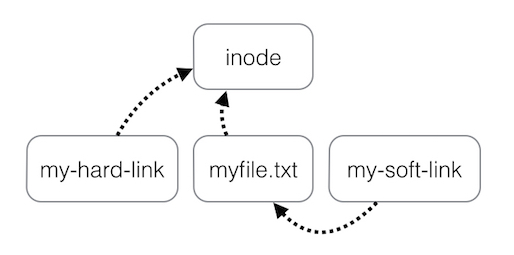

<!--truncate-->

[//]: # (Copyright Jiaqi Liu)

[//]: # (Licensed under the Apache License, Version 2.0 &#40;the "License"&#41;;)
[//]: # (you may not use this file except in compliance with the License.)
[//]: # (You may obtain a copy of the License at)

[//]: # (    http://www.apache.org/licenses/LICENSE-2.0)

[//]: # (Unless required by applicable law or agreed to in writing, software)
[//]: # (distributed under the License is distributed on an "AS IS" BASIS,)
[//]: # (WITHOUT WARRANTIES OR CONDITIONS OF ANY KIND, either express or implied.)
[//]: # (See the License for the specific language governing permissions and)
[//]: # (limitations under the License.)

Creating Soft & Hard Links
--------------------------

Underneath the file system, files are represented by inodes. A file in the file system is basically a link to an inode.
A **hard link**, then, just creates another file with a link to the same underlying inode. When we delete a file, it
removes one link to the underlying inode. The inode is only deleted (or deletable/over-writable) when all links to the
inode have been deleted. A symbolic link is a link to another name in the file system.



Here is how we get to that picture:

Create a name "myfile.txt" in the file system that points to a new inode (which contains the metadata for the file and
points to the blocks of data that contain its contents, i.e. the text "Hello, World!":

```bash
echo 'Hello, World!' > myfile.txt
```

Create a hard link "my-hard-link" to the file "myfile.txt", which means creates a file that should point to the same inode
that "myfile.txt" points to":

```bash
ln myfile.txt my-hard-link
```

Create a soft link "my-soft-link" to the file "myfile.txt", which means creates a file that should point to the file
"myfile.txt":

```bash
ln -s myfile.txt my-soft-link
```

Look what will now happen if "myfile.txt" is deleted (or moved): "my-hard-link" still points to the same contents, and
is thus unaffected, whereas "my-soft-link" now points to nothing.
