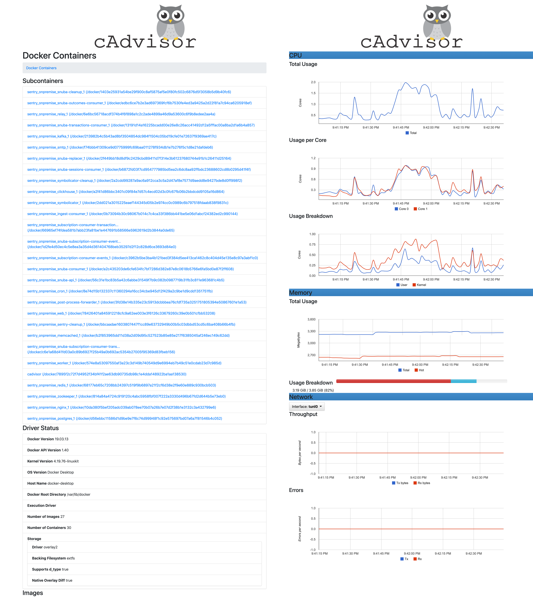
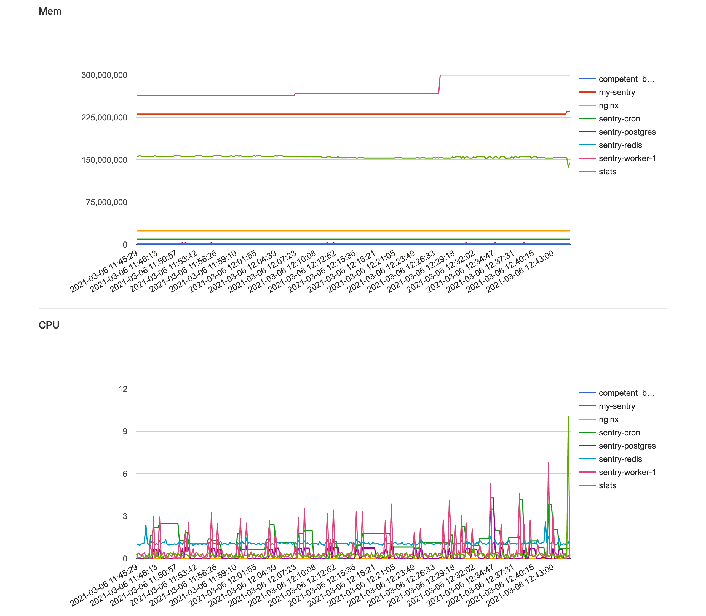

[//]: # (Copyright Jiaqi Liu)

[//]: # (Licensed under the Apache License, Version 2.0 &#40;the "License"&#41;;)
[//]: # (you may not use this file except in compliance with the License.)
[//]: # (You may obtain a copy of the License at)

[//]: # (    http://www.apache.org/licenses/LICENSE-2.0)

[//]: # (Unless required by applicable law or agreed to in writing, software)
[//]: # (distributed under the License is distributed on an "AS IS" BASIS,)
[//]: # (WITHOUT WARRANTIES OR CONDITIONS OF ANY KIND, either express or implied.)
[//]: # (See the License for the specific language governing permissions and)
[//]: # (limitations under the License.)

[cAdvisor] (Container Advisor) provides Docker container users an understanding of 
the resource usage and performance characteristics of their running containers. It is a running daemon that collects, 
aggregates, processes, and exports information about running containers. Specifically, for each container it keeps 
resource isolation parameters, historical resource usage, histograms of complete historical resource usage and network 
statistics. This data is exported by container and machine-wide.

<!--truncate-->

Although [cAdvisor] has some prelimilary (useful though) UI. It also offers

1. [RESTful API to query container stats](https://github.com/google/cadvisor/blob/master/docs/api.md)
2. [Export capability to common data storage, such as Elasticsearch](https://github.com/google/cadvisor/blob/master/docs/storage/README.md)

To pull the image and run it:

```bash
sudo docker run \
    --volume=/:/rootfs:ro \
    --volume=/var/run/docker.sock:/var/run/docker.sock:rw \
    --volume=/sys:/sys:ro \
    --volume=/var/lib/docker/:/var/lib/docker:ro \
    --volume=/dev/disk/:/dev/disk:ro \
    --publish=8080:8080 \
    --detach=true \
    --name=cadvisor \
    --privileged \
    --device=/dev/kmsg \
    gcr.io/cadvisor/cadvisor:v0.36.0
```




### [docker-container-stats](https://github.com/virtualzone/docker-container-stats)

[cAdvisor](https://github.com/google/cadvisor) is good for customizing container monitoring, but it's heavy. A
quick-and-lightweight option would be [docker-container-stats](https://github.com/virtualzone/docker-container-stats)



[cAdvisor]: https://github.com/google/cadvisor
