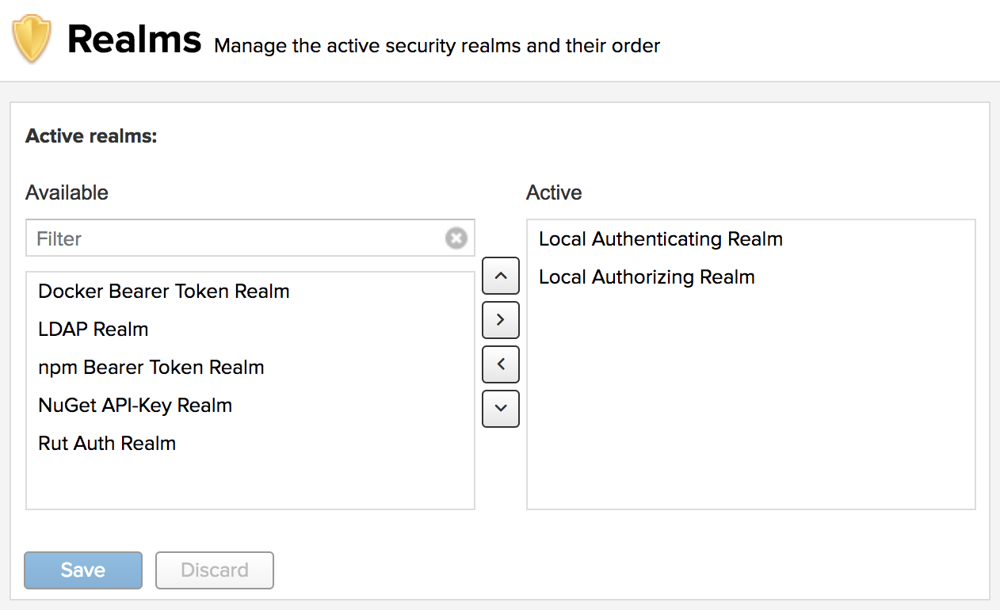
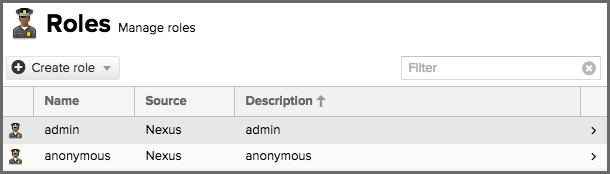
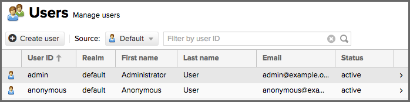

The proliferation of different repository formats and tools accessing them as well as the emergence of more publicly
available repositories has triggered the need to manage access and usage of these repositories and the components they
contain.

<!--truncate-->

Hosting our private repositories for internal components has proven to be a very efficient methodology to exchange
components during all phases of the software development lifecycle. It is considered a best practice at this stage.

The task of managing all the repositories a development teams interact with can be supported by the use of a dedicated
server application - a **repository manager**. To put it simply, a repository manager provides two core features:

1. **the ability of proxying a remote repository and cache components saving both bandwidth and time required to
   retrieve a software component from a remote repository repeatedly**
2. **the ability of hosting a repository providing an organization with a deployment target for internal software
   components**

Just as Source Code Management (SCM) tools are designed to manage source code, repository managers have been designed to
manage and trace external dependencies and components generated by internal build.

Repository managers are an essential part of any enterprise or open-source software development effort and they enable
greater collaboration between developers and wider distribution of software by facilitating the exchange and usage of
binary components.

When we install a repository manager, we are bringing the power of a repository like the Central Repository into our
organization. We can use it to proxy the Central Repositories and other repositories, and host our own repositories for
internal and external use.

In addition to the two aforementioned core features, a repository manager can support the following use cases

- allows us to manage binary software components through the software development lifecycle
- search and catalogue software components
- control component releases with rules and add automated notifications
- integrate with external security systems, such as LDAP
- manage component metadata
- control access to components and repositories
- display component dependencies
- brose component archive contents

Using a repository manager provides a number of benefits, including

- improved software build performance due to faster component download off the local repository manager
- reduced bandwidth usage due to component caching
- higher predictability and scalability due to limited dependency on external repositories
- increased understanding of component usage due to centralized storage of all used components
- simplified developer configuration due to central access configuration to remote repositories and components on the
  repository manager
- unified method to provide components to consumer reducing complexity overheads
- improved collaboration due to the simplified exchange of binary components

<!--truncate-->

System Requirements
-------------------

### Memory Requirements

The requirements assume there are no other significant memory hungry processes running on the same host.

| ****                     | **JVM Heap** | **JVM Direct**                           | **Host Physical/RAM** |
|:------------------------:|:------------:|:----------------------------------------:|:---------------------:|
| **Minimum ( default ) ** | 2703MB       | 2703MB                                   | 8GB                   |
| **Maximum**              | 4GB          | (host physical/RAM * 2/3) - JVM max heap | no limit              |

### Disk Space

**Application Directory** - The size of this directory varies slightly each release. It currently around 330 MB. It is
normal to have multiple application directories installed on the same host over time as repository manager is upgraded.

**Data Directory** - On first start, repository manager creates the base files needed to operate. The bulk of disk
space will be held by our deployed and proxied artifacts, as well as any search indexes. This is highly installation
specific, and will be dependent on the repository formats used, the number of artifacts stored, the size of our teams
and projects, etc.  It's best to plan for a lot though, formats like Docker and Maven can use very large amounts of
storage (500Gb easily).  **When available disk space drops below 4GB the database will switch to read-only mode**.

Concepts
--------

The Nexus Repository Manager OSS is all about working with **components** and **repositories**.

### Components

A component is a resource like a library or a framework that is used as part of a software application at run-time,
integration or unit test execution time or required as part of build process. It could be an entire application or a
static resource like an image.

Typically these components are archives of a large variety of files, such as Java bytecode in class files, text files,
or binary files such as images, PDFs, and music files. The archives have numerous formats such as JAR, WAR, ZIP, NPM
packages, or .sh

Components can be composed of multiple, nested components themselves. For example, consider a Java web application
packaged as a WAR component. It contains a number of JAR components and a number of JavaScript libraries. All of these
are standalone components in other contexts and happend to be included as part of the WAR component.

Components provide all the building blocks and features that allow a development team to create powerful applications
by assembling them and adding their own business related components to create a full-fledged, powerful application.

Components, in other tool-chains, are called artifacts, packages, bundles, archives, and other terms. The concept and
idea, however, remain the same and component is used as the independent, generic term.

### Repository

A wide variety of components exists and more are continuously created by the open source community as well as
proprietary vendors. These are libraries and frameworks written in various languages on different platforms that are
used for application development every day. It has become a default pattern to build applications by combining the
features of multiple components with our own custom components containing our application code to create an application
for a specific domain

In order to ease the consumption and usage of components, they are aggregated into collection of components. These are
called **repositories** and are typically available on the internet as a service. On different platforms terms such as
registry and others are used for the same concept.

Examples for such repositories are

- the Central Repository, also known as Maven Central
- the NuGet Gallery
- RubyGems.org
- npmjs.org

Components in these repositories are accessed by numerous tools including

- package managers like npm, nuget or gem
- build tools such as Maven, Gradle, rake or grunt
- IDE's such as Eclipse and IntelliJ

### Repository Format

The different repositories use different technologies to store and expose the components in them to client tools. This
defines a repository format and as such is closely related to the tools interacting with the repository.

For example, the Maven repository format relies on a specific directory structure defined by the identifiers of the
components and a number of XML formatted files for metadata. Component interaction is performed via plain HTTP commands
and some additional custom interaction with the XML files.

Other repositories formats use database for storage and REST API interactions, or different directory structures wit
format specific files for the metadata

Repository Management
---------------------

We've seen that repositories are the containers for the components provided to our users. Creating and managing
repositories is an essential part of our Nexus Repository configuration, since it allows us to expose more components
to our users. It supports proxy repositories, hosted repositories and repository groups in a number of different
repository formats.

:::info

To manage repositories select the **Repositories** item in the Repository sub menu of the **Administration** menu.

:::

The binary parts of a repository are stored in **blob stores**, which can be configured by selecting Blob Stores from
the Repository sub menu of the Administration menu.

### Repository Types

#### Proxy Repository

**A repository with the type proxy, also known as a proxy repository, is a repository that is linked to a remote
repository**. Any request for a component is verified against the local content of the proxy repository. If no local
component is found, the request is forwarded to the remote repository. The component is then retrieved and stored
locally in the repository manager, which acts as a cache. Subsequent requests for the same component are then fulfilled
from the local storage, therefore eliminating the network bandwidth and time overhead of retrieving the component from
the remote repository again.

By default, the repository manager ships with the following configured proxy repositories:

- **maven-central** This proxy repository accesses the Central Repository, formerly known as Maven Central. It is the
  default component repository built into Apache Maven
- **nuget.org-proxy** This proxy repository accesses the [NuGet Gallery](https://www.nuget.org/). It is the default
  component repository used by the `nuget` package management tool used for .Net development.

#### Hosted Repository

A repository with the type hosted, also known as a **hosted repository**, is a repository that stores components in the
repository manager as the authoritative location for these components.

By default, the repository manager ships with the following configured hosted repositories:

- **maven-releases** This hosted repository uses the maven2 repository format with a release version policy. It is
  intended to be the repository where an organization publishes internal releases. We can also use this repository for
  third-party components that are not available in external repositories and can therefore not be retrieved via a
  configured proxy repository. Examples of these components could be commercial, proprietary libraries such as an
  Oracle
  JDBC driver that may be referenced by the organization.
- **maven-snapshots** This hosted repository uses the maven2 repository format with a snapshot version policy. It is
  intended to be the repository where the organization publishes internal development versions, also known as
  snapshots.
- **nuget-hosted**  This hosted repository is where the organization can publish internal releases in repository using
  the nuget repository format. We can also use this repository for third-party components that are not available in
  external repositories, that could potentially be proxied to gain access to the components.

#### Repository Group

A repository with the type group, also known as **repository group**, represents a powerful feature of Nexus Repository
Manager. They allow us to combine multiple repositories and other repository groups in a single repository. This in
turn means that our users can rely on a single URL for their configuration needs, while the administrators can add more
repositories and therefore components to the repository group.

:::caution

When a user is given a privilege to a group repository, then that user will also have that privilege to all transitive
members of that group repository **only when their request is directed to the group repository**. Direct requests to
individual member repositories will only work if the user is given explicit permission to the individual repository.

:::

The repository manager ships with the following groups:

- **maven-public** The maven-public group is a repository group of maven2 formatted repositories and combines the
  important **external proxy repository for the Central Repository** with the hosted repositories **maven-releases**
  and maven-snapshots. This allows us to _expose the components of the Central Repository as well as our internal
  components in one single, simple-to-use repository_ and therefore URL.
- **nuget-group** This group combines the nuget formatted repositories nuget-hosted and nuget.org-proxy into a single
  repository for .Net development with NuGet.

### Managing Repositories and Repository Groups

TBA

#### Setting Up Maven Repositories

Historically Nexus Repository Manager started as a repository manager supporting the Maven repository format and it
continues to include excellent support for users of Apache Maven.

### Maven Repository Format Overview

> Looking at the Maven repository format and associated concepts and ideas allows us to grasp some of the details and
> intricacies involved with different tools and repository formats, that will help us appreciate the need for
> repository management.

Maven developers are familiar with the concept of a repository, since repositories are used by default. The primary
type of a binary component in a Maven format repository is a JAR file containing Java byte-code. This is due to the
Java background of Maven and the fact that the default component type is a JAR. Practically however, there is no limit
to what type of component can be stored in a Maven repository. For example, we can easily deploy WAR or EAR files,
source archives, Flash libraries and applications, Android archives or applications or Ruby libraries to a Maven
repository.

Every software component is described by an XML document called a Project Object Model (POM). This POM contains
information that describes a project and lists a project’s dependencies - the binary software components, which a given
component depends upon for successful compilation or execution.

When Maven downloads a component like a dependency or a plugin from a repository, it also downloads that component's
POM. _Given a component's POM, Maven can then download any other components that are required by that component_.

Maven, which interacts with a Maven repository to search for binary software components, model the projects they manage
and retrieve software components on-demand from a repository.

#### The Central Repository

When we download and install Maven without any customization, it retrieves components from the Central Repository. It
serves millions of Maven users every single day. It is the default, built-in repository using the Maven repository
format and is _managed by Sonatype_. We can also view statistics about the size of the Central Repository
[online](https://search.maven.org/stats).

The Central Repository is the largest repository for Java-based components. It can be easily used from other build
tools as well. One can look at the Central Repository as an example of how Maven repositories operate and how they are
assembled. Here are some of the properties of release repositories such as the Central Repository:

- **Component Metadata** All software components added to the Central Repository require proper metadata, including a
  Project Object Model (POM) for each component that describes the component itself and any dependencies that software
  component might have.
- **Release Stability** Once published to the Central Repository, a component and the metadata describing that
  component never change. This property of a release repository, like the Central Repository,  guarantees that
  projects that depend on releases will be repeatable and stable over time. While new software components are being
  published every day, once a component is assigned a release number on the Central Repository, there is a strict
  policy against modifying the contents of a software component after a release.
- **Component Security** The Central Repository contains cryptographic hashes and PGP signatures that can be used to
  verify the authenticity and integrity of software components served and supports connections in a secure manner via
  **HTTPS**.
- **Performance** The Central Repository is exposed to the users globally via a high performance content delivery
  network of servers.

In addition to the Central Repository, there are a number of major organizations, such as Red Hat, Oracle or the Apache
Software foundation, which maintain separate additional repositories. Best practice to facilitate these available
repositories with Nexus Repository Manager OSS is to proxy and cache the contents on our own network.

#### Component Coordinates and the Repository Format

Component coordinates create a unique identifier for a component. Maven coordinates use the following values: groupId,
artifactId, version, and packaging. This set of coordinates is often referred to as a **GAV coordinate**, which is
short for Group, Artifact, Version coordinate. The GAV coordinate standard is the foundation for Maven's ability to
manage dependencies. Four elements of this coordinate system are described below:

- **groupId** A group identifier groups a set of components into a logical group. Groups are often designed to reflect
  the **organization** under which a particular software component is being produced. For example, software components
  produced by the Maven project at the Apache Software Foundation are available under the groupId "org.apache.maven"
- **artifactId** An artifactId is an identifier for a software component and should be a descriptive name. The
  combination of groupId and artifactId must be unique for a specific project.
- **version** The version of a project ideally follows the established convention of
  [**semantic versioning**](http://semver.org/). For example, if our simple-library component has a major release
  version of 1, a minor release version of 2 and point release version of 3, the version would be 1.2.3. Versions can
  also have **alphanumeric qualifiers** which are often used to denote release status. An example of such a qualifier
  would be a version like "1.2.3-BETA" where BETA signals a stage of testing meaningful to consumers of a software
  component.
- **packaging** Maven was initially created to handle JAR files, but a Maven repository is completely agnostic about
  the type of component it is managing. Packaging can be anything that describes any binary software format including:
  zip, nar, war, ear, sar and aar.

Tools designed to interact Maven repositories translate component coordinates into a URL which corresponds to a
location in a Maven repository. If a tool such as Maven is looking for version "1.2.0" of the "commons-lang" JAR in
the group "org.apache.commons", this request is translated into:

```bash
<repoURL>/org/apache/commons/commons-lang/1.2.0/commons-lang-1.2.0.jar
```

Maven also downloads the corresponding POM for "commons-lang 1.2.0" from:

```bash
<repoURL>/org/apache/commons/commons-lang/1.2.0/commons-lang-1.2.0.pom
```

This POM may contain references to other components, which are then retrieved from the same repository using the same
URL patterns.

#### Release and Snapshot Repositories

A Maven repository stores two types of components:

1. **Release repositories** are for stable, static release components. A release component is a component which was
   created by a specific, versioned release. For example, consider the "1.2.0" release of the "commons-lang" library
   stored in the Central Repository. This release component, "commons-lang-1.2.0.jar", and the associated POM,
   "commons-lang-1.2.0.pom", are static objects which will never change in the Central Repository. Released components
   are considered to be solid, stable and perpetual in order to guarantee that builds which depend upon them are
   repeatable over time. The released JAR component is associated with a PGP signature, an MD5, and a SHA check-sum
   which can be used to verify both the authenticity and integrity of the binary software component.
2. **Snapshot repositories** are frequently updated repositories that store binary software components from projects
   under constant development. Snapshot components are components generated during the development of a software
   project. A Snapshot component has both a version number such as "1.3.0" or "1.3" and a timestamp in its name. For
   example, a snapshot component for "commons-lang 1.3.0" might have the name
   "commons-lang-1.3.0.-20090314.182342-1.jar". The associated POM, MD5 and SHA hashes would also have a similar name.
   To facilitate collaboration during the development of software components, Maven and other clients that know how to
   consume snapshot components from a repository also know how to interrogate the metadata associated with a Snapshot
   component to retrieve the latest version of a Snapshot dependency from a repository.

**While it is possible to create a repository which serves both release and snapshot components, repositories are
usually segmented into release or snapshot repositories serving different consumers and maintaining different standards
and procedures for deploying components**. Much like the difference between networks, a release repository is considered
like a production network and a snapshot repository is more like a development or a testing network. While there is a
higher level of procedure and ceremony associated with deploying to a release repository, snapshot components can be
deployed and changed frequently without regard for stability and repeatability concerns.

:::info

A project under active development produces snapshot components that change over time. A release is comprised of
components which will remain unchanged over time.

:::

### Version policy

Every repository has one of the 3 **version policies** configured:

- **Release** A Maven repository can be configured to be suitable for release components with the Release version
  policy. The Central Repository uses a release version policy.
- **Snapshot** Continuous development is typically performed with snapshot versions supported by the Snapshot version
  policy. These version values have to **end with -SNAPSHOT in the POM file**. This allows repeated uploads where the
  actual number used is composed of a date/timestamp and an enumerator and the retrieval can still use the -SNAPSHOT
  version string. The repository manager and client tools manage the metadata files that manage this translation from
  the snapshot version to the timestamp value.
- **Mixed** The Mixed version policy allows us to support both approaches within one repository.

### Hosting Maven Repositories

A hosted Maven repository can be used to deploy our own as well as third-party components. A default installation of
Nexus Repository Manager includes two hosted Maven repositories. The **maven-releases** repository uses a release
version policy and the **maven-snapshots** repository uses a snapshot version policy.

#### Deploying to Hosted Maven repository

Deployment to a repository is configured in 2 steps

1. [Have Maven project point to the repository](#configuring-repository-in-maven-project)
2. [Authenticate push access to the repository](#obtaining-push-access-to-repository)

##### Configuring Repository in Maven Project

Deployment to a repository is configured in the  `pom.xml` for the respective project in the "distributionManagement"
section:

```xml
<project>
   ...

    <distributionManagement>
        <repository>
            <id>nexus</id>
            <name>Releases</name>
            <url>https://nexus-host/repository/maven-releases</url>
        </repository>
        <snapshotRepository> <!-- This repository can be omitted -->
            <id>nexus</id>
            <name>Snapshot</name>
            <url>https://nexus-host/repository/maven-snapshots</url>
        </snapshotRepository>
    </distributionManagement>

   ...
```

:::tip

- Replace the `nexus-host` with the NDS address pointing to the actual Nexus instance and
  `maven-releases`/`maven-snapshots` to the actual repository name. For example,

  ```xml
  <distributionManagement>
      <repository>
          <id>nexus</id>
          <name>Releases</name>
          <url>https://nexus.paion-data.dev/repository/maven-oss</url>
      </repository>
  </distributionManagement>
  ```

- The "Snapshot" repository (tagged `snapshotRepository` above) can be omitted in the most CI/CD-enabled project team

:::

##### Obtaining Push Access to Repository

The credentials used for the deployment are configured in the "server" section of the `settings.xml` file. In the
example below server contains "nexus" as the id, along with a "headless user's" username and password. They are the
credentials needed to authenticate against the repository:

```xml
<settings>
...

    <servers>
        <server>
            <id>nexus</id>
            <username>some-headless-username</username>
            <password>some-headless-password</password>
        </server>
    </servers>

...
```

Next, we need to grant the user above (i.e. "some-headless-username") the push access on the repository side in the
following steps:

1. Create a [content selector](#content-selectors)
2. Create a [privilege](#privileges)
3. Create a [role](#roles)
4. Assign role to [the headless user](#users) defined above

A full build of project, including downloading the declared dependencies and uploading the build output to the
repository manager, can now be invoked with `mvn clean deploy`.

##### Deploying to Hosted Maven Repository via CI/CD (e.g. GitHub Actions)

Note that we deployed in the last minute our artifact to repository through a manual `mvn clean deploy` command. To
enable automatic deployment to the repository, we will simply go through
[the exact same procedure](#deploying-to-hosted-maven-repository-manually) except that instead of running
`mvn clean deploy` locally and manually, we let CI/CD execute that for us.

###### Up-version Automatically

It should be noted that a standard release repository does not allow an artifacts with a defined version to be pushed
into it twice. For example, if our artifacts is my-artifact-1.1.2.jar, this JAR, with version 1.1.2, will fail to be
published onto the repository the 2nd time unless we delete the version 1.1.2 up there.

Therefore, we need to bump the artifact version each time we release. We achieve this using GitHub's tagging system. The
two scripts below, taken from [Yahoo/fili's CI/CD](https://github.com/yahoo/fili/tree/master/screwdriver), creates a new
tag based on previous release tag:

1. **tag-for-release.bash**

   ```bash
   #!/bin/bash

   # Pick up the tags from the adjusted remote
   git fetch --unshallow
   git fetch --tags

   echo $(git branch -v)

   # Get the last tag on this branch
   LAST_TAG=$(git describe)
   echo "INFO Last tag: $LAST_TAG"

   # Build the new tag to push
   NEW_TAG=$(LAST_TAG=${LAST_TAG} python .github/upversion.py)
   echo "INFO Creating tag: $NEW_TAG"
   git tag $NEW_TAG -a -m "Autogenerated version bump tag"

   # Push the new tag
   echo "INFO Pushing tag: $NEW_TAG"
   git push origin $NEW_TAG
   ```

2. **upversion.py**

   ```python
   #!/usr/bin/python

   import os

   split_tag = (os.environ['LAST_TAG'].split('-')[0]).split(".")
   split_tag[-1] = str(int(split_tag[-1]) + 1)
   print(".".join(split_tag))
   ```

_We put these two files under **.github** directory_.

###### Deploying to [GitHub Packages](https://github.com/features/packages)

Create a **release.yml** file under _.github/workflows_ directory with the following content:

```yaml
---
name: Release

on:
  push:
    branches:
      - master

jobs:
  test:
    uses: ./.github/workflows/test.yml
    secrets: inherit

  publish:
    needs: [test]
    runs-on: ubuntu-latest
    permissions:
      contents: write # allow for pushing tag
      packages: write
    steps:
      - uses: actions/checkout@v3
      - uses: actions/setup-java@v3
        with:
          java-version: '11'
          distribution: 'adopt'
      - name: Tag for release
        run: |
          git config --global user.name 'QubitPi'
          git config --global user.email 'jack20191124@proton.me'
          .github/tag-for-release.bash
      - name: Set release version
        run: |
          VERSION=$(git describe)
          mvn versions:set -DnewVersion=$VERSION -DgenerateBackupPoms=false
          mvn versions:update-property -Dproperty=version.owner -DnewVersion=$VERSION -DgenerateBackupPoms=false
      - name: Publish Package to Paion Nexus Repository
        run: mvn --batch-mode deploy
        env:
          GITHUB_TOKEN: ${{ secrets.GITHUB_TOKEN }}
      - name: Deploy documentation to GitHub Pages
        uses: peaceiris/actions-gh-pages@v3
        with:
          github_token: ${{ secrets.GITHUB_TOKEN }}
          publish_dir: ./docs
          enable_jekyll: true
          user_name: QubitPi
          user_email: jack20191124@proton.me
```

:::info

The `test` job defined above is a [workflow call][reusing GitHub workflow] that delegates all testing to a separate
GitHub Action. An example of such workflow could be:

```yaml
---
name: Test

on:
  workflow_call:
  pull_request:
    types: [opened, synchronize, reopened]

jobs:
  test:
    name: Test
    runs-on: ubuntu-latest
    steps:
      - uses: actions/checkout@v2
      - name: Set up JDK 11 for Build
        uses: actions/setup-java@v1
        with:
          java-version: 11
      - name: Build
        run: mvn -B clean verify
```

:::

:::info

The "Set release version" step above was inspired by
[yahoo/fili's approach](https://github.com/yahoo/fili/blob/master/screwdriver/scripts/publish.sh)

:::

###### Deploying to Nexus 3

Or we can deploy to any hosted repository such as Nexus 3 with a slightly modified release definition:

:::tip

Note that this file differs from the [GitHub version](#deploying-to-github-packageshttpsgithubcomfeaturespackages) by
replacing the `GITHUB_TOKEN` with the dedicated credentials put in a dynamically generated settints.xml file using
the [whelk-io/maven-settings-xml-action](https://github.com/whelk-io/maven-settings-xml-action) action. These
credentials are sealed securely in [GitHub Secrets][GitHub Secrets]. We need to define the following 3 secrets:

1. **MAVEN_DEPLOY_SERVER_ID**
2. **MAVEN_DEPLOY_SERVER_USERNAME**
3. **MAVEN_DEPLOY_SERVER_PASSWD**

:::

```yaml
---
name: Release

on:
  push:
    branches:
      - master

jobs:
  test:
    uses: ./.github/workflows/test.yml
    secrets: inherit

  publish:
    needs: [test]
    runs-on: ubuntu-latest
    permissions:
      contents: write # allow for pushing tag
      packages: write
    steps:
      - uses: actions/checkout@v3
      - uses: actions/setup-java@v3
        with:
          java-version: '11'
          distribution: 'adopt'
      - name: Tag for release
        run: |
          git config --global user.name 'QubitPi'
          git config --global user.email 'jack20191124@proton.me'
          .github/tag-for-release.bash
      - name: Set release version
        run: |
          VERSION=$(git describe)
          mvn versions:set -DnewVersion=$VERSION -DgenerateBackupPoms=false
          mvn versions:update-property -Dproperty=version.owner -DnewVersion=$VERSION -DgenerateBackupPoms=false
      - name: Generate settings.xml in order to grant push access to Paion Nexus Repository
        uses: whelk-io/maven-settings-xml-action@v20
        with:
          servers: >
            [
              {
                "id": "${{ secrets.MAVEN_DEPLOY_SERVER_ID }}",
                "username": "${{ secrets.MAVEN_DEPLOY_SERVER_USERNAME }}",
                "password": "${{ secrets.MAVEN_DEPLOY_SERVER_PASSWD }}"
              }
            ]
      - name: Publish Package to Paion Nexus Repository
        run: mvn --batch-mode deploy
      - name: Deploy documentation to GitHub Pages
        uses: peaceiris/actions-gh-pages@v3
        with:
          github_token: ${{ secrets.GITHUB_TOKEN }}
          publish_dir: ./docs
          enable_jekyll: true
          user_name: QubitPi
          user_email: jack20191124@proton.me
```

:::tip

We can later pull our released artifact from the hosted repository by placing the **repository** section. For example:

```xml
<project>

    ...

    <repositories>
        <repository>
            <id>paion</id>
            <name>Paion Data Official Release Repository</name>
            <url>https://nexus.paion-data.dev/repository/maven-oss</url>
        </repository>
    </repositories>
</project>
```

:::

#### Using Repository Manager with Apache Maven

To use repository manager with [Apache Maven](http://maven.apache.org/), configure Maven to check the repository manager
instead of the default, built-in connection to the Central Repository.

To do this, we add a mirror configuration and override the default configuration for the central repository in our
"~/.m2/settings.xml", shown below:

:::tip

Replace the "nexus-host" with the NDS address pointing to the actual Nexus instance.

:::

```xml
<settings>
  <mirrors>
    <mirror>
      <!--This sends everything else to /public -->
      <id>nexus</id>
      <mirrorOf>*</mirrorOf>
      <url>https://nexus-host/repository/maven-public/</url>
    </mirror>
  </mirrors>

  <profiles>
    <profile>
      <id>nexus</id>
      <!--Enable snapshots for the built in central repo to direct -->
      <!--all requests to nexus via the mirror -->
      <repositories>
        <repository>
          <id>central</id>
          <url>http://central</url>
          <releases><enabled>true</enabled></releases>
          <snapshots><enabled>true</enabled></snapshots>
        </repository>
      </repositories>
     <pluginRepositories>
        <pluginRepository>
          <id>central</id>
          <url>http://central</url>
          <releases><enabled>true</enabled></releases>
          <snapshots><enabled>true</enabled></snapshots>
        </pluginRepository>
      </pluginRepositories>
    </profile>
  </profiles>

  <activeProfiles>
    <!--make the profile active all the time -->
    <activeProfile>nexus</activeProfile>
  </activeProfiles>
</settings>
```

In the configuration above, a single profile called **nexus** is defined. It configures a repository and a
pluginRepository with the id **central** that overrides the same repositories in the Super POM. The _Super POM_ is
internal to every Apache Maven install and establishes default values. These overrides are important since they change
the repositories by enabling snapshots and replacing the URL with a bogus URL. This URL is overridden by the **mirror**
setting in the same settings.xml file to point to the URL of our single repository group. This repository group can,
therefore, contain release as well as snapshot components and Maven will pick them up.

In addition, The **mirrorOf** pattern of `*` causes any repository request to be redirected to this mirror and to our
single repository group, which in the example is the public group.

:::tip

It is possible to use other patterns in the "mirrorOf" field. A possible valuable setting is to use **external:***.
This matches all repositories except those using "localhost" or file based repositories. This is used in conjunction
with a repository manager when you want to exclude redirecting repositories that are defined for integration testing.
The integration test runs for Apache Maven itself require this setting.

More documentation about mirror settings can be found in the
[mini guide on the Maven web site](http://maven.apache.org/guides/mini/guide-mirror-settings.html).

:::

:::note

For startup who doesn't really need to proxy the entire Maven Central at the moment, another approach is to set up
multiple repositories. In each project they are working on, they will still fetch everything from Maven Central except
for their hosted component from Nexus

There are two different ways that we can specify the use of multiple repositories. The first way is to specify in a POM
which repositories we want to use. That is supported both inside and outside of build profiles:

```xml
<project>
    ...

    <repositories>
        <repository>
            <id>my-repo1</id>
            <name>your custom repo</name>
            <url>http://jarsm2.dyndns.dk</url>
        </repository>
        <repository>
            <id>my-repo2</id>
            <name>your custom repo</name>
            <url>http://jarsm2.dyndns.dk</url>
        </repository>
    </repositories>

    ...
</project>
```

The other way we can specify multiple repositories is by creating a profile in the `${user.home}/.m2/settings.xml` or
`${maven.home}/conf/settings.xml` file like the following:

```xml
<settings>
    ...
    <profiles>
        ...
        <profile>
            <id>myprofile</id>
            <repositories>
                <repository>
                    <id>my-repo2</id>
                    <name>your custom repo</name>
                    <url>http://jarsm2.dyndns.dk</url>
                </repository>
            </repositories>
        </profile>
        ...
    </profiles>

     <activeProfiles>
         <activeProfile>myprofile</activeProfile>
     </activeProfiles>
     ...
</settings>
```

If we specify repositories in profiles we must remember to activate that particular profile. As we can see above we do
this by registering a profile to be active in the `activeProfiles` element.

We could also activate this profile on the command like by executing the following command:

```bash
mvn -Pmyprofile ...
```

In fact the `-P` option will take a CSV list of profiles to activate if we wish to activate multiple profiles
simultaneously.

The settings descriptor documentation can be found on the
[Maven Local Settings Model Website](https://maven.apache.org/maven-settings/settings.html).

:::

Remote repository URLs are queried in the following order for artifacts until one returns a valid result:

1. Global settings.xml
2. User settings.xml
3. Local pom.xml
4. Parent POMs, recursively
5. Super POM
6. effective POMs from dependency path to the artifact.

For each of these locations, the repositories within the profiles are queried first in the order outlined at
[Introduction to build profiles](https://maven.apache.org/guides/introduction/introduction-to-profiles.html).

Before downloading from a repository,
[mirrors configuration](https://maven.apache.org/guides/mini/guide-mirror-settings.html) is applied.

Effective settings and local build POM, with profile taken into account, can easily be reviewed to see their
repositories order with `mvn help:effective-settings` and mvn `help:effective-pom -Dverbose`.

### Setting Up Docker Registry

Docker containers and their usage have revolutionized the way applications and the underlying operating system are
packaged and deployed to development, testing and production systems. The creation of the
[Open Container Initiative](https://opencontainers.org/), and the involvement of a large number of stakeholders,
guarantees that the ecosystem of tools around the lightweight containers and their usage will continue to flourish.
[Docker Hub](https://hub.docker.com/) is the original registry for Docker container images and it is being joined by
more and more other publicly available registries such as the
[Google Container Registry](https://cloud.google.com/container-registry/) and others.

Nexus Repository Manager OSS support Docker registries as the Docker repository format for **hosted** and **proxy**
repositories. We can expose these repositories to the client-side tools directly or as a
[repository group](#repository-group), which is a repository that merges and exposes the contents of multiple
repositories in one convenient URL. This allows us to reduce time and bandwidth usage for accessing Docker images in a
registry as well as share our images within our organization in a hosted repository. Users can then launch containers
based on those images, resulting in a completely private Docker registry with all the features available in the
repository manager.

#### Docker Port Scalability

The Docker client has strict requirements about how it can retrieve content from a repository (i.e., a registry). These
requirements mainly center around the path at which it expects everything to be hosted.

While it is possible to tell the Docker client to use a chosen host from which to retrieve (or to which to upload)
images, it is not possible to tell it to use an arbitrary base path where images are stored in a registry.

To further explain, the Docker client is given a registry to contact by specifying only the hostname + port. It's also
given a specific path to an image in that registry. So, for example, it would be given
`example:443/some/custom/image` to specify an image. We are not able to specify a registry application path.

Nexus Repository exposes its Docker registries with a repository path of `/repository/<repo_name>/` and, by default,
and application context path of `/`.

So, a full Docker image in the repository "docker-hosted" might be accessible at full URL
"example:443/nexus3/repository/docker-hosted/some/custom/image", which can be broken down as follows:

- **example.com** = host name
- **443** = port
- /nexus3 = application context path
- /repository/docker-hosted = base registry path
- **/some/custom/image** = specific image path in the registry

There is no way to give the Docker client the application context path or base registry path. Docker needs the registry
exposed at the root of the host + port that it is accessing.

This is important because Nexus Repository uses request paths to separate content between different repositories. There
are a few potential ways to overcome this Docker limitation:

### Access Control

Nexus Repository uses **role-based access contro**l (**RBAC**) to give administrators fine-grained control over user
rights to the following:

- Access to the Nexus Repository web application
- Read access to a component path in a repository
- Administator access to configuration
- Publish or upload files to a repository

The default configuration ships with the administrator role and optional anonymous access to browse and read all
repositories. **We should not use the default anonymous role if we need to create protected repositories**.

### Realms

:::info What Is a Realm?

A realm is a security policy domain defined for a web or application server. The protected resources on a server can be
partitioned into a set of protection spaces, **each with its own authentication scheme** and/or authorization database
containing a collection of users and groups.
:::

The realms can be accessed via the **Realms** menu item located under **Security**, in the Administration main menu.



Effectively, the configuration shown above determines what authentication realm is used to grant a user access and the
order the realms are used.

- **Local Authenticating Realm and Local Authorizing Realm** These are the built-in realms used by default. They allow
  the repository manager to manage security setup without additional external systems. Sonatype recommends keeping the
  Local realms at the top of the active list.  In the event of system recovery, if we have them lower in the order (or
  removed), restoration may be more difficult.

### Privileges

Privileges define actions which can be performed against specific functionality. Privileges can only be assigned to
roles.

To access Privileges go to **Security** in the Administration menu, where it's listed as a sub-section. An extensive
list of privileges is already built in the repository manager and is partially shown in the figure below


This feature allows us to inspect existing privileges and create custom privileges as required. Users will need
_nx-privilege_ or _nx-all_ privileges to access this page.

#### Privilege Names

Names are unique identifiers. Privileges included by default are prefixed with **nx-** . Privileges that are migrated
from Nexus Repository 2 will be named as they were in Repository 2. Privileges that we create ourselves can only
consist of letters, digits, underscores(`_`), hyphens(`-`), and dots(`.`). A privilege name cannot start with an
underscore or dot.

For custom privileges, it is encouraged that we use a **simple convention** to namespace our privileges. For example
using a simple acronym representing our organization name. "Example Organization Inc." could prefix its privilege names
with **eoi-** for example.

#### Privilege Types

The privilege list displays an icon for the privilege Type as the first column in the list:

:::info Privilege Permissions

Privilege permissions are represented by a colon separated list of text segments, where each segment can be one of:

- a single text value
- a comma separated list of text values
- an asterisk character * to represent all values in that segment

The internal segment matching algorithm uses
[Apache Shiro wildcard permissions](https://shiro.apache.org/permissions.html).

:::

- application (`nexus:{name}:{actions}`)

  * Applicable Actions: create, read, update, delete
  * Description: Application type privileges are most commonly the built-in privileges that control access to specific
    product feature areas in the Administration **UI**. For example, "nexus:blobstores:create,read" means allowing for
    creating and reading blobstores

- repository-admin (`nexus:repository-admin:{format}:{repository}:{actions}`)

  * Applicable Actions: browse,read,edit,add,delete
  * Description: Repository Admin privileges control administration of **configuration** for specific repositories or
    repository formats. For example, "nexus:repository-admin:nuget:nuget.org-proxy:browse,read" means allowing viewing
    of the repository configuration for the nuget format repository named "nuget.org-proxy". **These privileges do not
    control access to repository content.**

- repository-content-selector (`nexus:repository-content-selector:{selector}:{format}:{repository}:{actions}`)

  * Applicable Actions: browse,read,edit,add,delete
  * Description: Repository Content Selector privileges provide fine-grained control over access to content within a
    repository by way of a content selector. For example, "nexus:repository-content-selector:*:maven2:*:read" means
    allowing a user for read access to any content matching a content selector defined for the maven2 format.

- repository-view (`nexus:repository-view:{format}:{repository}:{actions}`)

  * Applicable Actions: browse,read,edit,add,delete
  * Description: Repository View privileges control general access to all content contained within specific
    repositories or repository formats. For example, "nexus:repository-view:maven2:central:browse,read" means allow
    browsing and viewing content within the maven2 format repository named central. **These privileges do not allow
    changing configuration of a repository.**

- script (`nexus:script:{script name}:{actions}`)

  * Applicable Actions: browse,read,edit,add,delete,run
  * Description: Script privileges control access to using the Groovy Script related REST APIs as documented in
    [REST and Integration API](https://help.sonatype.com/repomanager3/integrations/rest-and-integration-api) . These
    privileges do not control general REST API access. For example, "nexus:script:*:read" means allowing for read
    access to all scripts of any name. "nexus:script:my-uploaded-script:run" means allowing the calling user for
    running (executing) the script named my-uploaded-script

- wildcard (`*`)

  * Applicable Actions: *
  * Description: Wildcard privileges allow one to build a privilege string using a free-form series of segments. All
    other privilege types are more specific segment forms of a wildcard privilege. There is only one wildcard privilege
    included by default named **nx-all** with permission **nexus:***  that gives access to all functionality.

:::info Privilege Actions

Actions are functions allowing an explicit behavior the privilege can perform with the associated function.

The Actions to choose from are

- **add** allows privileges to add repositories or scripts.
- **read** allows privileges to view various configuration lists and scripts. Without **read**, any associated action
  will permit a privilege to see these lists but not its contents. The **read** action also allows privileges to
  utilize tools that can look at content from the command line.
- **browse**  allows privileges to view the contents of associated repositories. Unlike **read**, privilege types with
  browse can only view and administrate repository _contents_ from _UI_.
- **create** allows privileges to create applicable configurations within the repository manager. Since a **read**
  permission is required to view a configuration, this action is associated with most existing create privileges.
- **delete** allows privileges to delete repository manager configurations, repository contents, and scripts. A
  **read** action is generally associated with delete actions, so the actor can view these configurations to remove
  them.
- **edit** allows privileges to modify associated scripts, repository content, and repository administration.
- **update** allows privileges to update repository manager configurations. Most existing privileges with update
  include **read** actions. Therefore, if creating custom privileges with update, the actor should consider adding read
  to the privilege in order to view repository manager configuration updates.
- **`*`**, the wildcard, gives us the ability to group all actions together.

We must assign a single or combination of comma-delimited actions when creating new privileges. The privilege type to
which we apply any of these Actions will perform the action's implied behavior. Consider how each action behaves when
applied to a privilege type

:::

#### Creating a Privilege

Click the **Create privilege** button to view a list of privilege types


After selecting a type, fill in the required fields and save the privilege. The privilege can be found listed among the
default privileges on the main **Privileges** screen. We can use the **Filter** input box to find a specific
privilege. In the following example, an _Application_ privilege type is created:


The form provides Name, Description, Domain, and Actions in figure above. The form is completed for a privilege that
allows read access to the LDAP administration. If assigned this privilege, a user is able to view LDAP administration
configuration but not edit it, create a new LDAP configuration, nor delete any existing LDAP configurations.

In another example, a _Repository View_ privilege type is created:


The form provides Name, Description, Format, Repository, and Actions in figure above. The form is completed for a
privilege granting sufficient access to publish images to a specific hosted repository. A user with this privilege can
view and read the contents of the repository as well as publish new images to it, but not delete images.

### Content Selectors

Content selectors provide a means for us to select specific content from all of our content. The content we select is
evaluated against expressions written in **CSEL** (**Content Selector Expression Language**). CSEL is a light version
of **JEXL** used to script queries along specific paths and coordinates available to our repository manager formats.

Content selectors allow us to define what content users are allowed to access. We can define, in a simplified example,
a selector named "Apache Maven" with a search expression of `path =~ "^/org/apache/maven/"`. This would match all
components that start with the designated component path. Another, yet more complete, example would be to "select all
maven2 content along a path that starts with `org.apache.commons`":
`format == "maven2" and path =~ "^/org/apache/commons/.*"`

#### Creating a Query

Before we identify user permissions for our selector, create the query first. Click **Content Selectors** located in
**Repository**, from the **Administration** menu. Click **Create Selector** to open a new form.


:::tip

We can preview our selector and what results it will return by clicking the **Preview** results button located
somewhere in the middle section of the page. Select a repository or grouping of repositories from the **Preview
Repository** dropdown and click the **Preview** button. Assets that match will be returned in the space below the
filter and can be filtered upon if we wish to check on a specific result.

:::

Once we are satisfied with our fields, click **Save** to create the content selector. All saved selector queries we
create will be listed in the **Content Selectors** screen.

#### Finer Access Control with "Content Selector privilege"

As part of our security setup, we can create user permissions to manage the filters we built in the _Create Selector_
form. We can add a new privilege that controls operations of read, edit, delete or * (all) for components matching that
selector. The privilege can even span multiple repositories.

To create a new **content selector privilege**, click **Privileges** in the **Security** section of the
**Administration** panel. Then click the **Create privilege** button. Locate and click **Repository Content Selector**
from the list of options in **Select Privilege Type**. We will see a form that displays the following:

- Name: Create a name for the content selector privilege.
- Description: Add a brief description for the privilege.
- Content Selector: Use this dropdown to select from a list of selectors we created.
- Repository: Use this dropdown to select from either a range of all repository contents, all repository contents of an
  individual format, or repositories created by us.
- Actions: Grant read, edit, delete, or * (all) privileges for user access control.

To complete the form, save the new privilege by clicking **Create privilege**. We can use our new privilege to regulate
what permissible data we want the user to access. We could group all related privileges into a [role](#roles).
Ultimately, we could assign our roles to a [user](#users).

#### Content Selector Query Reference

Below are the allowable attributes for content selectors that define path and format as values supported by Nexus
Repository Manager.

| **Attribute** | **Allowed Values**                           |
|---------------|----------------------------------------------|
| format        | The format of the content for which we query |
| path          | The path of our repository content           |

Valid Operators are

| Operator   | Definition                                |                          Example                           |
|:----------:|:-----------------------------------------:|:----------------------------------------------------------:|
| `==`       | Matches text _exactly_                    |                    `format == "maven2"`                    |
| `=~`       | Matches a Java regular expression pattern |            `path =~ "^/org/apache/commons/.*"`             |
| `=^`       | Starts with text.                         |                 `path =^ "/com/example/"`                  |
| `and`      | Match all expressions                     | `format == "maven2" and path =~ "^/org/apache/commons/.*"` |
| `or`       | Match any expression                      |          `format == "maven2" or format == "npm"`           |
| `( expr )` | Group multiple expressions.               |                         [^example]                         |

[^example]: `format == "npm" or (format == "maven2" and path =~ "^/org/apache/commons/.*")`

:::info Version Range Regular Expressions

To avoid encountering database errors, we should escape dashes in version range regular expressions. For example,
`path =~ "[0-9a-zA-Z\-_]"`

:::

:::caution

When writing a content selector, remember that the asset's path will always begin with a leading slash when the
selector is evaluated. This is true even though the leading slash is not displayed when searching or browsing assets.

:::

### Roles

Roles aggregate [privileges](#privileges) into a related context and can, in turn, be grouped to create more complex
roles.

The repository manager ships with a predefined _admin_ as well as an _anonymous role_. These can be inspected in the
**Roles** feature view accessible via the **Roles** item in the **Security** section of the **Administration** main
menu. A simple example is shown in figure below. The list displays the _Name_ and _Description_ of the role as well as
the **Source**, which displays whether the role is internal (Nexus) or a mapping to an external source like LDAP. In
order to access these functions, a user must have _nx-roles_ or _nx-all_ [privileges](#privileges).



To create a new role, click on the **Create Role** button, select **Nexus role** and fill out the Role creation feature
view:

:::info

To use functions of creating, editing and deleting roles, a user without the _nx-all_ privilege also will need
_nx-privilege-read_. This is because the roles page lists privileges on it.

:::


When creating a new role, we will need to supply a **Role ID** and a **Role Name** and optionally a **Description**.
Roles are comprised of other roles and individual privileges. To assign a role or privilege to a role, drag and drop
the desired privileges from the _Available_ list to the _Given_ list under the _Privileges_ header. We can use the
**Filter** input to narrow down the list of displayed privileges and the arrow buttons to add or remove privileges.

The same functionality is available under the _Roles_ header to select among the _Available_ roles and add them to the
list of _Contained_ roles.

Finally press the **Save** button to get the role created.

An existing role can be inspected and edited by clicking on the row in the list. This role-specific view allows us to
delete the role with the **Delete** button. The built-in roles are managed by the repository manager and _cannot_ be
edited or deleted.

#### Mapping External Groups to Nexus Roles

In addition to creating an internal role, the **Create Role** button allows us to create an **External Role Mapping**
to an external authorization system configured in the repository manager such as LDAP. This is something we would do,
if we want to grant every member of an externally managed group (such as an LDAP group) a number of privileges and
roles in the repository manager

For example, assume that we have a group in LDAP named "scm" and we want to make sure that everyone in that group has
administrative privileges.

Select **External Role Mapping** and **LDAP** to see a list of roles managed by that external realm in a dialog. Pick
the desired scm group and confirm by pressing **Create** mapping.

:::tip

For faster access or if we cannot see our group name, we can also type in a portion or the whole name of the group and
it will limit the dropdown to the selected text.

:::

Once the external role has been selected, creates a linked role. We can then assign other roles and privileges to this
new externally mapped role like we would do for any other role.

Any user that is part of the scm group in LDAP, receives all the privileges defined in the created role allowing us to
adapt our generic role in LDAP to the repository manager-specific use cases we want these users to be allowed to
perform.

### Users

The repository manager ships with two users by default: _admin_ and _anonymous_. The _admin_ user has all privileges
and the _anonymous_ user has read-only privileges. The initial password for the admin user can be found in an
"admin.password" file found in the `$data-dir` directory after starting the server.

The Users feature view displayed in figure below can be accessed via the **Users** item in the **Security** section of
the **Administration** menu. Users must have _nx-users_ or _nx-all_ [privileges](#privileges) to see this page. On page
load, the security Source of "Local" is selected and represents the local NXRM realm. The filtered list shows the
users' User ID, First Name, Last Name, Email and Status from the security Source selected in the dropdown.



Clicking on a user in the list or clicking on the **Create local user** button displays the details view to edit or
create the account shown in figure below. For external users, such as LDAP or Crowd, once we have our external realm
setup we can edit their permissions here as well. Simply select the realm the user is on from the **Source** dropdown.
Then type the user ID into the field to the right of that dropdown and search for it. Then click on the result desired
to edit, same as a local user.

:::info

To use functions of creating, editing and deleting users, a user without the _nx-all_ privilege also will need
_nx-roles-read_. This is because the users page lists roles on it.

:::


The **ID** can be defined upon initial creation and remains fixed thereafter. In addition we can specify the users
**First Name**, **Last Name** and **Email address**.  We also must enter and confirm a **Password**.

The Status allows us to set an account to be _Disabled_ or _Active_. The [_Roles_](#roles) control allows us to add and
remove defined roles to the user and therefore control the privileges assigned to the user. A user can be assigned one
or more roles that in turn can include references to other roles or to individual privileges.

On edit, we can select **Change Password** item in the drop down. The password can be changed in a dialog, provided the
user is managed by the built-in security realm.

### Default Role

The Default Role is a role that is automatically granted to all authenticated users.

To enable appending a default role to all authenticated users, navigate to the **Capabilities** item in the **System**
section of the **Administration** menu; then hit **Create capability** and choose capability type **Default Role** as
pictured below; we will then be able to select the role that we want applied to users.


Once this is saved, the _Default Role Realm_ will be added to the active list of security realms and start applying the
new role to all authenticated users.

:::caution

This default role is appended to authenticated users dynamically, and will **NOT** show up as assigned to any user via
the User administration page.

:::

Troubleshooting
---------------

### "413 Request Entity Too Large"

If deploying, for example, a Maven JAR or Docker image to some Nexus repository results in "413 Request Entity Too
Large" error, that's due to, in the case of Nginx as reverse proxy in front of the Nexus, our server block having a
default value for **client_max_body_size** of around 1MB in size when unset.

To resolve this, we will need to add the following line to our server block (`/etc/nginx/nginx.conf`):


For more information, such as where "client_max_body_size" directive should be placed, please refer to
[Nginx documentation](http://nginx.org/en/docs/http/ngx_http_core_module.html#client_max_body_size)

### "400 Repository does not allow updating assets"

The version already exists on a release repository. We will need to either bump component version or let Nexus admin
to delete the root folder of that component.

### "A database error occurred"

When we perform some disk I/O related task on UI and we see the following on the top right corner of the page:


The error itself does not indicate any information about the nature of the error. We will then need to know more
details about the error by going down to the Nexus server log.

:::note

In case Nexus is running as a Docker container, we need to jump into the container first by executing

```bash
docker exec -it <nexus-container-name> bash
```

where `nexus-container-name` can be seen using `docker ps -a`

:::

The log file we will be looking at, in the case of running inside Docker container, is located at
`/nexus-data/log/nexus.log`

[GitHub Secrets]: https://docs.github.com/en/actions/security-guides/encrypted-secrets

[reusing GitHub workflow]: https://docs.github.com/en/actions/using-workflows/reusing-workflows#creating-a-reusable-workflow
