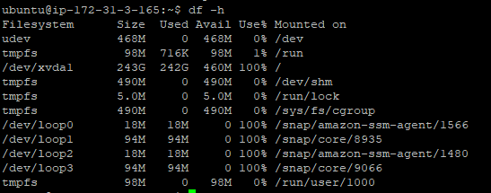

[//]: # (Copyright Jiaqi Liu)

[//]: # (Licensed under the Apache License, Version 2.0 &#40;the "License"&#41;;)
[//]: # (you may not use this file except in compliance with the License.)
[//]: # (You may obtain a copy of the License at)

[//]: # (    http://www.apache.org/licenses/LICENSE-2.0)

[//]: # (Unless required by applicable law or agreed to in writing, software)
[//]: # (distributed under the License is distributed on an "AS IS" BASIS,)
[//]: # (WITHOUT WARRANTIES OR CONDITIONS OF ANY KIND, either express or implied.)
[//]: # (See the License for the specific language governing permissions and)
[//]: # (limitations under the License.)

New Volume in EC2 Instance Not Reflecting
-----------------------------------------

When we have increased the size of the volume attached a running EC2 instance. We are able to see the new volume using
`lsblk`:


But when `df -h` command still displays the old volume size:



This is because new volumes should be formatted to be accessible. Resized existing volumes should also be modified
(resized) from the inside of the operating system. The general information on how to do this safely (e.g. with snapshots)
is given in the following AWS documentation:

* [Making an Amazon EBS volume available for use on Linux](https://docs.aws.amazon.com/AWSEC2/latest/UserGuide/ebs-using-volumes.html)
* [Extending a Linux file system after resizing a volume](https://docs.aws.amazon.com/AWSEC2/latest/UserGuide/recognize-expanded-volume-linux.html)

* Based on the discussion in comments, two commands were used to successfully solve the problem:

```bash
sudo growpart /dev/xvda 1
sudo resize2fs /dev/xvda1
```
