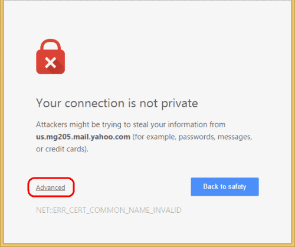
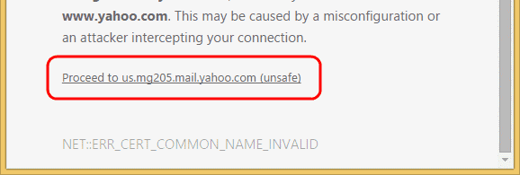

<!--truncate-->

[//]: # (Copyright Jiaqi Liu)

[//]: # (Licensed under the Apache License, Version 2.0 &#40;the "License"&#41;;)
[//]: # (you may not use this file except in compliance with the License.)
[//]: # (You may obtain a copy of the License at)

[//]: # (    http://www.apache.org/licenses/LICENSE-2.0)

[//]: # (Unless required by applicable law or agreed to in writing, software)
[//]: # (distributed under the License is distributed on an "AS IS" BASIS,)
[//]: # (WITHOUT WARRANTIES OR CONDITIONS OF ANY KIND, either express or implied.)
[//]: # (See the License for the specific language governing permissions and)
[//]: # (limitations under the License.)

Jenkins is an open-source automation server that integrates with a number of AWS Services, including: AWS CodeCommit,
AWS CodeDeploy, Amazon EC2 Spot, and Amazon EC2 Fleet. We can use Amazon Elastic Compute Cloud (Amazon EC2) to deploy a
Jenkins application on AWS.

This section documents the process of deploying a Jenkins application. We will launch an EC2 instance, install Jenkins
on that instance, and configure Jenkins to automatically spin up Jenkins agents if build abilities need to be augmented
on the instance.

:::note Prerequisites

1. [Register an AWS account](https://portal.aws.amazon.com/billing/signup#/start), if not having one yet.
2. [An Amazon EC2 key pair](#creating-a-key-pair), if we don't have one yet

:::

Creating a Key Pair
-------------------

Creating a key pair helps ensure that the correct form of authentication is used when we install Jenkins.

To create our key pair:

1. Open the [Amazon EC2 console](https://console.aws.amazon.com/ec2/) and sign in.
2. In the navigation pane, under **NETWORK & SECURITY**, select **Key Pairs**.
3. Select **Create key pair**.
4. For **Name**, enter a descriptive name for the key pair. Amazon EC2 associates the public key with the name that we
   specify as the **key name**. A key name can include up to 255 ASCII characters. It cannot include leading or trailing
   spaces.
5. For **File format**, select the format in which to save the private key.
    - For OpenSSH compatibility (Linux or Mac OS X), select pem.
    - For PuTTY compatibility (Windows), select ppk.
6. Select **Create key pair**.
7. The private key file downloads automatically. The base file name is the name we specified as the name of our key
   pair, and the file name extension is determined by the file format we chose. Save the private key file in a safe
   place.

   :::caution

   This is the only chance for us to save the private key file.

   :::

8. If we use an SSH client on a macOS or Linux computer to connect to our Linux instance, we would also run the
   following command to set the permissions of our private key file so that only we can read it, otherwise we won't be
   able to connect to our instance using this key pair. For more information, please refer to
   [Error: Unprotected private key file](https://docs.aws.amazon.com/AWSEC2/latest/UserGuide/TroubleshootingInstancesConnecting.html#troubleshoot-unprotected-key).

   ```bash
   chmod 400 <key_pair_name>.pem
   ```

Creating a Security Group
-------------------------

A security group acts as a firewall that controls the traffic allowed to reach one or more EC2 instances. When we launch
an instance, we can assign it one or more security groups. We add rules that control the traffic allowed to reach the
instances in each security group. We can modify a security group's rules any time, and the new rules take effect
_immediately_.

To create and configure our security group:

1. Decide who may access our instance. For example, a single computer or all trusted computers on a network. For a
   single computer/user, we can use the public IP address of the computer/user. To find the IP address, use the
   [check IP service tool](http://checkip.amazonaws.com/) from AWS3 (this tool works for VPN as well) or search for the
   phrase "what is my IP address" in any search engine.
2. Sign in to the [AWS Management Console](https://console.aws.amazon.com/ec2/).
3. Open the Amazon EC2 console by selecting **EC2** under **Compute**.

   

4. In the left-hand navigation bar, select **Security Groups**, and then select **Create Security Group**.

   

5. In **Security group name**, enter **WebServerSG** or any preferred name of our choice, and provide a description.
6. Select our VPC from the list. We can use the default VPC.
7. On the **Inbound tab**, add the rules as follows:
    - Select **Add Rule**, and then select **SSH** from the Type list.
    - Under Source, select **Custom**, and in the text box, enter the IP address from step 1.
    - Select **Add Rule**, and then select **HTTP** from the Type list.
    - Select **Add Rule**, and then select **Custom TCP Rule** from the Type list.
    - Under **Port Range**, enter **8080** (Jenkins UI port).
8. Select Create.

For more information, refer to
[Security Groups](http://docs.aws.amazon.com/AWSEC2/latest/UserGuide/using-network-security.html) in the Amazon EC2 User
Guide for Linux Instances.

Launching an Amazon EC2 Instance
--------------------------------

To launch an EC2 instance:

1. Sign in to the [AWS Management Console](https://console.aws.amazon.com/ec2/).
2. Open the Amazon EC2 console by selecting EC2 under **Compute**.
3. From the Amazon EC2 dashboard, select **Launch Instance**.

   

4. We will run Ubuntu OS in our instance, so let's pick up "Ubuntu" and give it a name such as "Jenkins Server"

   

5. On the Choose an Instance Type page, the **t2.micro** instance is selected by default. Verify this instance type is
   selected to stay within the free tier.
6. Pick up the Key Pair (under "Key pair" section) and the security group (under "Network settings") we defined
   previously
7. Hit "Launch Instance"
8. In the left-hand navigation bar, choose Instances to view the status of our instance. Initially, the status of our
   instance is pending. After the status changes to running, our instance is ready for use.

   

Installing Jenkins on EC2
-------------------------

Now that the Amazon EC2 instance has been launched, Jenkins can be installed properly.

In this step we will deploy Jenkins on our EC2 instance by completing the following tasks:

1. [Connecting to Our Linux Instance](#connecting-to-our-linux-instance)
2. [Downloading and Installing Jenkins](#downloading-and-installing-jenkins)
3. [Configuring Jenkins](#configuring-jenkins)

### Connecting to Our Linux Instance

After we launch our instance, we can connect to it and use it the same way as our local machine.

Before we connect to our instance, get the public DNS name of the instance using the Amazon EC2 console.


Use the `ssh` command to connect to the instance. We will specify the private key (.pem) file and
`ec2-user@public_dns_name`.

```bash
ssh -i "/path/my-key-pair.pem" ubuntu@ec2-198-51-100-1.compute-1.amazonaws.com
```

We will receive a response like the following:

```bash
The authenticity of host 'ec2-198-51-100-1.compute1.amazonaws.com (10.254.142.33)' cant be
established.

RSA key fingerprint is 1f:51:ae:28:bf:89:e9:d8:1f:25:5d:37:2d:7d:b8:ca:9f:f5:f1:6f.

Are you sure you want to continue connecting
(yes/no)?
```

Enter "yes". We will receive a response like the following:

```bash
Warning: Permanently added 'ec2-198-51-100-1.compute1.amazonaws.com' (RSA) to the list of known hosts.
```

### Downloading and Installing Jenkins

#### Installing Java

Jenkins requires Java in order to run, yet certain distributions don't include this by default and some Java versions
are incompatible with Jenkins, because **Jenkins requires Java 11 or 17 since Jenkins 2.357 and LTS 2.361.1**.

There are multiple Java implementations which we can use. [OpenJDK](https://openjdk.java.net/) is the most popular one
at the moment, we will use it in this guide.

Update the Debian apt repositories, install OpenJDK 11, and check the installation with the commands:

```bash
$ sudo apt update
$ sudo apt install openjdk-11-jre
$ java -version
openjdk version "11.0.12" 2021-07-20
OpenJDK Runtime Environment (build 11.0.12+7-post-Debian-2)
OpenJDK 64-Bit Server VM (build 11.0.12+7-post-Debian-2, mixed mode, sharing)
```

#### Installing Jenkins

On Debian and Debian-based distributions like Ubuntu, i.e. our EC2 base image, we can install Jenkins through `apt`.

##### Long Term Support Release

A Jenkins [LTS (Long-Term Support) release](https://www.jenkins.io/download/lts/) is chosen every 12 weeks from the
stream of regular releases as the stable release for that time period. It can be installed from the
[debian-stable apt repository](https://pkg.jenkins.io/debian-stable/).

```bash
curl -fsSL https://pkg.jenkins.io/debian-stable/jenkins.io.key | sudo tee \
/usr/share/keyrings/jenkins-keyring.asc > /dev/null

echo deb [signed-by=/usr/share/keyrings/jenkins-keyring.asc] \
https://pkg.jenkins.io/debian-stable binary/ | sudo tee \
/etc/apt/sources.list.d/jenkins.list > /dev/null

sudo apt-get update
sudo apt-get install jenkins
```

Beginning with Jenkins 2.335 and Jenkins 2.332.1, the package is configured with **systemd** rather than the older
System V init, so we would use systemd extensively to configure Jenkins next.

The package installation will:

- Setup Jenkins as a daemon launched on start. Run **`systemctl cat jenkins`** for more details.
- Create a "**jenkins**" user to run this service. This username is very important because it would be used latter
  during [HTTPS/SSL configuration](#enable-ssl-on-jenkins-server-ubuntu)

  :::tip

  To verify user "jenkins" has been created, run `cat /etc/passwd`. Every user on a Linux system, whether created as an
  account for a real human being or associated with a particular service or system function, is stored in a file called
  "**/etc/passwd**", which contains information about the users on the system. Each line describes a distinct user.

  :::

- Direct console log output to `systemd-journald`. Run **`journalctl -u jenkins.service -r`** if we are troubleshooting
  Jenkins.
- Populate `/lib/systemd/system/jenkins.service` with configuration parameters for the launch, e.g `JENKINS_HOME`
- Set Jenkins to listen on port 8080. Access this port with our browser to start configuration. Note that this is not
  a secure port because it is a HTTP port. We would change this port in a moment for better security.

##### Weekly Release

Alternatively, a new release is produced weekly to deliver bug fixes and features to users and plugin developers. It can
be installed from the [debian apt repository](https://pkg.jenkins.io/debian/).

```bash
curl -fsSL https://pkg.jenkins.io/debian/jenkins.io.key | sudo tee \
  /usr/share/keyrings/jenkins-keyring.asc > /dev/null

echo deb [signed-by=/usr/share/keyrings/jenkins-keyring.asc] \
  https://pkg.jenkins.io/debian binary/ | sudo tee \
  /etc/apt/sources.list.d/jenkins.list > /dev/null

sudo apt-get update
sudo apt-get install jenkins
```

Enable SSL on Jenkins Server (Ubuntu)
-------------------------------------

It is very important to secure Jenkins by enabling SSL which runs in a project environment. This section is designed to
introduce the Secure Sockets Layer (SSL) application-level protocol, and particularly the OpenSSL implementation of
SSL, in the context of using in Jenkins. After a brief description of exactly what OpenSSL is, and what it is useful
for, the section will further illustrate the practical usage of OpenSSL in Jenkins service for the purpose of serving
secured Jenkins resources from our EC2 instance.

While previous familiarity with Server Sockets Layer (SSL), or the OpenSSL implementation in particular, is not required
for this section, if desired, the reader is advised to pursue further learning from the [resources](#resources) listed
below in order to broaden his/her understanding of this powerful security layer.

### Resources

#### Local System Resources

| command           | description                                                             |
|-------------------|-------------------------------------------------------------------------|
| **`man config`**  | System manual page for the OpenSSL library configuration files          |
| **`man gendsa`**  | System manual page for the gendsa DSA private key generator             |
| **`man genrsa`**  | System manual page for the genrsa RSA private key generator             |
| **`man openssl`** | System manual page for the openssl command-line tool                    |
| **`man rand`**    | System manual page for the rand pseudo-random byte generator utility    |
| **`man x509`**    | System manual page for the x509 certificate display and signing utility |

#### WWW Resources

- [CACert, a FREE X.509 Certificate Authority](http://www.cacert.org/)
- [OpenSSL Website](http://www.openssl.org/)
- [Public Key Infrastructure (X.509) (pkix)](http://www.ietf.org/html.charters/pkix-charter.html)

### About OpenSSL

**Secure Sockets Layer** is an application-level protocol which was developed by the Netscape Corporation for the
purpose of transmitting sensitive information, such as Credit Card details, via the Internet. SSL works by using a
private key to encrypt data transferred over the SSL-enabled connection, thus thwarting eavesdropping of the
information. The most popular use of SSL is in conjunction with web browsing (using the HTTP protocol), but many network
applications can benefit from using SSL. By convention, URLs that require an SSL connection start with "https:" instead
of "http:"

**OpenSSL** is a robust, commercial-grade implementation of SSL tools, and related general purpose library based upon
SSLeay, developed by Eric A. Young and Tim J. Hudson. OpenSSL is available as an Open Source equivalent to commercial
implementations of SSL via an [Apache-style license](http://www.openssl.org/source/license.html).

#### About X.509

X.509 is a specification for digital certificates published by the International Telecommunications Union -
Telecommunication (ITU-T). It specifies information and attributes required for the identification of a person or a
computer system, and is used for secure management and distribution of digitally signed certificates across secure
Internet networks. OpenSSL most commonly uses X.509 certificates.

### Installing OpenSSL Toolkit

AWS EC2 instance usually have OpenSSL installed and configured properly.

### Generating SSL Certificates

Once we have properly generated an X.509-compliant SSL certificate, we may either elect to

- sign the certificate by ourselves by [generating a Certificate Authority (CA)](#self-signing-a-certificate), or
- have a globally recognized Certificate Authority [sign the certificate](#applying-for-a-certificate-using-certbot). We
  can use services such as [Letsencrypt](https://letsencrypt.org/) for valid SSL certificates. But these certificates
  have to be renewed every three months.

When the certificate is signed, it is then ready to be used with the OpenSSL toolkit, or the library to enable encrypted
SSL connections to a Lightweight Directory Access Protocol, (LDAP) or Hyper Text Transport Protocol (HTTP) server, for
example. The following sections describe the certificate generation, and signing process for both self-signed, and
recognized CA-signed certificates.

> Note that this section has no Jenkins involved and sets up SSL in a more general context

#### Self-signing a Certificate

##### Establishing a Certificate Authority

:::info What is a Self-Signed Certificate?

A **self-signed certificate** is an SSL/TSL certificate not signed by a public or private certificate authority.
Instead, it is signed by the creator’s own personal or root CA certificate.

Here is what we do to request paid SSL/TLS certificate from a **well-known Certificate Authority** like Verisign or
comodo.


1. Create a **certificate signing request (CSR)** with a private key. A CSR contains details about location,
   organization, and FQDN (Fully Qualified Domain Name).
2. Send the CSR to the trusted CA authority.
3. The CA authority will send us the SSL certificate signed by their root certificate authority and private key.
4. We can then validate and use the SSL certificate with our applications.

But for a **self-signed certificate**, here is what we do.


1. Create our own root CA certificate & CA private key (We act as a CA on our own)
2. Create a server private key to generate CSR
3. Create an SSL certificate with CSR using our root CA and CA private key.
4. Install the CA certificate in the browser or Operating system to avoid security warnings.

Most browsers & operating systems hold a copy of root CA certificates of all the trusted certified Certificated
Authorities. That's the reason the browsers won't show any security messages when we visit standard websites that use
SSL from a trusted and well-known commercial Certificate authority. For example, the following image shows the root CA
present in the Firefox browser by default.


At the same time, if we use a self-signed certificate, our browser will throw a security warning. The reason is browsers
only trust SSL from a trusted Certificate authority. For example,

```bash
Your connection is not private
Attackers might be trying to steal your information from demo.apps.mlopshub.com (for example, passwords, messages or
credit cards)
```

But we can force browsers & operating systems to accept our own certificate authority. So we won't see the security
warning once we install the CA certificate and add it to the trusted list. We can also share the CA certificate with our
development team to install in their browsers as well.

Also, we can use this CA to create **more than one SSL certificate**.

:::

Self-signed certificates have a major advantage in that they are completely free to use, and they may be generated,
signed, and used on an as-needed basis. Self-signed certificates are great for use in closed-lab environments or for
testing purposes. One of the drawbacks of using self-signed certificates, however, is that warnings will typically be
issued by a user's Web browser, and other applications, upon accessing an SSL-secured server that uses a self-signed
certificate. By default, client applications (e.g., Firefox) will suppress such warnings for certificates that are
signed using only a globally-recognized and trusted Certificate Authority, but warnings may also be squelched by
importing a server's root certificate into client applications; a relevant demonstration is shown later in this guide.
Using self-signed certificates in a publicly-accessible, production environment is not recommended due to the implicit
trust issues arising from these warnings, in addition to the potential confusion caused to users.

:::caution

We must obtain a certificate signed by a recognized Certificate Authority in order to establish a commercial site, e.g.,
for conducting "e-commerce", which is however not the case in the context of Jenkins we deiscuss here

:::

Provided we've have the OpenSSL toolkit properly installed on our EC2 instance, the generation of X.509 SSL certificates
is quite simple. For self-signed certificates, we must **first establish a Certificate Authority (CA)** by following the
steps below:

First, create an initial working environment, for example within our home directory by issuing the following command
from a terminal prompt:

```bash
cd && mkdir -p myCA/signedcerts && mkdir myCA/private && cd myCA
```

The above command will place us in a newly-created subdirectory of our home directory named "myCA", and within this
subdirectory, we should have two additional subdirectories named "signedcerts" and "private".

Within this initial working environment, the significance of the subdirectories, and their contents is as follows:

1. `~/myCA`: contains CA certificate, certificates database, generated certificates, keys, and requests
2. `~/myCA/signedcerts`: contains copies of each signed certificate
3. `~/myCA/private`: contains the private key

Next, create an initial certificate database in the `~/myCA` subdirectory with the following command at a terminal
prompt:

```bash
echo '01' > serial  && touch index.txt
```

Now create an initial **caconfig.cnf** file suitable for the creation of CA certificates. Using our favorite editor,
edit the file `~/myCA/caconfig.cnf`, and insert the following content into the file:

```bash
sudo nano ~/myCA/caconfig.cnf
```

```conf
# My sample caconfig.cnf file.
#
# Default configuration to use when one is not provided on the command line.
#
[ ca ]
default_ca      = local_ca
#
#
# Default location of directories and files needed to generate certificates.
#
[ local_ca ]
dir             = /home/<username>/myCA
certificate     = $dir/cacert.pem
database        = $dir/index.txt
new_certs_dir   = $dir/signedcerts
private_key     = $dir/private/cakey.pem
serial          = $dir/serial
#
#
# Default expiration and encryption policies for certificates.
#
default_crl_days        = 365
default_days            = 1825
default_md              = sha1
#
policy          = local_ca_policy
x509_extensions = local_ca_extensions
#
#
# Copy extensions specified in the certificate request
#
copy_extensions = copy
#
#
# Default policy to use when generating server certificates.  The following
# fields must be defined in the server certificate.
#
[ local_ca_policy ]
commonName              = supplied
stateOrProvinceName     = supplied
countryName             = supplied
emailAddress            = supplied
organizationName        = supplied
organizationalUnitName  = supplied
#
#
# x509 extensions to use when generating server certificates.
#
[ local_ca_extensions ]
basicConstraints        = CA:false
#
#
# The default root certificate generation policy.
#
[ req ]
default_bits    = 2048
default_keyfile = /home/<username>/myCA/private/cakey.pem
default_md      = sha1
#
prompt                  = no
distinguished_name      = root_ca_distinguished_name
x509_extensions         = root_ca_extensions
#
#
# Root Certificate Authority distinguished name.  Change these fields to match
# your local environment!
#
[ root_ca_distinguished_name ]
commonName              = MyOwn Root Certificate Authority
stateOrProvinceName     = NC
countryName             = US
emailAddress            = root@tradeshowhell.com
organizationName        = Trade Show Hell
organizationalUnitName  = IT Department
#
[ root_ca_extensions ]
basicConstraints        = CA:true
```

:::caution

Make sure to adjust the site-specific details in the file, such as the two instances of `/home/<username>/` under
`[ local_ca ]` and `[ req ]`. Also change `commonName`, `stateOrProvinceName` `countryName` etc under
`[ root_ca_distinguished_name ]` accordingly. For more information on the directives contained within this configuration
file, use the `man config` command.

:::

When we've edited the file to match our environment, save the file as `~/myCA/caconfig.cnf`.

Next, we need to generate the **Certificate Authority Root Certificate** and **Key**, by issuing a few commands. First,
do this:

```bash
export OPENSSL_CONF=~/myCA/caconfig.cnf
```

The previous command sets an environment variable, `OPENSSL_CONF`, which forces the openssl tool to look for a
configuration file in an alternative location (in this case, `~/myCA/caconfig.cnf`).

Now, generate the CA certificate and key with the following command:

```bash
openssl req -x509 -newkey rsa:2048 -out cacert.pem -outform PEM -days 1825
```

We should be prompted for a passphrase, and see output similar to this:

```bash
Generating a 2048 bit RSA private key
.................................+++
.................................................................................................+++
writing new private key to '/home/bshumate/myCA/private/cakey.pem'
Enter PEM pass phrase:
Verifying - Enter PEM pass phrase:
-----
```

**Do not forget the passphrase used with the command above!** We'll need it every time we want to generate and sign a
new server or client certificate!

The process above will create a self-signed certificate using PEM format and RSA public/private key encryption. The
certificate will be valid for _1825_ days. The location, and purpose of the resultant files is as follows:

- `~/myCA/cacert.pem`: CA public **certificate**
- `~/myCA/private/cakey.pem`: CA private key

##### Creating a Self-Signed Server Certificate

Now that we have a Certificate Authority configured, we may use it to sign self-signed certificates. Prior to beginning
the steps below, we may wish to encrypt the certificate's private key with a passphrase. The advantages of encrypting
the key with a passphrase include protection of the certificate in the event it is stolen.

The certificate cannot be used with SSL-enabled applications without entering the passphrase every time the SSL-enabled
application is started. This condition, while being most secure, can present a problem: If the server must be started in
an unattended manner as in the case of a computer restart, then no one will be available to enter the passphrase, and
subsequently the server will not start. One way to eliminate this condition involves a trade-off in security: The key
may be decrypted, to remove the passphrase necessity; thus SSL-enabled applications will start automatically, without a
need for us to enter a passphrase.

To actually generate a self-signed certificate for use with an SSL application, follow this process:

Create the server configuration file, by editing `~/myCA/exampleserver.cnf` with your favorite text editor. Add this
example content:

```conf
#
# exampleserver.cnf
#

[ req ]
prompt                  = no
distinguished_name      = server_distinguished_name
req_extensions          = v3_req

[ server_distinguished_name ]
commonName              = tradeshowhell.com
stateOrProvinceName     = NC
countryName             = US
emailAddress            = root@tradeshowhell.com
organizationName        = My Organization Name
organizationalUnitName  = Subunit of My Large Organization

[ v3_req ]
basicConstraints        = CA:FALSE
keyUsage                = nonRepudiation, digitalSignature, keyEncipherment
subjectAltName          = @alt_names

[ alt_names ]
DNS.0                   = tradeshowhell.com
DNS.1                   = alt.tradeshowhell.com
```

Be sure to change the values under `server_distinguished_name` especially the **commonName** value. The commonName value
must match the host name (i.e. AWS EC2 **Public IPv4 DNS**), or CNAME for the host we wish to use the key for. If the
commonName does not match the intended hostname, then host/certificate mismatch errors will appear in the client
applications of clients attempting to access the server.

Once we've edited the file appropriately, save it as `~/myCA/exampleserver.cnf`. Generate the server certificate, and
key with the following commands:

```bash
export OPENSSL_CONF=~/myCA/exampleserver.cnf
```

The previous command sets an environment variable `OPENSSL_CONF` which forces the `openssl` tool to look for a
configuration file in an alternative location (in this case, `~/myCA/exampleserver.cnf`).

Now generate the certificate, and key:

```bash
openssl req -newkey rsa:1024 -keyout tempkey.pem -keyform PEM -out tempreq.pem -outform PEM
```

We should be prompted for a passphrase, and see output similar to this:

```bash
Generating a 1024 bit RSA private key
...++++++
...............++++++
writing new private key to 'tempkey.pem'
Enter PEM pass phrase:
Verifying - Enter PEM pass phrase:
-----
```

**Don't forget the passphrase!**

Next, we may translate the temporary private key into an unencrypted key by using the following command:

```bash
openssl rsa < tempkey.pem > server_key.pem
```

We should be prompted for the passphrase used above, and see the following output:

```bash
Enter pass phrase:
writing RSA key
```

If we wish to leave the key encrypted with a passphrase, we will simply rename the temporary key using the following
command, instead of following the step above:

:::info

If we use a server key encrypted with a passphrase, the passphrase will have to be entered each time the server
application using the encrypted key is started. This means the server application will not start unless someone, or
something enters the key.

:::

```bash
mv tempkey.pem server_key.pem
```

##### Signing the Self-Signed Server Certificate

Now we need to sign the server certificate with the Certificate Authority (CA) key using these commands:

```bash
export OPENSSL_CONF=~/myCA/caconfig.cnf
```

The previous command modifies the environment variable `OPENSSL_CONF` which forces the `openssl` tool to look for a
configuration file in an alternative location (in this case, `~/myCA/caconfig.cnf` to switch back to the CA
configuration).

Then sign the certificate as follows:

```bash
openssl ca -in tempreq.pem -out server_crt.pem
```

We will be prompted for the passphrase of the CA key as created in the
[Certificate Authority setup](#establishing-a-certificate-authority) section above. Enter this passphrase at the prompt,
and we will then be prompted to confirm the information in the `exampleserver.cnf`, and finally asked to confirm signing
the certificate. Output should be similar to this:

```bash
Using configuration from /home/bshumate/myCA/caconfig.cnf
Enter pass phrase for /home/bshumate/myCA/private/cakey.pem:
Check that the request matches the signature
Signature ok
The Subject's Distinguished Name is as follows
commonName            :PRINTABLE:'tradeshowhell.com'
stateOrProvinceName   :PRINTABLE:'NC'
countryName           :PRINTABLE:'US'
emailAddress          :IA5STRING:'root@tradeshowhell.com'
organizationName      :PRINTABLE:'Trade Show Hell'
organizationalUnitName:PRINTABLE:'Black Ops'
Certificate is to be certified until Jan  4 21:50:08 2011 GMT (1825 days)
Sign the certificate? [y/n]:y

1 out of 1 certificate requests certified, commit? [y/n]y
Write out database with 1 new entries
Data Base Updated
```

Remove the temporary certificate, and key files with the following command:

```bash
rm -f tempkey.pem && rm -f tempreq.pem
```

Hooray! We now have a self-signed server application certificate, and key pair:

1. **server_crt.pem**: Server application certificate file
2. **server_key.pem**: Server application key file

Next, we shall use the certificate for our Jenkins instance.

##### Chrome: Bypass "Your connection is not private" Message

- Option 1 - **Simply Proceed**: If Chrome says the security certificate is from the same domain we are attempting to
  login to, it is likely there is nothing to worry about when this warning appears. To proceed, simply choose the
  "**Advanced**" link, then choose "`Proceed to <link> (unsafe)`".

  
  

- Option 2 - **Prevent Warning**: Click a blank section of the denial page and use our keyboard, type `thisisunsafe`.
  This will add the website to a safe list, where we should not be prompted again. _Strange steps, but it surely
  works!_

#### Applying for a Certificate using Certbot

:::note Requirements


:::

##### Install and Setup Certbot

1. **SSH into the server** SSH into the server (i.e. EC2 instance) running our Jenkins instance as a user with sudo
   privileges.

2. **Install snapd** from command line

    ```bash
    $ sudo apt update
    $ sudo apt install snapd
    ```

   Either log out and back in again, or restart the EC2 instance, to ensure snap's paths are updated correctly. To test
   our system, install the [hello-world](https://snapcraft.io/hello-world) snap and make sure it runs correctly:

    ```bash
    $ sudo snap install hello-world
    hello-world 6.4 from Canonical✓ installed
    $ hello-world
    Hello World!
    ```

3. **Ensure that our version of snapd is up to date** Execute the following instructions on the command line on the
   machine to ensure that we have the latest version of `snapd`.

    ```bash
    $ sudo snap install core; sudo snap refresh core
    ```

4. **Install Certbot** Run this command on the command line on the machine to install Certbot.

    ```bash
    $ sudo snap install --classic certbot
    ```

5. **Prepare the Certbot command** Execute the following instruction on the command line on the machine to ensure that
   the `certbot` command can be run.

    ```bash
    $ sudo ln -s /snap/bin/certbot /usr/bin/certbot
    ```

6. **Install Nginx**

    We would choose Nginx instead of Apache server in this case by installing Nginx using

    ```bash
    $ sudo apt install python3-certbot-nginx
    ```

   Note that Certbot does not install nginx for us automatically and will through us an error, in the next step, of

    ```
    Could not find a usable 'nginx' binary. Ensure nginx exists, the binary is executable, and your PATH is set
    correctly
    ```

7. **Get and Install Certificates** Run this command to get a certificate and have Certbot edit our nginx configuration
   automatically to serve it, turning on HTTPS access in a single step.

   :::note Prerequisite

   1. A DNS domain record, e.g. "jenkins.my-domain.com", has been setup to use
   2. The server running Jenkins can be reached at port 80 publicly

   :::

   ```bash
   sudo certbot --nginx
   ```

   Enter an email address of ours

   ```bash
   $ sudo certbot --nginx
   Saving debug log to ...
   Enter email address (used for urgent renewal and security notices)
    (Enter 'c' to cancel):
   ```

   Next give content to the Terms of Service and decide whether or not to receive promotion emails from Let's Encrypt
   and Certbot

   ```bash
   - - - - - - - - - - - - - - - - - - - - - - - - - - - - - - - - - - - - - - - -
   Please read the Terms of Service at
   https://letsencrypt.org/documents/LE-SA-v1.3-September-21-2022.pdf. You must
   agree in order to register with the ACME server. Do you agree?
   - - - - - - - - - - - - - - - - - - - - - - - - - - - - - - - - - - - - - - - -
   (Y)es/(N)o: Y
   - - - - - - - - - - - - - - - - - - - - - - - - - - - - - - - - - - - - - - - -
   Would you be willing, once your first certificate is successfully issued, to
   share your email address with the Electronic Frontier Foundation, a founding
   partner of the Let's Encrypt project and the non-profit organization that
   develops Certbot? We'd like to send you email about our work encrypting the web,
   EFF news, campaigns, and ways to support digital freedom.
   - - - - - - - - - - - - - - - - - - - - - - - - - - - - - - - - - - - - - - - -
   (Y)es/(N)o: Y
    ```

   As the last step, provide the domain name sitting in front of our Jenkins instance. Let's give it as
   "jenkins.my-domain.com"

   ```bash
   Account registered.
   Please enter the domain name(s) you would like on your certificate (comma and/or
   space separated) (Enter 'c' to cancel): jenkins.my-domain.com
   Requesting a certificate for jenkins.my-domain.com
   ```

   If everything works successfully, we shall see the output similar to the one below

   ```bash
   Successfully received certificate.
   Certificate is saved at: /path/to/server_crt.pem
   Key is saved at:         /path/to/server_key.pem
   This certificate expires on ****-**-**.
   These files will be updated when the certificate renews.
   Certbot has set up a scheduled task to automatically renew this certificate in the background.

   Deploying certificate
   Successfully deployed certificate for jenkins.my-domain.com to /some/path/...
   Congratulations! You have successfully enabled HTTPS on <https://jenkins.my-domain.com>

   ...
   ```

   :::tip Troubleshooting

   ```bash
   Please enter the domain name(s) you would like on your certificate (comma and/or
   space separated) (Enter 'c' to cancel): jenkins.my-domain.com
   Requesting a certificate for jenkins.my-domain.com

   Certbot failed to authenticate some domains (authenticator: nginx). The Certificate Authority reported these
   problems:
   Domain: jenkins.my-domain.com
   Type:   connection
   Detail: ...: Timeout during connect (likely firewall problem)

   Hint: The Certificate Authority failed to verify the temporary nginx configuration changes made by Certbot. Ensure
   the listed domains point to this nginx server and that it is accessible from the internet.

   Some challenges have failed.
   Ask for help or search for solutions at https://community.letsencrypt.org. See the logfile
   /var/log/letsencrypt/letsencrypt.log or re-run Certbot with -v for more details.
   ```

   This problem usually happens when we are re-deploying certificate. There are cases when we would like to deploy
   Jenkins to a new server or VM and we are setting everything up anew. We then would want to request the same
   certificate. _But before we do this our DNS record (i.e. "jenkins.my-domain.com") is still pointing to the old
   Jenkins instance which in most cases has already been unreachable_. The solution then is to delete that DNS record
   from our domain config

   ```bash
   Please enter the domain name(s) you would like on your certificate (comma and/or
   space separated) (Enter 'c' to cancel): jenkins.my-domain.com
   Requesting a certificate for jenkins.my-domain.com

   Certbot failed to authenticate some domains (authenticator: nginx). The Certificate Authority reported these
   problems:
   Domain: jenkins.my-domain.com
   Type:   dns
   Detail: DNS problem: NXDOMAIN looking up A for jenkins.my-domain.com - check that a DNS record exists for this
   domain; DNS problem: NXDOMAIN looking up AAAA for jenkins.my-domain.com - check that a DNS record exists for this
   domain

   Hint: The Certificate Authority failed to verify the temporary nginx configuration changes made by Certbot. Ensure
   the listed domains point to this nginx server and that it is accessible from the internet.

   Some challenges have failed.
   Ask for help or search for solutions at https://community.letsencrypt.org. See the logfile
   /var/log/letsencrypt/letsencrypt.log or re-run Certbot with -v for more details.
   ```

   This error is rather straightforward. After we delete the DNS record, we simply forgot to link the DNS record to
   a new server/VM IP
   :::

   Remember the two paths from the command above: "**/path/to/server_crt.pem**" and "**/path/to/server_key.pem**". We
   will need them in order to [load certificate onto Jenkins instance](#convert-ssl-keys-to-pkcs12-format) later. In
   addition, under "/path/to/" there is also the CA certificate "**/path/to/cert.pem**", which we will be using

   :::tip **Or**, just get a certificate

   If you're feeling more conservative and would like to make the changes to the nginx configuration by hand, run this
   command instead of the one above:

   ```bash
   sudo certbot certonly --nginx
   ```

   :::

8. **Test automatic renewal** The Certbot packages on our system come with a cron job or systemd timer that will renew
   our certificates automatically before they expire. We will not need to run Certbot again, unless we change our
   configuration. We can test automatic renewal for our certificates by running this command:

   ```bash
   sudo certbot renew --dry-run
   ```

   :::info

   The command to renew certbot is installed in one of the following locations:

   - `/etc/crontab/`
   - `/etc/cron.*/*`
   - `systemctl list-timers`

   :::

#### Convert SSL keys to PKCS12 format

When [SSL is ready](#generating-ssl-certificates), let's enable secure connection to our Jenkins instance. We would need
the following files:

1. `server_crt.pem` - The signed certificate
2. `server_key.pem` - The certificate key
3. `cacert.pem` - The CA certificate

**_In the case of [self-signed certificate](#self-signing-a-certificate)_**, under `~/myCA` directory, execute

```bash
openssl pkcs12 -export -out jenkins.p12 \
-passout 'pass:your-strong-password' -inkey server_key.pem \
-in server_crt.pem -certfile cacert.pem -name jenkins.some-domain.com
```

_**In the case of [publicly authorized certificate](#applying-for-a-certificate-using-certbot)**_, run

```bash
sudo openssl pkcs12 -export \
    -out jenkins.p12 \
    -passout 'pass:your-strong-password' \
    -inkey /path/to/server_key.pem \
    -in /path/to/server_crt.pem \
    -certfile /path/to/cert.pem \
    -name jenkins.some-domain.com
```

where `your-strong-password` would be a password of our choice; for example, if you choose "sdfef3qxA" as the password,
put `-passout 'pass:sdfef3qxA'` there. Replace all the occurrences of "your-secrete-password" seen below with
"sdfef3qxA". In adiition, _Replace "jenkins.some-domain.com" with our own CNAME_

The command given above converts SSL certs to intermediate PKCS12 format named **jenkins.p12**.

#### Convert PKCS12 to JKS format

Use the following keytool command to convert the `jenkins.p12` file to JKS format.

```bash
keytool -importkeystore -srckeystore jenkins.p12 \
-srcstorepass 'your-secret-password' -srcstoretype PKCS12 \
-srcalias jenkins.some-domain.com -deststoretype JKS \
-destkeystore jenkins.jks -deststorepass 'your-secret-password' \
-destalias jenkins.some-domain.com
```

Replace the following with our own values:

- `-srcstorepass` - [The password we created above](#convert-ssl-keys-to-pkcs12-format)
- `-deststorepass` - A new password we created in this step
- `-srcalias` - The "jenkins.some-domain.com" or our own CNAME we used
  [from the previous step](#convert-ssl-keys-to-pkcs12-format)
- `-destalias` - A destination CNAME, usually the same as `srcalias`

We should, after the command is executed, see a file named **jenkins.jks** in the current location.

#### Add JKS to Jenkins Path

The jenkins.jks file should be saved in a specific location where Jenkins can access it. Let's create a folder for it
and move the jenkins.jks key to that location.

```bash
sudo mkdir -p /etc/jenkins
sudo cp jenkins.jks /etc/jenkins/
```

Change the permissions of the keys and folder.

```bash
sudo chown -R jenkins: /etc/jenkins
sudo chmod 700 /etc/jenkins
sudo chmod 600 /etc/jenkins/jenkins.jks
```

> The `jenkins:` used in the first command is a standard Jenkins user that get's created when we install
> [Jenkins package](#long-term-support-release). We are essentially granting permission for that user here so do not
> throw some other "smart" names there or change, please.

#### Modify Jenkins Configuration for SSL

```bash
sudo systemctl edit jenkins
```

```conf
### Anything between here and the comment below will become the new contents of the file

[Service]
Environment="JENKINS_PORT=-1"
Environment="JENKINS_HTTPS_PORT=443"
Environment="JENKINS_HTTPS_KEYSTORE=/etc/jenkins/jenkins.jks"
Environment="JENKINS_HTTPS_KEYSTORE_PASSWORD=<some strong password>"
Environment="JENKINS_HTTPS_LISTEN_ADDRESS=0.0.0.0"

### Lines below this comment will be discarded
```

:::note

The config content above actually gets appended to the end of `systemctl cat jenkins` output, which we can verify to
make sure that the changes here actually propagates to Jenkins runtime.

Ignore the comments lines which starts with `### ...`

:::

#### Restart Jenkins

The restart command on Ubuntu C2 instance is

```bash
sudo systemctl restart jenkins.service
```

which would probably fail, however, with the error

```bash
$ sudo systemctl restart jenkins.service
Job for jenkins.service failed because the control process exited with error code.
See "systemctl status jenkins.service" and "journalctl -xeu jenkins.service" for details.
```

Whenever Jenkins control failes with `systemctl`, we can use its diagnosing command `journalctl` to further investigate:

```bash
journalctl -u jenkins.service -r
```

which probably would show us the follwoing error

```bash
Caused: java.io.IOException: Failed to bind to /0.0.0.0:443
        at org.eclipse.jetty.server.ServerConnector.openAcceptChannel(ServerConnector.java:339)
        at java.base/sun.nio.ch.ServerSocketChannelImpl.bind(ServerSocketChannelImpl.java:227)
        at java.base/sun.nio.ch.Net.bind(Net.java:448)
        at java.base/sun.nio.ch.Net.bind(Net.java:459)
        at java.base/sun.nio.ch.Net.bind0(Native Method)
java.net.SocketException: Permission denied
```

This is because Jetty, which is the Jenkins server, does not have sudo permission to listen on SSL port 443 on startup.
We could verify this by having Jenkins SSL port listen on a non-sudo port such as 8443. To do so, we will run

```bash
sudo systemctl edit jenkins
```

again and change the line from

```conf
Environment="JENKINS_HTTPS_PORT=443"
```

to

```conf
Environment="JENKINS_HTTPS_PORT=8443"
```

We will see that Jenkins process started:

```bash
$ ps -aux | grep jenkins
jenkins    46742 45.1 99.1 3245534 89876543 ?      Ssl  06:12   0:29 /usr/bin/java -Djava.awt.headless=true -jar
/usr/share/java/jenkins.war --webroot=/var/cache/jenkins/war --httpPort=-1 --httpsPort=8443 --httpsListenAddress=0.0.0.0
--httpsKeyStore=/etc/jenkins/jenkins.jks --httpsKeyStorePassword=**************
```

We have 2 options.

1. Instruct `sudo systemctl restart jenkins.service` to execute the command above with `sudo`
2. Simply add an inbound rule to AWS EC2 security group to have Jenkins HTTPS listen on a port greater than 1024

We would go with the 2nd option in this post. If we want to open the port for HTTPS and it's not 443, then in addition
to adding HTTPS rule, we could also just add a "Custom TCP" rule for the desired port (i.e. 8443) and it will work.

Now we should be able to access Jenkins over HTTPS with port 8443 at `https://jenkins.some-domain.com:8443`

#### HTTPS via Nginx Reverse Proxy

Proxying is typically used to distribute the load among several servers, seamlessly show content from different
websites, or pass requests for processing to application servers over protocols other than HTTP.

:::info What Is a Reverse Proxy Server?

A proxy server is a go‑between or intermediary server that forwards requests for content from multiple clients to
different servers across the Internet. A **reverse proxy server** is a type of proxy server that typically sits behind
the firewall in a private network and directs client requests to the appropriate backend server. A reverse proxy
provides an additional level of abstraction and control to ensure the smooth flow of network traffic between clients and
servers.

Common uses for a reverse proxy server include:

- **Load balancing** A reverse proxy server can act as a "traffic cop" sitting in front of backend servers and
  distributing client requests across a group of servers in a manner that maximizes speed and capacity utilization
  while ensuring no one server is overloaded, which can degrade performance. If a server goes down, the load balancer
  redirects traffic to the remaining online servers.
- **Web acceleration** Reverse proxies can compress inbound and outbound data, as well as cache commonly requested
  content, both of which speed up the flow of traffic between clients and servers. They can also perform additional
  tasks such as SSL encryption to take load off of your web servers, thereby boosting their performance.
- **Security & Anonymity** By intercepting requests headed for your backend servers, a reverse proxy server protects
  their identities and acts as an additional defense against security attacks. It also ensures that multiple servers can
  be accessed from a single record locator or URL regardless of the structure of your local area network.

:::


##### Understanding the Nginx Configuration File Structure and Configuration Contexts

While we know Certbot utilizes Nginx's capabilities, people are often confused by some of the conventions they find in
Nginx configuration files. In this section, we will focus first on the basic structure of an Nginx configuration file.

The main Nginx configuration file is located at "**/etc/nginx/nginx.conf**" in our EC2 Ubuntu instance.

One of the first things that we should notice when looking at the main configuration file is that it appears to be
organized in a tree-like structure, defined by sets of brackets (that look like `{` and `}`). In Nginx parlance, the
areas that these brackets define are called “contexts” because they contain configuration details that are separated
according to their area of concern. Basically, these divisions provide an organizational structure along with some
conditional logic to decide whether to apply the configurations within.

Because contexts can be layered within one another, Nginx provides a level of directive inheritance. As a general rule,
if a directive is valid in multiple nested scopes, a declaration in a broader context will be passed on to any child
contexts as default values. The children contexts can override these values at will. It is worth noting that an override
to any array-type directives will replace the previous value, not append to it.

Directives can only be used in the contexts that they were designed for. Nginx will error out on reading a configuration
file with directives that are declared in the wrong context. The
[Nginx documentation](http://nginx.org/en/docs/dirindex.html) contains information about which contexts each directive
is valid in, so it is a great reference if you are unsure.

Next, we'll discuss the most common contexts in Nginx.

###### The Main Context

The most general context is the "main" or "global" context. It is the only context that is not contained within the
typical context blocks that look like this:

```config
# The main context is here, outside any other contexts

. . .

context {

    . . .

}
```

Any directive that exist entirely outside of these blocks is said to inhabit the "main" context. Keep in mind that if
our Nginx configuration is set up in a modular fashion, some files will contain instructions that appear to exist
outside of a bracketed context, but which will be included within such a context when the configuration is stitched
together.

The main context represents the broadest environment for Nginx configuration. It is used to configure details that
affect the entire application on a basic level. While the directives in this section affect the lower contexts, many of
these aren't inherited because they cannot be overridden in lower levels.

Some common details that are configured in the main context are the user and group to run the worker processes as, the
number of workers, and the file to save the main process's PID. We can even define things like worker CPU affinity and
the "niceness" of worker processes. The default error file for the entire application can be set at this level (this can
be overridden in more specific contexts).

###### The Events Context

The "events" context is contained within the "main" context. It is used to set global options that affect how Nginx
**handles connections** at a general level. There can only be a single events context defined within the Nginx
configuration.

This context will look like this in the configuration file, outside of any other bracketed contexts:

```conf
# main context

events {

    # events context
    . . .

}
```

Nginx uses an event-based connection processing model, so the directives defined within this context determine how
worker processes should handle connections. Mainly, directives found here are used to either select the connection
processing technique to use, or to modify the way these methods are implemented.

Usually, the connection processing method is automatically selected based on the most efficient choice that the platform
has available. For Linux systems, the _epoll_ method is usually the best choice.

Other items that can be configured are the number of connections each worker can handle, whether a worker will only take
a single connection at a time or take all pending connections after being notified about a pending connection, and
whether workers will take turns responding to events.

###### The HTTP Context

When configuring Nginx as a web server or **reverse proxy**, the "http" context will hold the majority of the
configuration. This context will contain all of the directives and other contexts necessary to define how the program
will handle HTTP or **HTTPS** connections.

The http context is a sibling of the events context, so they should be listed side-by-side, rather than nested. They
both are children of the main context:

```conf
# main context

events {
    # events context

    . . .

}

http {
    # http context

    . . .

}
```

While lower contexts get more specific about how to handle requests, directives at this level control the defaults for
every virtual server defined within. A large number of directives are configurable at this context and below, depending
on how we would like the inheritance to function.

Some of the directives that we are likely to encounter control the default locations for access and error logs
(**access_log** and **error_log**), configure asynchronous I/O for file operations (aio, sendfile, and directio), and
configure the server's statuses when errors occur (error_page). Other directives configure compression (gzip and
gzip_disable), fine-tune the TCP keep alive settings (**keepalive_disable**, **keepalive_requests**, and
**keepalive_timeout**), and the rules that Nginx will follow to try to optimize packets and system calls (sendfile,
tcp_nodelay, and tcp_nopush). Additional directives configure an application-level document root and index files (root
and index) and set up the various hash tables that are used to store different types of data (*_hash_bucket_size and
*_hash_max_size for server_names, types, and variables).

###### The Server Context

The "server" context is declared within the "http" context. This is our first example of nested, bracketed contexts. It
is also the first context that allows for multiple declarations.

The general format for server context may look something like this. Remember that these reside within the http context:

```conf
# main context

http {

    # http context

    server {

        # first server context

    }

    server {

        # second server context

    }

}
```

The reason for allowing multiple declarations of the server context is that **each instance defines a specific virtual
server to handle client requests**. You can have as many server blocks as you need, each of which can handle a specific
subset of connections.

Due to the possibility and likelihood of multiple server blocks, this context type is also the first that Nginx must use
a selection algorithm to make decisions. Each client request will be handled according to the configuration defined in a
single server context, so Nginx must decide which server context is most appropriate based on details of the request.
The directives which decide if a server block will be used to answer a request are:

- **listen**: The _IP:port_ combination that this server block is designed to respond to. If a request is made by a
  client that matches these values, this block will potentially be selected to handle the connection.
- **server_name**: This directive is the other component used to select a server block for processing. If there are
  multiple server blocks with listen directives of the same specificity that can handle the request, Nginx will parse
  the "Host" header of the request and match it against this directive.

The directives in this context can override many of the directives that may be defined in the http context, including
logging, the document root, compression, etc. In addition to the directives that are taken from the http context, we
also can configure files to try to respond to requests (try_files), issue redirects and rewrites (return and rewrite),
and set arbitrary variables (set).

###### The Location Context

The next context that we will deal with regularly is the location context. Location contexts share many relational
qualities with server contexts. For example, multiple location contexts can be defined, each location is used to handle
a certain type of client request, and each location is selected by virtue of matching the location definition against
the client request through a selection algorithm.

While the directives that determine whether to select a server block are defined within the server context, the
component that decides on a location's ability to handle a request is located in the location definition (the line that
opens the location block).

The general syntax looks like this:

```config
location match_modifier location_match {

    . . .

}
```

Location blocks live within server contexts and, unlike server blocks, can be nested inside one another. This can be
useful for creating a more general location context to catch a certain subset of traffic, and then further processing it
based on more specific criteria with additional contexts inside:

```conf
# main context

server {

    # server context

    location /match/criteria {

        # first location context

    }

    location /other/criteria {

        # second location context

        location nested_match {

            # first nested location

        }

        location other_nested {

            # second nested location

        }

    }

}
```

While server contexts are selected based on the requested IP address/port combination and the host name in the "Host"
header, location blocks further divide up the request handling within a server block by looking at the request URI. The
request URI is the portion of the request that comes after the domain name or IP address/port combination.

For example, if a client requests `http://www.example.com/blog` on port 80, the `http`, `www.example.com`, and port 80
would all be used to determine which server block to select. After a server is selected, the "/blog" portion (the
request URI), would be evaluated against the defined locations to determine which further context should be used to
respond to the request.

Many of the directives you are likely to see in a location context are also available at the parent levels. New
directives at this level allow you to reach locations outside of the document root (alias), mark the location as only
internally accessible (internal), and proxy to other servers or locations (using http, fastcgi, scgi, and uwsgi
proxying).

##### How Certbot + Nginx Enable SSL

Recall that we have made our Jenkins instance available at `https://jenkins.some-domain.com:8443` with a port number of
"8443". If we would like to get rid of it and simply visit Jenkins at `https://jenkins.some-domain.com`, we will add an
redirect to Certbot-managed Nginx config at **/etc/nginx/sites-enabled/default**:

```config
server {

    location / {
        proxy_pass https://localhost:8443;
    }

    listen [::]:443 ssl ipv6only=on;
    listen 443 ssl;
    ssl_certificate ...;
    ssl_certificate_key ...;
}
```

Note the proxying rule of `proxy_pass https://localhost:8443;`. If, instead, we have some other app that runs on top of
HTTP only (with port 8080 for example) while our EC2 host has SSL certificate, we would simply have our EC2 instance
taking care of all the SSL stuff and proxy all HTTPS request to the HTTP app via `proxy_pass http://localhost:8080;`

:::note

We may need to restart EC2 instance for the change above to take effect

:::

### Post-Installation Setup Wizard

After downloading, installing and running Jenkins on SSL, the post-installation setup wizard begins.

The setup wizard takes us through a few quick "one-off" steps to unlock Jenkins, customize it with plugins and create
the first administrator user through which we can continue accessing Jenkins.

#### Unlocking Jenkins

When we first access a new Jenkins instance, we are asked to unlock it using an automatically-generated password. Browse
to `https://jenkins.my-domain.com:8443` and wait until the Unlock Jenkins page appears.


As prompted, enter the password found in **/var/lib/jenkins/secrets/initialAdminPassword** on our EC2 instance path. Use
the following command to display this password:

```bash
[ec2-user ~]$ sudo cat /var/lib/jenkins/secrets/initialAdminPassword
```

On the Unlock Jenkins page, paste this password into the **Administrator password** field and click **Continue**.

:::note

This password also serves as the default administrator account's password (with username "admin") if we happen to skip
the subsequent user-creation step in the setup wizard (So, DO NOT skip this subsequent step).

:::

#### Customizing Jenkins with Plugins

After [unlocking Jenkins](#unlocking-jenkins), the Customize Jenkins page appears. Here we can install any number of
useful plugins as part of our initial setup.

Click one of the two options shown:

- **Install suggested plugins** - to install the recommended set of plugins, which are based on most common use cases.
- **Select plugins to install** - to choose which set of plugins to initially install. When we first access the plugin
  selection page, the suggested plugins are selected by default.

:::tip

If we are not sure what plugins we need, choose **Install suggested plugins**. We can install (or remove) additional
Jenkins plugins at a later point in time via the
[**Manage Jenkins**](https://www.jenkins.io/doc/book/managing/) >
[**Manage Plugins page in Jenkins**](https://www.jenkins.io/doc/book/managing/plugins/).

:::

The setup wizard shows the progression of Jenkins being configured and our chosen set of Jenkins plugins being
installed. This process may take a few minutes.

#### Creating the First Administrator User


Finally, after [customizing Jenkins with plugins](#customizing-jenkins-with-plugins), Jenkins asks us to create our
first administrator user.

1. When the **Create First Admin User** page appears, specify the details for our administrator user in the respective
   fields and click **Save and Finish**.
2. When the **Jenkins is ready** page appears, click **Start using Jenkins**.

   - This page may indicate **Jenkins is almost ready!** instead and if so, click **Restart**.
   - If the page does not automatically refresh after a minute, use our web browser to refresh the page manually.

3. If required, log in to Jenkins with the credentials of the user we just created and we are ready to start using
   Jenkins!
