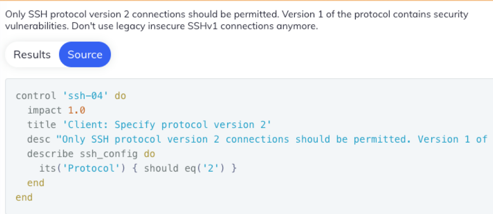

Chef was founded in 2008. Its first product was called _Chef_ (now called _Chef Infra_) which is a set of tools that
automate the configuration of our cloud-based or on-prem server infrastructure.

<!--truncate-->

[//]: # (Copyright Jiaqi Liu)

[//]: # (Licensed under the Apache License, Version 2.0 &#40;the "License"&#41;;)
[//]: # (you may not use this file except in compliance with the License.)
[//]: # (You may obtain a copy of the License at)

[//]: # (    http://www.apache.org/licenses/LICENSE-2.0)

[//]: # (Unless required by applicable law or agreed to in writing, software)
[//]: # (distributed under the License is distributed on an "AS IS" BASIS,)
[//]: # (WITHOUT WARRANTIES OR CONDITIONS OF ANY KIND, either express or implied.)
[//]: # (See the License for the specific language governing permissions and)
[//]: # (limitations under the License.)

:::info

From this point on, we will use "Chef" and "Chef Infra" interchangeably, unless clarified otherwise.

:::

Chef can automate how we build, deploy, and manage our infrastructure. For example, say a large retailer needs to deploy
and configure 50 servers for an upcoming sale. They could use Chef to automate that infrastructure deployment.

:::info

In October 2020, Chef Software was acquired by Progress Software and Chef Software operates as a business unit of
Progress Software. Chef Software has been and still is a leader in DevOps and DevSecOps.

:::

Chef Software users consist of hundreds of small businesses to large enterprises:


<!-- markdown-link-check-disable -->
With Chef, [infrastructure automation](iac-intro#infrastructure-automation) typically begins with using the Chef and its
tools.
<!-- markdown-link-check-enable -->

In the example below, the user is uploading a set of Chef cookbooks to the Chef server. We can think of Chef cookbooks
as a set of configuration files, called **recipes**, that will instantiate, configure, and maintain our infrastructure
nodes in an automated fashion. (A node is a physical or virtual machine.)


The Chef server in turn loads those cookbooks to the correct nodes. Chef can do this on a massive scale thus eliminating
the tedious task of manually configuring your infrastructure nodes individually.

The [Chef](https://github.com/chef/chef) is an open source technology that uses Ruby to develop basic building blocks
like Chef recipes and cookbooks that configure and maintain our infrastructure. Chef helps in **reducing manual and
repetitive tasks for infrastructure management**.

Here is an example of a Chef recipe. This little bit of code, when applied to a node in our infrastructure, will:

- install an Apache web server package (httpd)
- create a file on that node called "/var/www/html/index.html"
- enable and start the Apache web server

```ruby
package 'httpd'

template '/var/www/html/index.html' do
  source 'index.html.erb'
end

service 'httpd' do
  action [:enable, :start]
end
```

Chef also works as a tool for implementing better DevOps. DevOps is a set of practices that combines software
development (Dev) and IT operations (Ops). DevOps is a fundamental aspect of collaboration between engineering and IT
operations to deploy better code, faster, in an **automated** manner. DevOps helps to improve an organization's velocity
to deliver apps and services. It's all about alignment -- alignment of engineering and IT ops via improved collaboration
and communication.


Open Source Software at Chef are

- [Chef](#chef)
- [Chef InSpec](#chef-inspec)
- [Chef Habitat](#chef-habitat)
- [Chef Workstation](#chef-workstation)
- [Chef Automate](#chef-automate)

Chef
----

[**Chef**](https://community.chef.io/tools/chef-infra/), a powerful automation platform that transforms infrastructure
configuration into code. Whether we're operating in the cloud, on-premises, or in a hybrid environment, Chef _automates
how infrastructure is configured, deployed, and managed across our network_.

At the heart of this tool is the Chef Client, which typically runs as an agent on the systems managed by Chef. The
client runs Chef libraries called [Cookbooks](#cookbooks), which declare the desired state of our system using
infrastructure-as-code. The client then ensures our system is inline with the declared policy.

The diagram below demonstrates Chef Components:

:::info

Note that "Chef Client" is the same thing as "Chef Infra Client"

:::


### Cookbooks

A cookbook is the fundamental unit of configuration and policy distribution in Chef. A cookbook defines a scenario and
contains everything that is required to support that scenario:

- Recipes that specify which Chef built-in resources to use, as well as the order in which they are to be applied. A
  recipe is the most fundamental configuration element within the organization. A recipe:

  * Is authored using Ruby, which is a programming language designed to read and behave in a predictable manner
  * Is mostly a collection of [resources](#resources), defined using patterns (resource names, attribute-value pairs,
    and actions); helper code is added around this using Ruby, when needed
  * Must define everything that is required to configure **part of** a system
  * Must be stored in a cookbook
  * May be included in another recipe
  * May have a dependency on one (or more) recipes
  * May use the results of a search query and read the contents of a data bag (including an encrypted data bag)
  * Must be added to a run-list before it can be used by Chef Client
  * Is always executed in the same order as listed in a run-list

  The Chef Client will run a recipe only when asked. When the Chef Client runs the same recipe more than once, the
  results will be the same system state each time. When a recipe is run against a system, but nothing has changed on
  either the system or in the recipe, the Chef Client will not change anything.

  The Chef Language is a comprehensive systems configuration language with resources and helpers for configuring
  operating systems. The language is primarily used in Chef recipes and custom resources to tell the Chef Client what
  action(s) to take to configure a system. The Chef Language provides resources for system-level components such as
  packages, users, or firewalls, and it also includes helpers to allow us to make configuration decisions based on
  operating systems, clouds, virtualization hypervisors, and more.

- Attribute values, which allow _environment-based_ configurations such as **dev** or **production**.

  An attribute can be defined in a cookbook (or a recipe) and then used to override the default settings on a node. When
  a cookbook is loaded during a Chef Client run, these attributes are compared to the attributes that are already
  present on the node. Attributes that are defined in attribute files are first loaded according to cookbook order. For
  each cookbook, attributes in the _default.rb_ file are loaded first, and then additional attribute files (if present)
  are loaded in **lexical** sort order. When the cookbook attributes take precedence over the default attributes, Chef
  Client applies those new settings and values during a Chef Client run on the node.

- [Custom Resources](#custom-resources) for extending Chef beyond the [built-in resources](#resources). A resource is a
  statement of configuration policy that:

  * Describes the desired state for a configuration item
  * Declares the steps needed to bring that item to the desired state
  * Specifies a resource type - such as package, template, or service
  * Lists additional details (also known as resource properties), as necessary
  * Are grouped into recipes, which describe working configurations

- Files and Templates for distributing information to systems.
- Custom Ohai Plugins for extending system configuration collection beyond the Ohai defaults.
- The "metadata.rb" file, which describes the cookbook itself and any dependencies it may have. Every cookbook requires
  a small amount of metadata. The contents of the "metadata.rb" file provides information that helps Chef Client and
  Server correctly deploy cookbooks to each node. A "metadata.rb" file is located at the top level of a cookbook's
  directory structure.

### Policy

Policy maps business and operational requirements, process, and workflow to settings and objects stored on the Chef
Server:

- Roles define server types, such as "web server" or "database server".
- Environments define process, such as "dev", “staging”, or "production"
- Certain types of data - passwords, user account data, and other sensitive items - can be placed in data bags, which
  are located in a secure sub-area on the Chef Server that can only be accessed by nodes that authenticate to the Chef
  Server with the correct SSL certificates

Chef InSpec
-----------

[**Chef InSpec**](https://community.chef.io/tools/chef-inspec), which provides a language for describing security and
compliance rules that can be shared between software engineers, operators, and security engineers.

:::info Compliance Automation

Compliance automation refers to automatically ensuring our infrastructure complies with security standards set by
authorities such as the [Center for Internet Security](https://www.cisecurity.org/) (CIS). Compliance automation helps
ensure our infrastructure is protected from malicious intrusions and other security issues.


The Chef Compliance solution can automatically scan our infrastructure to identify and report security compliance
issues. Then we can use the Chef to remediate such security issues.

Chef Compliance uses the Chef InSpec language to create and run compliance profiles, which contain the logic to scan for
security issues.

Here is an example of the Chef InSpec language that tests a node for security compliance. In this example, InSpec is
testing the node to ensure the ssh_config protocol should be 2. If the actual value from the node is not protocol 2, a
critical issue is reported and can be displayed in the Chef Automate UI shown above



:::

InSpec is a language used to declare security requirements, or tests, called "controls" that are packaged into groups
called **profiles**. These profiles can be used to describe the requirements for all the environments that need to be
audited on a regular basis, such as production systems running business-critical applications.

Chef Habitat
------------

**Chef Habitat**, an open source automation solution for defining, packaging, and delivering applications to almost any
environment regardless of operating system or platform.

:::info Application Automation

Application Automation refers to defining, packaging and delivering applications to almost any environment regardless of
operating system or deployment platform. At Chef, the Chef Habitat solution enables DevOps and application teams to:

- Build continuous delivery pipelines across all applications and all change events
- Create artifacts that can be deployed on-demand to bare-metal, VMs, or containers without any rewriting or refactoring
- Scale the adoption of agile delivery practices across development and operations

:::

With Chef Habitat, an application that is built and run in development will be exactly the same as what's deployed in
production environments. This is accomplished by declaring the build and runtime instructions for the application in a
Habitat Plan file. The application is then built in a cleanroom environment that bundles the application alongside its
deployment instructions into a single deployable Habitat artifact file (.HART). This artifact is then deployed by the
Habitat Supervisor, which monitors the application lifecycle, including deploying runtime configuration updates
without having the rebuild the application.

Habitat allows for application automation to live alongside the app's source code. This reduces misunderstandings
between developers and operators about how an app is built or deployed, since these groups are using the same
source-of-truth to define how an app works.

Chef Workstation
----------------

**Chef Workstation** bundles together all the common software needed when building automation instructions for tools
like Chef and Chef InSpec. It also includes common debugging and testing tools for all our automation code. Chef
Workstation includes:

- _The Chef Workstation App_
- _Chef Client_
- _Chef InSpec_
- _Chef Command Line Tool_, which allows you to apply dynamic, repeatable configurations to your servers directly over
  SSH or WinRM via chef-run. This provides a quick way to apply config changes to the systems we manage whether or not
  they're being actively managed by Chef, without requiring any pre-installed software.
- _Test Kitchen_, which can test cookbooks across any combination of platforms and test suites before we deploy those
  cookbooks to actual infrastructure nodes
- _Cookstyle_, which is a code linting tool that helps us write better Chef cookbooks by detecting and automatically
  correcting style, syntax, and logic mistakes in our code
- Plus various Test Kitchen and Knife plugins

Chef Automate
-------------

**Chef Automate**, an enterprise visibility and metrics tool that provides actionable insights for any systems that we
manage using Chef tools and products. The dashboard and analytics tool enables cross-team collaboration with actionable
insights for configuration and compliance, such as a history of changes to environments to make audits simple and
reliable. Chef Automate can be used with a number of Chef Software products and solutions, and segregates information
into separate dashboards for quick access and filtering.

The goal of Chef Automate is to make infrastructure management, application delivery and continuous compliance realities
by enabling cross-team collaboration using a single source-of-truth. All Chef OSS tools like Infra, InSpec and Habitat
can be configured to report into Chef Automate to provide a window into the status and health of every application and
system in your organization.


This diagram shows how we develop, test, and deploy our Chef code.


