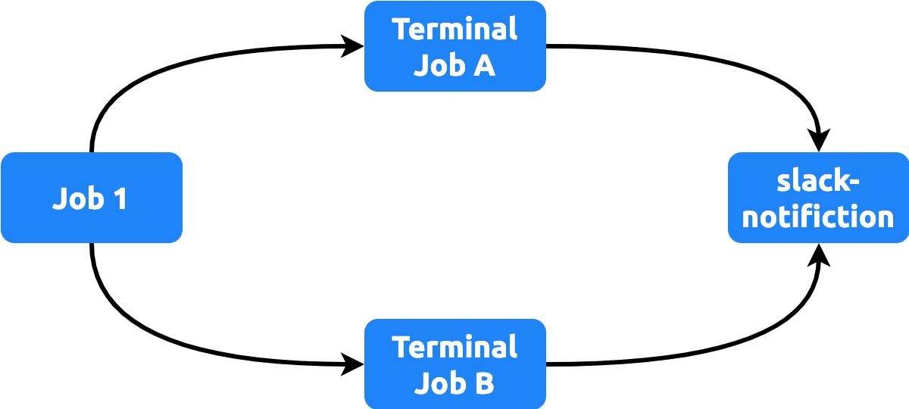

[//]: # (Copyright Jiaqi Liu)

[//]: # (Licensed under the Apache License, Version 2.0 &#40;the "License"&#41;;)
[//]: # (you may not use this file except in compliance with the License.)
[//]: # (You may obtain a copy of the License at)

[//]: # (    http://www.apache.org/licenses/LICENSE-2.0)

[//]: # (Unless required by applicable law or agreed to in writing, software)
[//]: # (distributed under the License is distributed on an "AS IS" BASIS,)
[//]: # (WITHOUT WARRANTIES OR CONDITIONS OF ANY KIND, either express or implied.)
[//]: # (See the License for the specific language governing permissions and)
[//]: # (limitations under the License.)

Sending data into Slack using [slack-send](https://github.com/marketplace/actions/slack-send).

<!--truncate-->

slack-send
----------

This post discusses practical guide for sending data to Slack via a **Slack Incoming Webhook URL**. The reason we prefer
webhook approach is to preserve the privacy of team member. The chatbot invite approach potentially
allow all Slack member to touch a private app of an individual

1. Follow the [setup](https://github.com/slackapi/slack-github-action?tab=readme-ov-file#setup-2)
2. Add `slack-notification` job and a trigger in the last CI/CD job:

   ```yaml title=.github/workflows/ci-cd.yml
   ---
   name: My CI/CD

   jobs:
     the-last-job:
       name: The last CI/CD job in workflow
       outputs:
         outcome: ${{ job.status }}
       continue-on-error: true
       runs-on: ubuntu-latest
       steps:
         ...

     slack-notification:
       name: Send Slack Notification
       if: ${{ always() }}
       needs: the-last-job
       uses: QubitPi/hashicorp-aws/.github/workflows/slack-notification.yml@master
       with:
         job-status: ${{ needs.the-last-job.outputs.outcome }}
       secrets:
         slack-webhook-url: ${{ secrets.SLACK_WEBHOOK_URL }}
   ```

   :::info

   Note the key block in `the-last-job`:

   ```yaml
   outputs:
     outcome: ${{ job.status }}
   continue-on-error: true
   ```

   :::

### Multi-Terminal-Job Configuration

The config above applies to the case with a single last job. We call this job "terminal job". The configuration becomes
a little different when there are multiple terminal jobs such as the one workflow in the figure below:



In this case we change the `job-status` input of `slack-notification`:

```yaml title=.github/workflows/ci-cd.yml
---
name: My CI/CD

jobs:
  terminal-job-a:
    name: Terminal Job A
    outputs:
      outcome: ${{ job.status }}
    continue-on-error: true
    runs-on: ubuntu-latest
    steps:
      ...

  terminal-job-b:
    name: Terminal Job B
    outputs:
      outcome: ${{ job.status }}
    continue-on-error: true
    runs-on: ubuntu-latest
    steps:
      ...

  slack-notification:
    name: Send Slack Notification
    if: ${{ always() }}
    needs: [terminal-job-a, terminal-job-b]
    uses: QubitPi/hashicorp-aws/.github/workflows/slack-notification.yml@master
    with:
      job-status: ${{ (needs.terminal-job-a.outputs.outcome == 'success' && needs.terminal-job-b.outputs.outcome == 'success') && 'success' || 'failure' }}
    secrets:
      slack-webhook-url: ${{ secrets.SLACK_WEBHOOK_URL }}
```

Note we are using the [ternary expression in GitHub Actions] for the value of `job-status` above.

slack-send v.s. Github Slack Integration
----------------------------------------

[Github Slack Integration] offers "on-click" experience with almost no configurations like the one above. In addition,
it sends notification on GitHub issues open/close, pull requests, GitHub Action workflow _status_, etc. The easier setup
and richer notifications makes [Github Slack Integration] a better choice for team-collaboration managing multiple
repositories with a common communication standards

slack-send, on the other hands, supports sending any information about GitHub Action workflow, not just _status_. It
also supports custom messages; we can inject emoji or custom pictures in the notification messges, which is a big plus
for those who love personal customizations and focuses on only success-or-fail of each GitHub action run.

:::info

With slack-send we also do not need to run `/invite @GitHub` so our channel is completely private.

:::

[Github Slack Integration]: https://github.com/integrations/slack

[ternary expression in GitHub Actions]: https://7tonshark.com/posts/github-actions-ternary-operator/
