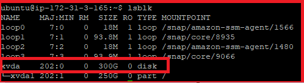

New Volume in EC2 Instance Not Reflecting
-----------------------------------------

When we have increased the size of the volume attached a running EC2 instance. We are able to see the new volume using
`lsblk`:



But when `df -h` command still displays the old volume size:


This is because new volumes should be formatted to be accessible. Resized existing volumes should also be modified
(resized) from the inside of the operating system. The general information on how to do this safely (e.g. with snapshots)
is given in the following AWS documentation:

* [Making an Amazon EBS volume available for use on Linux](https://docs.aws.amazon.com/AWSEC2/latest/UserGuide/ebs-using-volumes.html)
* [Extending a Linux file system after resizing a volume](https://docs.aws.amazon.com/AWSEC2/latest/UserGuide/recognize-expanded-volume-linux.html)

* Based on the discussion in comments, two commands were used to successfully solve the problem:

```bash
sudo growpart /dev/xvda 1
sudo resize2fs /dev/xvda1
```
