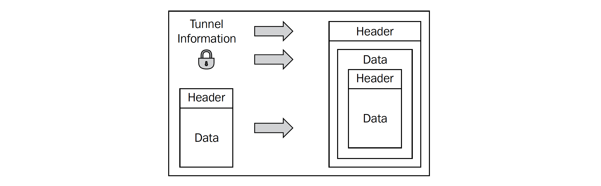

<!--truncate-->

[//]: # (Copyright Jiaqi Liu)

[//]: # (Licensed under the Apache License, Version 2.0 &#40;the "License"&#41;;)
[//]: # (you may not use this file except in compliance with the License.)
[//]: # (You may obtain a copy of the License at)

[//]: # (    http://www.apache.org/licenses/LICENSE-2.0)

[//]: # (Unless required by applicable law or agreed to in writing, software)
[//]: # (distributed under the License is distributed on an "AS IS" BASIS,)
[//]: # (WITHOUT WARRANTIES OR CONDITIONS OF ANY KIND, either express or implied.)
[//]: # (See the License for the specific language governing permissions and)
[//]: # (limitations under the License.)

OpenVPN
-------

It is necessary to secure and protect the data transmitted on a wide network of Internet. One use case is that more and
more enterprises offer their customers or business partners a protected access to relevant data for their business
relations such as ordering formulae or stock data. Virtual Private Networks (VPNs) were created out of a greater need
for such secured communication across an otherwise unprotected infrastructure, such as internet, over private channels,
where the community at large isn't able to eavesdrop

we have three typical scenarios for VPN solutions in modern enterprises as follows:

1. An intranet spanning over several locations of a company
2. Access for home or field workers with changing IPs, mobile devices, and centralized protection
3. An extranet for customers or business partners

Each of these typical scenarios requires special security considerations and setups. The external home workers will need
different access to servers in the company than the customers and business partners. In fact, access for business
partners and customers must be restricted severely.

### Computer Networks Basics

To understand VPN, some basic network concepts need to be understood. All data exchange in computer networks is based on
**protocols**. Protocols are like languages or rituals that must be used between communication partners in networks.
Without the correct use of the correct protocol, communication fails.

#### Protocols and Layers

There are a large number of protocols involved in any action we take when we access the Internet or a PC in our local
network. Our **Network Interface Card (NIC)** will communicate with a hub, a switch, or a router. Our application will
communicate with its partner on a server on another PC, and many more protocol-based communication procedures are
necessary to exchange data.

Because of this, the **Open Systems Interconnection (OSI) specification** was created. Every protocol used in today's
networks can be classified by this scheme. The OSI specification defines seven numbered layers of data exchange which
start at layer 1 (the physical layer) of the underlying network media (electrical, optical, or radio signals) and span
up to layer 7 (the application layer), where applications on PCs communicate with each other.

The layers of the OSI model are as follows:

1. **Physical layer**: Sending and receiving through the hardware
2. **Data link layer**: Encoding and decoding data packets into bits
3. **Network layer**: Switching, routing, addressing, error handling, and so on
4. **Transport layer**: End-to-end error recovery and flow control
5. **Session layer**: Establishing connections and sessions between applications
6. **Presentation layer**: Translating between application data formats and network formats
7. **Application layer**: Application-specific protocols

_In the Internet, however, a slightly different approach is used_. The Internet is mainly based on the **Internet
Protocol (IP)**.

The layers of the IP model are as follows:

1. **Link layer**: A concatenation of OSI layers 1 and 2 (the physical and data link layers).
2. **Network layer**: Comprising the network layer of the OSI model
3. **Transport layer**: Comprising protocols, such as **Transmission Control Protocol (TCP)** and **User Datagram
   Protocol (UDP)**, which are the basis for protocols of the application layer.
4. **Application layer**: Concatenation of OSI layers 5 through 7 (the session, presentation, and application layers).

A TCP/IP network packet consists of two parts - header and data. The header is a sort of label containing metadata on
sender, recipient, and administrative information for the transfer. On the networking level of an Ethernet network these
packets are called frames. In the context of the Internet Protocol these packets are called datagrams, Internet datagrams,
IP datagrams, or simply **packets**

So what do VPNs do? **VPN software takes IP packets or Ethernet frames and wraps them into another packet**.
Specifically:

* Whole network packets (frames, datagrams) consisting of header and data are _wrapped_ into new packets
* All data, including metadata, such as recipient and sender, are encrypted
* The new packets are labeled with new headers containing meta-information about the VPN and are addressed to the VPN
  partner

All VPN software systems differ only in the special way of _wrapping_ and _locking_ the data.

#### Tunneling and Overhead

VPN technology is often called **tunneling** because the data in a VPN connection is protected from the Internet, as the
walls of a road or rail tunnel protect the traffic in the tunnel from the weight of stone of the mountain above. Let's
now have a closer look at how the VPN software does this.

The VPN software in the locations A and B encrypts and decrypts the data and sends it through the tunnel. Like cars or
trains in a tunnel, the data cannot go anywhere else but to the other tunnel endpoint (if they are properly routed).

The following are put together and wrapped into one new package:

* Tunnel information (such as the address of the other endpoint)
* Encryption data and methods
* The original IP packet (or network frame)

The new package is then sent to the other tunnel endpoint. The payload of this package now holds the complete IP packet
(or network frame), but in an encrypted form. It is, therefore, not readable to anyone who does not possess the right
key. The new header of the packet simply contains the addresses of the sender, recipient, and other metadata that is
necessary for and provided by the VPN software that is used.

Perhaps you have noticed that the amount of data that is sent grows during the process of 'wrapping'. Depending on the
VPN software used, this so-called **overhead** can become a very important factor. The overhead is the difference
between the net data that is sent to the tunnel software and the gross data that is sent through the tunnel by the VPN
software. If a file of 1MB is sent from user A to user B, and this file causes 1.5MB traffic in the tunnel, then the
overhead would be 50%, a very high level indeed (note that every protocol that is used causes overhead, so not all of
that 50% might be the fault of the VPN solution.). The overhead caused by the VPN software depends on the amount of
organizational (meta-) data and the encryption used. Whereas the first depends only on the VPN software used, the latter
is simply a matter of choice between security and speed. In other words, the better the cipher you use for encryption,
the more overhead you will produce. _Speed versus security is your choice_.

#### VPN Concepts

##### A Proposed Standard for Tunneling

In principle, tunneling can be done on almost all layers of the OSI model. The **General Routing Encapsulation (GRE)**
provides a standard for tunneling data, which was defined in 1994 in Request for Comments (**RFCs**) 1701 and 1702, and
later in RFCs 2784 and 2890. Perhaps because this definition is not a protocol definition, but more or less a standard
proposal on how to tunnel data, this implementation has found its way into many devices and has become the basis for
other protocols.

##### Protocols Implemented on OSI Layer 2

VPN technologies residing in layer 2 can theoretically tunnel any kind of packet. In most cases a virtual
**Point-to-Point Protocol (PPP)** device is established, which is used to connect to the other tunnel endpoint. A PPP
device is normally used for modem or DSL connections.

4 well known layer-2 VPN technologies, which are defined by RFCs, use encryption methods and provide user
authentication, as follows:

1. The **Point to Point Tunneling Protocol (PPTP)**, RFC 2637, which was developed with the help of Microsoft, is an
   expansion of the PPP. It is integrated in all newer Microsoft operating systems. PPTP uses GRE for encapsulation and
   can tunnel IP, IPX, and other protocols over the Internet. The main disadvantage is the restriction that there can
   only be one tunnel at a time between communication partners.
2. The **Layer 2 Forwarding (L2F)**, RFC 2341, was developed almost at the same time by other companies, including
   Cisco, and offers more possibilities than PPTP, especially regarding tunneling of network frames and multiple
   simultaneous tunnels.
3. The **Layer 2 Tunneling Protocol (L2TP)**, RFC 2661, is accepted as an industry standard and is being widely used by
   Cisco and other manufacturers. Its success is based on the fact that it combines the advantages of L2F and PPTP
   without suffering their drawbacks. Even though it does not provide its own security mechanisms, it can be combined
   with technologies offering such mechanisms, such as IPsec (see the section
   [_Protocols Implemented on OSI Layer 3_](#protocols-implemented-on-osi-layer-3)).
4. The **Layer 2 Security Protocol (L2Sec)**, RFC 2716, was developed to provide a solution to the security flaws of
   IPsec. Even though its overhead is rather big, the security mechanisms that are used are secure, because mainly
   SSL/TLS is used

##### Protocols Implemented on OSI Layer 3

**IPsec (Internet Protocol Security)** is the most widespread tunneling technology. In fact it is a more complex set of
protocols, standards, and mechanisms than a single technology.

IPsec was developed as an Internet Security Standard on layer 3 and has been standardized by the Internet Engineering
Task Force (IETF) since 1995. IPsec can be used to encapsulate any traffic of application layers, but no traffic of
lower network layers. Network frames, IPX packets, and broadcast messages cannot be transferred, and network address
translation is only possible with restrictions.

Nevertheless IPsec can use a variety of encryption mechanisms, authentication protocols, and other security
associations. IPsec software exists for almost every platform.

The main advantage of IPsec is the fact that it is being used everywhere. An administrator can choose from a large
number of hardware devices, software implementations, and administration frontends to provide networks with a secure
tunnel.

There are two methods that IPsec uses:

1. **Tunnel mode**: All IP packets are encapsulated in a new packet and sent to the other tunnel endpoint, where the VPN
   software unpacks them and forwards them to the recipient. In this way the IP addresses of sender and recipient and
   all other metadata are protected.
2. **Transport mode**: In transport mode, only the payload of the data section is encrypted and encapsulated. In this
   way the overhead becomes significantly smaller than in tunnel mode, but an attacker can easily read the metadata and
   find out who is communicating with whom. However the data is encrypted and therefore protected, which makes IPsec a
   real 'private' VPN solution.

##### Protocols Implemented on OSI Layer 4

### What is a VPN

Simply put, **a VPN allows an administrator to create a "local" network between multiple computers on varying network
segments**. In some instances, those machines can be on the same LAN, they can be distant from each other across the
vast Internet, or they can even be connected across a multitude of connection media such as wireless uplinks, satellite,
dial-up-networking, and so on. The P in VPN comes from the added protection to make that virtual network private.
Network traffic that is flowing over a VPN is often referred to as **inside the (VPN) tunnel**, compared to all the
other traffic that is **outside the tunnel**.

In the following figure, network traffic is shown as it traditionally traverses across multiple network segments and the
general Internet. Here, this traffic is relatively open to inspection and analysis, which is insecure:

When a VPN is used, the traffic inside the tunnel is no longer identifiable. Here is an example of the traffic within a
VPN. While the VPN itself is routed across the Internet like in the preceding figure, devices along the network path
only see VPN traffic; those devices are completely unaware of what is being transmitted inside the private tunnel.
Protected protocols, such as HTTPS and SSH, will still be protected inside the tunnel from other VPN users, but will be
additionally unidentifiable from outside the tunnel. A VPN not only encrypts the traffic within, it hides and protects
individual data streams from those outside the tunnel.

OpenVPN is often called an SSL-based VPN, as it uses the SSL/TLS protocol to secure the connection. However, OpenVPN
also uses HMAC in combination with a digest (or hashing) algorithm for ensuring the integrity of the packets delivered.
It can be configured to use pre-shared keys as well as X.509 certificates. These features are not typically offered by
other SSL-based VPNs.

Furthermore, OpenVPN uses a **virtual network adapter (a tun or tap device)** as an interface between the user-level
OpenVPN software and the operating system. In general, any operating system that has support for a tun/tap device can
run OpenVPN. This currently includes Linux, Free/Open/NetBSD, Solaris, AIX, Windows, and Mac OS, as well as iOS/Android
devices. For all these platforms, client software needs to be installed, which sets OpenVPN apart from client-less
or web-based VPNs.

OpenVPN has the notion of a control channel and a data channel, both of which are encrypted and secured differently.
However, all traffic passes over a single UDP or TCP connection. The control channel is encrypted and secured using
SSL/TLS, the data channel is encrypted using a custom encryption protocol.

#### OpenVPN Packages

There are several OpenVPN packages available on the Internet:

* The open source or community version of OpenVPN
* OpenVPN Access Server, the closed-source commercial offering by OpenVPN Inc.
* The mobile platform versions of OpenVPN for both Android and iOS (part of the code is closed-source, as a requirement
  of Apple)

##### OpenVPN Internals

###### The Tun/Tap Driver

One of the basic building blocks of OpenVPN is the tun/tap driver. The concept of the tun/tap driver comes from the
Unix/Linux world, where it is often natively available as part of the operating system. This is a virtual network
adapter that is treated by the operating system as either a point-to-point adapter (tun-style) for IP-only traffic or as
a full virtual Ethernet adapter for all types of traffic (tap-style). At the backend of this adapter is an application,
such as OpenVPN, to process the incoming and outgoing traffic. Linux, Free/Open/NetBSD, Solaris and Mac OS include a tun
kernel driver, which is capable of both tun-style and tap-style operations.

The flow of traffic from a user application via OpenVPN is depicted in the preceding diagram. In the diagram, the
application is sending traffic to an address that is reachable via the OpenVPN tunnel. The steps are as follows:

1. The application hands over the packet to the operating system.
2. The OS decides using normal routing rules that the packet needs to be routed via the VPN.
3. The packet is then forwarded to the kernel tun device.
4. The kernel tun device forwards the packets to the (user-space) OpenVPN process.
5. The OpenVPN process encrypts and signs the packet, fragments it if necessary, and then hands it over to the kernel
   again to send it to the address of the remote VPN endpoint.
6. The kernel picks up the encrypted packet and forwards it to the remote VPN endpoint, where the same process is
   reversed. It can also be seen in this diagram that the performance of OpenVPN will always be less than that of a
   regular network connection. For most applications, the performance loss is minimal and/or acceptable. However, for
   speeds greater than 1GBps, there is a performance bottleneck, both in terms of bandwidth and latency.

### Additional OpenVPN Resources

* [Free Profile](https://www.vpnbook.com/) - OpenVPN tab (need VPN access first)

#### Config File

When people talk about "openvpn client config", they are referring to the `.ovpn` files that you drop to the
"Import Profiles" section of OpenVPN. Add those lines to `.ovpn` file after, for example, "remote pl226.vpnbook.com 80"
line

#### Contingency Plan

* [Lantern](https://github.com/getlantern/download)
* [Free VPN for Chrome - VPN Proxy VeePN](https://chrome.google.com/webstore/detail/free-vpn-for-chrome-vpn-p/majdfhpaihoncoakbjgbdhglocklcgno?hl=en)
