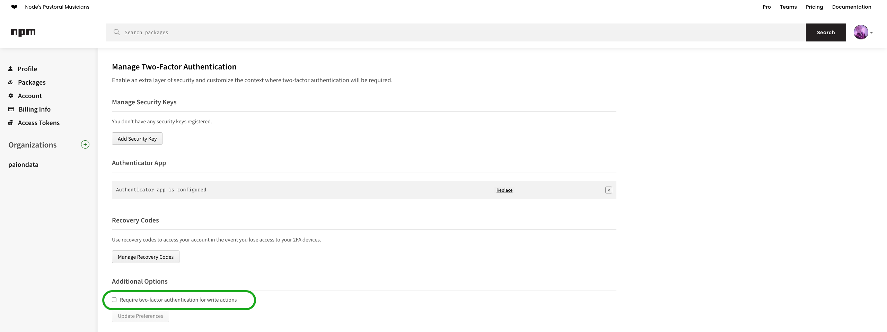

[//]: # (Copyright Jiaqi Liu)

[//]: # (Licensed under the Apache License, Version 2.0 &#40;the "License"&#41;;)
[//]: # (you may not use this file except in compliance with the License.)
[//]: # (You may obtain a copy of the License at)

[//]: # (    http://www.apache.org/licenses/LICENSE-2.0)

[//]: # (Unless required by applicable law or agreed to in writing, software)
[//]: # (distributed under the License is distributed on an "AS IS" BASIS,)
[//]: # (WITHOUT WARRANTIES OR CONDITIONS OF ANY KIND, either express or implied.)
[//]: # (See the License for the specific language governing permissions and)
[//]: # (limitations under the License.)

:::tip

- EBS volumes during build time will [automatically be removed][HashiCorp Packer delete_on_termination]

:::

Manual Deployment
-----------------

The following script variables need to be defined:

- [**AWS_ACCESS_KEY_ID**][AWS_ACCESS_KEY_ID] & [**AWS_SECRET_ACCESS_KEY**][AWS_SECRET_ACCESS_KEY]

  :::info

  The _IAM user_ associated with the credentials above must have the following [AWS permissions policies]:

    - IAMFullAccess
    - AmazonEC2FullAccess
    - AmazonRoute53FullAccess

  :::

- **REACT_DIR**: The local absolute path to the React project repo

  :::caution

  Should the React App be built with [.env file], this file MUST exist at `$REACT_DIR/.env` at this moment. This .env
  file is essentially the same one mentioned in the `HC_CONFIG_DIR` part below

  :::

- **HC_DIR**: The local absolute path to the [hashicorp-aws] directory
- **HC_CONFIG_DIR**: The local absolute path to a directory containing the following deployment files:

    - SSL cert file located (`/abs/path/to/hashicorp-aws-config-dir/server.crt`)
    - SSL cert key file (`/abs/path/to/hashicorp-aws-config-dir/server.key`)
    - Nginx config file (`/abs/path/to/hashicorp-aws-config-dir/nginx.conf`)
    - .env file (`/abs/path/to/hashicorp-aws-config-dir/.env`)
    - A [HashiCorp Packer variable file][HashiCorp Packer variable file] named **aws-react.pkrvars.hcl** with the following
      variable values (`/abs/path/to/hashicorp-aws-config-dir/aws-react.pkrvars.hcl`):

      ```hcl
      aws_image_region                 = "my-aws-region"
      ami_name                         = "my-react-app"
      instance_type                    = "<one of t2.micro/t2.small/t2.medium/t2.large/t2.xlarge/t2.2xlarge>"
      react_dist_path                  = "../../../../dist"
      aws_react_ssl_cert_file_path     = "../../../../hashicorp-aws-config-dir/server.crt"
      aws_react_ssl_cert_key_file_path = "../../../../hashicorp-aws-config-dir/server.key"
      aws_react_nginx_config_file_path = "../../../../hashicorp-aws-config-dir/nginx.conf"
      aws_react_dot_env_file_path      = "../../../../hashicorp-aws-config-dir/filebeat.yml"
      ```

    - A [HashiCorp Terraform variable file][HashiCorp Terraform variable file] named **aws-react.tfvars** with the
      following variable values (`/abs/path/to/hashicorp-aws-config-dir/aws-react.tfvars`):

      ```hcl
      aws_deploy_region   = "my-aws-region"
      route_53_zone_id    = "9DQXLTNSN7ZX9P8V2KZII"
      ami_name            = "my-react-app"
      instance_type       = "<one of t2.micro/t2.small/t2.medium/t2.large/t2.xlarge/t2.2xlarge>"
      ec2_instance_name   = "My React App"
      ec2_security_groups = ["My React App"]
      react_domain        = "myreactapp.mycompany.com"
      ```

Then we can execute the **[deploy.sh]** to manually deploy any React Apps

GitHub Action Automatic Deployment
----------------------------------

### General Template in Downstream Repo

```yaml
env:
  NODE_VERSION: 16

jobs:
  hashicorp:
    name: Generated React dist in GitHub Action, publish its AMI and deploy the AMI to EC2 through HashiCorp
    runs-on: ubuntu-latest
    steps:
      - name: Checkout
        uses: actions/checkout@v3
      - name: Set node version to ${{ env.NODE_VERSION }}
        uses: actions/setup-node@v3
        with:
          node-version: ${{ env.NODE_VERSION }}
      - name: Checkout HashiCorp deployment tool
        run: git clone https://github.com/QubitPi/hashicorp-aws.git ../hashicorp-aws
      - name: Load hashicorp-aws-config-dir and put it in the same directory as hashicorp-aws
        run: ...
      - name: Load Packer variable file
        run: cp ../hashicorp-aws-config-dir/aws-react.pkrvars.hcl ../hashicorp-aws/hashicorp/react/images/aws-react.auto.pkrvars.hcl
      - name: Load Terraform variable file
        run: cp ../hashicorp-aws-config-dir/aws-react.tfvars ../hashicorp-aws/hashicorp/react/instances/aws-react.auto.tfvars
      - name: Generate dist
        run: cp ../hashicorp-aws-config-dir/.env . && yarn && yarn build
      - name: Move dist to a location for HashiCorp deployment to pickup
        run: mv dist ../
      - name: QubitPi/hashicorp-aws
        uses: QubitPi/hashicorp-aws@master
        with:
          hashicorp-dir: ../hashicorp-aws/hashicorp/react
          aws-access-key-id: ${{ secrets.AWS_ACCESS_KEY_ID }}
          aws-secret-access-key: ${{ secrets.AWS_SECRET_ACCESS_KEY }}
          aws-region: ${{ secrets.AWS_REGION }}
```

### Auxiliary Actions

:::caution

The following auxiliary actions assumes a yarn-based project

:::

#### Code Style Checks

This action assume [ESLint], [typescript-eslint], and [Prettier] have been installed

```bash
yarn add --dev @typescript-eslint/parser @typescript-eslint/eslint-plugin eslint typescript
yarn add --dev --exact prettier
```

:::info ESLint Configuration

```bash
yarn run eslint --init # https://dev.to/maithanhdanh/configuration-for-eslint-b47
```

Edit the auto-generated **.eslintrc.json** to make it look like the following:

```json title=".eslintrc.json"
{
  "env": {
    "browser": true,
    "es2021": true
  },
  "extends": [
    "standard-with-typescript",
    "plugin:react/recommended",
    "eslint:recommended",
    "plugin:@typescript-eslint/recommended",
    "prettier"
  ],
  "parser": "@typescript-eslint/parser",
  "parserOptions": {
    "ecmaVersion": "latest",
    "sourceType": "module"
  },
  "plugins": ["react", "@typescript-eslint"],
  "rules": {
    "react/react-in-jsx-scope": "off"
  }
}
```

```ignore
docs/**
dist/**
config/**
scripts/**
```

:::

:::info Prettier Configuration

Linters usually contain not only code quality rules, but also stylistic rules. Most stylistic rules are unnecessary
when using Prettier, but worse - they might conflict with Prettier! Use Prettier for code formatting concerns, and
linters for code-quality concerns, as outlined in
[Prettier vs. Linters](https://qubitpi.github.io/prettier/docs/en/comparison).

Luckily it's easy to turn off rules that conflict or are unnecessary with Prettier, by using these pre-made configs:

- [eslint-config-prettier](https://github.com/prettier/eslint-config-prettier)

```bash
yarn add --dev eslint-config-prettier
```

```json title=".prettierrc.json"
{
  "tabWidth": 2,
  "useTabs": false,
  "printWidth": 120
}
```

```ignore .prettierignore
*.md
build
coverage
node_modules
docs
```

:::

```yaml
---
name: My CI/CD

env:
  NODE_VERSION: 16

jobs:
  code-style:
    name: Code Style Check
    runs-on: ubuntu-latest
    steps:
      - uses: QubitPi/hashicorp-aws/auxiliary/github/actions/ui-code-style@master
        with:
          node-version: ${{ env.NODE_VERSION }}
```

:::tip

We can fix it by formatting all files at the root of project with:

```bash
yarn prettier . --write
```

:::

#### Unit Tests

Our **package.json** should have an entry that defines the command `yarn test`, for example, when our unit tests is
written with [Jest]:

```json
{
  "scripts": {
    "test": "jest"
  }
}
```

```yaml
---
name: My CI/CD

env:
  NODE_VERSION: 16

jobs:
  unit-tests:
    name: Unit Tests
    needs: [yml-md-style, code-style]
    runs-on: ubuntu-latest
    steps:
      - uses: QubitPi/hashicorp-aws/auxiliary/github/actions/ui-unit-test@master
        with:
          node-version: ${{ env.NODE_VERSION }}
```

#### Cypress E2E Tests

**Cypress E2E Tests** offers developers Actions that provide an easy way to automate, customize, and execute
**parallel** end-to-end tests within a GitHub project.  The action provides

- dependency installation via **yarn**,
- scanning of test specs,
- _running each spec in parallel_, and
- upload test screenshots and video on test failure.

The example below is a very simple setup:

1. Install Cypress with `yarn add cypress --dev`
2. Initialize Cypress with `yarn run cypress open`
3. [Support TypeScript](https://qubitpi.github.io/cypress-documentation/guides/tooling/typescript-support/)
3. Put all **.spec.cy.ts** test files under "cypress/e2e" directory 
4. Have a file at the root of project with the name **.env.test**, which will contain all the environment variables used
   during the test. The action will rename the ".env.test" name to the regular _.env_ file 
5. Place a **test-setup.sh** file under _.githubtest-setup.sh_ directory for any pre-test setup. For example, to start
   a [lowdb](https://github.com/typicode/lowdb) server and
   [run e2e only after the server starts](https://www.npmjs.com/package/wait-on):

   ```bash
   #!/bin/bash

   cd packages/lowdb
   yarn install
   yarn start ../../.github/db.json &
   yarn wait-on-server
   ```

   Don't forget to make the script executable by running

   ```bash
   chmod u+x .github/test-setup.sh
   ```

   :::tip

   If no pre-test setup is needed, please leave this file with only 1 line: `#!/bin/bash`, i.e. no-ops

   :::

6. Install [wait-on]: `yarn add -D wait-on`
7. Add the following script command to `package.json`:

   ```json
   {
     ...
   
     "scripts": {
       "cypress:open": "cypress open",
       "e2e": "cypress run --browser chrome",
       "wait-on-dev": "wait-on http-get://localhost:3000/",
       "wait-on-prod": "wait-on http-get://localhost:3000/"
     },
     
     ...
   }
   ```

8. Use Cypress E2E Tests workflow:

   ```yaml
   ---
   name: My GitHub Workflow

   "on":
      pull_request:
      push:
         branches:
            - master

   jobs:
     list-e2e-specs:
       runs-on: ubuntu-latest
       outputs:
         paths: ${{ steps.list-e2e-specs.outputs.paths }}
       steps:
         - name: List Files
           id: list-e2e-specs
           uses: mirko-felice/list-files-action@v3.0.5
           with:
             repo: ${{ github.repository }}
             ref: ${{ github.ref }}
             path: "cypress/e2e"
             ext: ".ts"

     e2e-tests:
       name: E2E Tests
       needs: list-e2e-specs
       runs-on: ubuntu-latest
       strategy:
         fail-fast: false
         matrix:
           node_version: [18]
           start_strategy: ["yarn-start", "serve"]
           test_spec: ${{ fromJson(needs.list-e2e-specs.outputs.paths) }}
       steps:
         - uses: QubitPi/hashicorp-aws/auxiliary/github/actions/cypress-e2e@master
           with:
             node-version: ${{ env.NODE_VERSION }}
             start-strategy: ${{ matrix.start_strategy }}
             spec-relative-path: ${{ matrix.test_spec }}
   ```

#### Release to NPM

```python title=".github/upversion.py"
#!/usr/bin/python
import os

split_tag = (os.environ['LAST_TAG'].split('-')[0]).split(".")
split_tag[-1] = str(int(split_tag[-1]) + 1)
print(".".join(split_tag))
```

```bash title=".github/tag-for-release.bash"
#!/bin/bash

# Pick up the tags from the adjusted remote
git fetch --tags

echo $(git branch -v)

# Get the last tag on this branch
LAST_TAG=$(git describe --tags)
echo "INFO Last tag: $LAST_TAG"

# Build the new tag to push
NEW_TAG=$(LAST_TAG=${LAST_TAG} python .github/upversion.py)
echo "INFO Creating tag: $NEW_TAG"
git tag $NEW_TAG -a -m "Autogenerated version bump tag"

# Push the new tag
echo "INFO Pushing tag: $NEW_TAG"
git push origin $NEW_TAG
```

```yaml
---
name: My CI/CD

env:
  USER: QubitPi
  EMAIL: jack20220723@gmail.com
  NODE_VERSION: 16

jobs:
  unit-tests:
    name: Unit Tests
    runs-on: ubuntu-latest
    steps:
      - uses: QubitPi/hashicorp-aws/auxiliary/github/actions/npm-release@master
        with:
          node-version: ${{ env.NODE_VERSION }}
          user: ${{ env.USER }}
          email: ${{ env.EMAIL }}
          npm-token: ${{ secrets.NPM_TOKEN }}
```

:::note

Please make sure to disable 2F authentication before running the CI/CD above so that release can be pushed to NPM from
within GitHub Action without auth errors



:::

[AWS_ACCESS_KEY_ID]: https://docs.aws.amazon.com/cli/latest/userguide/cli-configure-envvars.html
[AWS permissions policies]: https://docs.aws.amazon.com/IAM/latest/UserGuide/introduction_access-management.html
[AWS_SECRET_ACCESS_KEY]: https://docs.aws.amazon.com/cli/latest/userguide/cli-configure-envvars.html

[deploy.sh]: https://github.com/QubitPi/hashicorp-aws/blob/master/hashicorp/react/deploy.sh

[ESLint]: https://eslint.org/

[hashicorp-aws]: https://qubitpi.github.io/hashicorp-aws/
[HashiCorp Packer delete_on_termination]: https://qubitpi.github.io/hashicorp-packer/packer/integrations/hashicorp/amazon/latest/components/builder/ebs#:~:text=Optional%3A-,delete_on_termination,-(bool)%20%2D%20Indicates%20whether
[HashiCorp Packer variable file]: https://qubitpi.github.io/hashicorp-packer/packer/guides/hcl/variables#from-a-file
[HashiCorp Terraform variable file]: https://qubitpi.github.io/hashicorp-terraform/terraform/language/values/variables#variable-definitions-tfvars-files

[Jest]: https://qubitpi.github.io/jest/

[Prettier]: https://qubitpi.github.io/prettier/docs/en/install.html

[typescript-eslint]: https://typescript-eslint.io/

[wait-on]: https://github.com/jeffbski/wait-on

[.env file]: https://create-react-app.dev/docs/adding-custom-environment-variables/#adding-development-environment-variables-in-env
