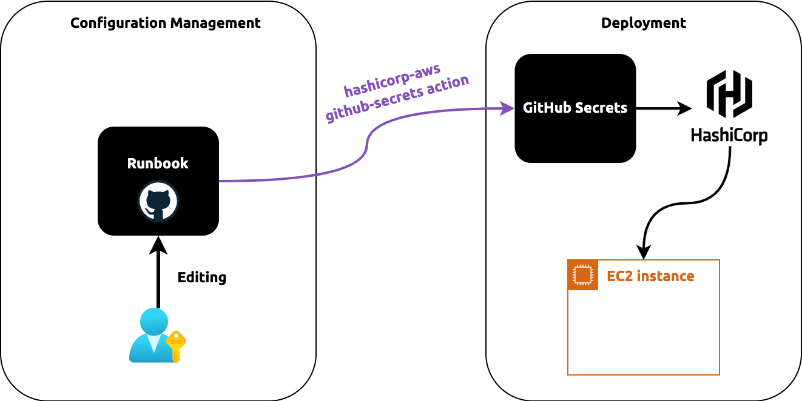

[//]: # (Copyright Jiaqi Liu)

[//]: # (Licensed under the Apache License, Version 2.0 &#40;the "License"&#41;;)
[//]: # (you may not use this file except in compliance with the License.)
[//]: # (You may obtain a copy of the License at)

[//]: # (    http://www.apache.org/licenses/LICENSE-2.0)

[//]: # (Unless required by applicable law or agreed to in writing, software)
[//]: # (distributed under the License is distributed on an "AS IS" BASIS,)
[//]: # (WITHOUT WARRANTIES OR CONDITIONS OF ANY KIND, either express or implied.)
[//]: # (See the License for the specific language governing permissions and)
[//]: # (limitations under the License.)

Overview
--------

Being a strong proponent of Immutable Infrastructure, [hashicorp-aws] is constantly pushing the limits of its ability
in various use cases, one of which is the _Configuration Management_

Traditional configuration management includes Chef, Puppet, and Ansible. They all assume mutable infrastructure being
present. For example, Chef has a major component responsible for jumping into a VM, checking if config has been mutated
before apply any operations.

With the adoption of Immutable infrastructure, we initially stored and managed our configuration, such as SSL
certificate or AWS SECRET ACCESS KEY directly in GitHub Secrets. This has the disadvantage of not being able to see
their values after creation, making it very hard to manage.

Then we moved to a centralized runbook, where everything can easily be seen and modified by authorized team members. In
this approache, CI/CD server will pull down the entire runbook and simply pick up the config files. This, however, 
exposed a great security risk because illegal usage could simply leak any credentials to public by `cat`ing that 
credential file out

So the problem, or what [hashicorp-aws] is trying to solve here, is 

- being able to keep credentials, whether it's string values or values stored in files, **secure**, and
- allowing team member to easily **manage** those credentials

:::note

We tried HashiCorp Vault but
[it doesn't support storing file credential](https://discuss.hashicorp.com/t/how-to-store-a-file-content-in-hashicorp-kv-secret-engine-as-value-through-cmd-line-or-script/46895/2), 
[hashicorp-aws] addressed exactly how file can be managed in this case

:::

So this brought us to the ultimate way of thinking about Configuration Management in Immutable Infrastructure, which is
depicted below:

We still need GitHub Secrets because our tech dev has a deep integratin with it and that's the most secure way to pass
our organization credentials around.

In addition, we will also keep runbook for config management. The runbook will be hosted separately, not in GitHub
Secrets.

:::info

Runbooks was used in Yahoo that keeps all DevOps credentials in a dedicated GitHub private repo. It's been proven to
be an effective way to manage and share a software configurations within a team.

:::

[hashicorp-aws]'s github-secret now comes into play to bridge the gap between two componet.

[hashicorp-aws]: https://qubitpi.github.io/hashicorp-aws/
