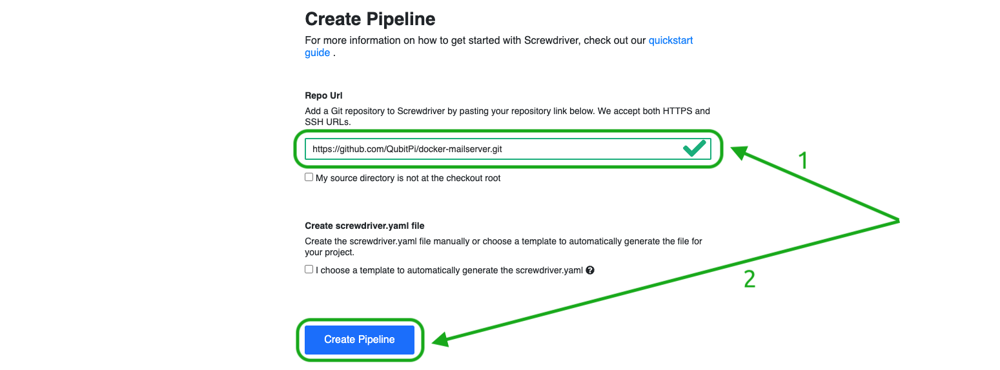

Docker Mailserver Release Definition Template
=============================================

hashistack offer a [Screwdriver template][Screwdriver CD template] that deploys an
[immutable][Immutable Infrastructure] instance of [Docker Mailserver] to AWS. It uses the
[screwdriver-template-main npm package] to assist with template validation, publishing, and tagging. This template tags
the latest versions with the `latest` tag.

:::caution

hashistack deploys Docker Mailserver as a [t2.micro](https://aws.amazon.com/ec2/instance-types/t2/) instance by
default

:::

How to Use This Template
------------------------

[Create a Screwdriver pipeline](../adaptors/screwdriver-cd#1-creating-a-screwdriver-pipeline) with the __Repo Url__
being `https://github.com/QubitPi/docker-mailserver.git`

In addition, the following [Screwdriver Secrets][Screwdriver CD Secrets] needs to be defined before running the pipeline:

- [`AWS_ACCESS_KEY_ID`](../setup#aws)
- [`AWS_SECRET_ACCESS_KEY`](../setup#aws)

To run the pipeline, fill in the AWS-related **parameters** first

Then hit "**Submit**" to start deploying.

[Docker Mailserver]: https://qubitpi.github.io/docker-mailserver/edge/

[Immutable Infrastructure]: https://www.hashicorp.com/resources/what-is-mutable-vs-immutable-infrastructure

[Screwdriver CD Secrets]: https://screwdriver-docs.qubitpi.org/user-guide/configuration/secrets
[Screwdriver CD template]: https://screwdriver-docs.qubitpi.org/user-guide/templates/job-templates
[screwdriver-template-main npm package]: https://github.com/QubitPi/screwdriver-cd-template-main
