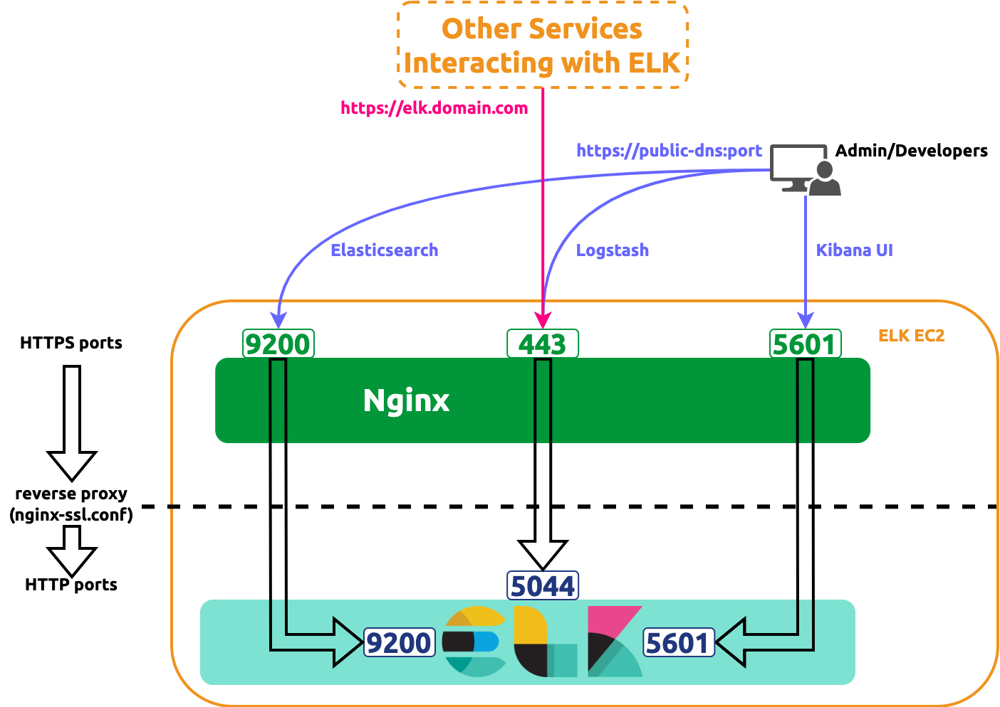

[//]: # (Copyright Jiaqi Liu)

[//]: # (Licensed under the Apache License, Version 2.0 &#40;the "License"&#41;;)
[//]: # (you may not use this file except in compliance with the License.)
[//]: # (You may obtain a copy of the License at)

[//]: # (    http://www.apache.org/licenses/LICENSE-2.0)

[//]: # (Unless required by applicable law or agreed to in writing, software)
[//]: # (distributed under the License is distributed on an "AS IS" BASIS,)
[//]: # (WITHOUT WARRANTIES OR CONDITIONS OF ANY KIND, either express or implied.)
[//]: # (See the License for the specific language governing permissions and)
[//]: # (limitations under the License.)

Operations and SRE teams can use [hashicorp-aws] to safely manage ELK deployment using infrastructure as code
methodology, which allows us to peer-reviewed infrastructure changes in an automated and controlled fashion.

:::info What is the ELK Stack?

The ELK stack is an acronym used to describe a stack that comprises three popular projects: [Elasticsearch],
[Logstash], and [Kibana]. Often referred to as Elasticsearch, the ELK stack gives us the ability to aggregate logs from
all our systems and applications, analyze these logs, and create visualizations for application and infrastructure
monitoring, faster troubleshooting, security analytics, and more.

:::

**Assuming ELK is a _non-frequently deployed_ tech asset, [hashicorp-aws] makes it a semi-automated deployment**.

:::caution

[hashicorp-aws] deploys ELK as a [t2.large](https://aws.amazon.com/ec2/instance-types/t2/) instance. This is because all
Elasticsearch, Kibana, and Logstash are contained in it, which can cause
[performance issue](https://stackoverflow.com/a/50022217) in small instance. _t2.large_, by experiment, is the smallest
size that supports smooth runtime. For that, **please be aware AWS credit charges shall incur afterward**

:::

hashicorp-aws deploys ELK in the following way:

- Deploys all components of ELK in **HTTP** mode
- Deploys a reverse proxy Nginx in front of the ELK in the same EC2 to redirect all HTTPS request to ELK's
  corresponding HTTP ports

The diagram below illustrates the resulting deployment



General Deployments
-------------------

:::info

Please complete the [general setup](setup#setup) before proceeding.

:::

:::tip[Supporting HTTPS Protocol]

We offer a [Nginx config file](setup#optional-setup-ssl) template.
[This template](https://github.com/QubitPi/hashicorp-aws/blob/master/hashicorp/elk/images/nginx-ssl.conf) will be used
by hashicorp-aws by default

:::

### Defining Packer Variables

Create a [HashiCorp Packer variable values file] named **aws-elk.pkrvars.hcl** under
**[hashicorp-aws/hashicorp/elk/images]** with the following contents:

```hcl title="hashicorp-aws/hashicorp/elk/images/aws-kong.auto.pkrvars.hcl"
ami_region             = "us-east-2"
ami_name               = "my-elk-ami"
ssl_cert_file_path     = "/path/to/ssl.crt"
ssl_cert_key_file_path = "/path/to/ssl.key"
```

- `ami_region` is the [region][AWS regions] where ELK [AMI][AWS AMI] will be published to. The published image will be
  _private_
- `ami_name` is the published [AMI][AWS AMI] name; it can be arbitrary
- `ssl_cert_file_path` is the absolute path or the path relative to [hashicorp-aws/hashicorp/elk/images] of
  the [SSL certificate file](setup#optional-setup-ssl) for the domain serving the ELK EC2 instance
- `ssl_cert_key_file_path`  is the absolute path or the path relative to [hashicorp-aws/hashicorp/elk/images] of the [SSL certificate key file](setup#optional-setup-ssl) for the domain serving the ELK EC2 instance

### Defining Terraform Variables

Create a [HashiCorp Terraform variable values file] named **aws-elk.tfvars** under
**[hashicorp-aws/hashicorp/elk/instances]**with the following contents:

```hcl title="hashicorp-aws/hashicorp/elk/instances/aws-kong.auto.tfvars"
aws_deploy_region = "us-east-2"
ami_name          = "my-elk-ami"
instance_name     = "My ELK instance"
key_pair_name     = "My AWS keypair name"
security_groups   = ["My ELK Security Group"]
elk_domain         = "myelk.mycompany.com"
route_53_zone_id  = "9DQXLTNSN7ZX9P8V2KZII"
```

- `aws_deploy_region` is the [EC2 runtime region][AWS regions] where ELK EC2 instance will be deployed into
- `ami_name` is the name of the published AMI; **it must be the same as the `ami_name` in
  [Packer variable file](#defining-packer-variables)**
- `instance_name` is the deployed EC2 name as appeared in the instance list of AWS console; it can be arbitrary
- `key_pair_name` is the name of
  [AWS EC2 key pair](https://docs.aws.amazon.com/AWSEC2/latest/UserGuide/ec2-key-pairs.html) bound to this ELK instance.
  We will use this key pair to later ssh into the ELK to for [post setup discussed below](#post-setup-in-ec2-instance)
- `security_groups` is the list of [AWS Security Group] _names_ to associate with (yes, not ID, but name...)
- `elk_domain` is the SSL-enabled domain that will serve various ELK endpoints, such as its API and [Kibana UI][Kibana]

  :::warning

  hashicorp-aws will bind a _private_ IP address to this domain for the following reasons:

  - [AWS security groups works for private IP only for DNS resolving](https://serverfault.com/a/967483). Services
    sending logs to ELK can use this domain.
  - In the case of internal access, for example developers visiting Kibana UI for debugging purposes, people can still
    use `https://public-dns:port`

  :::

- `route_53_zone_id` is the AWS Route 53 hosted Zone ID that hosts the domain "myelk.mycompany.com"

  :::tip

  To find the zone ID in AWS Route 53, we can:

  1. Sign in to the AWS Management Console
  2. Open the Route 53 console at https://console.aws.amazon.com/route53/
  3. Select Hosted zones in the navigation pane
  4. Find the requested ID in the top level Hosted Zones summary in the Route 53 section

  :::

### Building AMI Image

```console
cd hashicorp-aws/hashicorp/elk/images
packer init .
packer validate -var "skip_create_ami=true" .
packer build -var "skip_create_ami=false" .
```

Record the **Elasticsearch password (for _elastic_ user)** at command line prompt. For example

```shell
==> install-elk.amazon-ebs.elk: + sudo /usr/share/elasticsearch/bin/elasticsearch-reset-password -u elastic
==> install-elk.amazon-ebs.elk: + yes
    install-elk.amazon-ebs.elk: This tool will reset the password of the [elastic] user to an autogenerated value.
    install-elk.amazon-ebs.elk: The password will be printed in the console.
    install-elk.amazon-ebs.elk:
    install-elk.amazon-ebs.elk:
    install-elk.amazon-ebs.elk: Password for the [elastic] user successfully reset.
    install-elk.amazon-ebs.elk: New value: dsrg34IKHU787iud=dio
```

In this case, the password is **dsrg34IKHU787iud=dio** which is shown in the last line of the output above. **We will be
using this password in later steps** so please keep it securely

### Deploying to EC2

:::caution

Depending on the [AMI](#defining-packer-variables) and [EC2](#defining-terraform-variables) configs, **please be aware
AWS credit charges shall incur after the following commands execute**

:::

```console
cd ../instances/
terraform init
terraform validate
terraform apply -auto-approve
```

### Post Setup in EC2 Instance

As we've mentioned in the beginning, this is a semi-deployment and we still need to SSH into the box to manually
generate Kibana token & verification code. This will make the automated deploymentl logic simple and easy to maintain

```bash
sudo /usr/share/elasticsearch/bin/elasticsearch-create-enrollment-token --scope kibana --url "https://localhost:9200"
sudo /usr/share/kibana/bin/kibana-verification-code
```

Now we can visit `https://public-dns:port` to enter the token and verification code to access our ELK instance.

#### Logstash

Logstash, at this moment, supports redirecting log lines from Filebeat to Elasticsearch and, similar to the
token and verification above, needs to be setup manually.

Create a file named **logstash-filebeat.conf** in the default location chosen by Logstash:

```bash
sudo nano /usr/share/logstash/logstash-filebeat.conf
```

Copy and paste the following contents into the file

:::info

Replace the `<password for user 'elastic'>` accordingly. If the user is _elastic_, which is the case here, the password
has been generated during the [AMI image building phase](#building-ami-image)

:::

```text
input {
    beats {
        port => "5044"
    }
}

output {
    elasticsearch {
        hosts => [ "https://localhost:9200" ]

        ssl_certificate_verification => false

        user => "elastic"

        password => "<password for user 'elastic'>"
    }
}
```

Start Logstash with:

```bash
sudo /usr/share/logstash/bin/logstash -f logstash-filebeat.conf --config.reload.automatic
```

or with nohup at background:

```bash
nohup sudo /usr/share/logstash/bin/logstash -f logstash-filebeat.conf --config.reload.automatic &
```

Deployment via Screwdriver CD
-----------------------------

hashicorp-aws also support deployment using [Screwdriver CD] with this [elk-release-definition-template]

Deployment via GitHub Actions
-----------------------------

Deployment via HACP
-------------------

:::tip

Please try our HACP platform to deploy an ELK instance. It gives us one-click experience that helps us stand up ELK in
a minute.

:::

[Elasticsearch]: https://qubitpi.github.io/elasticsearch/
[Kibana]: https://qubitpi.github.io/kibana/
[Logstash]: https://qubitpi.github.io/logstash/

[AWS AMI]: https://docs.aws.amazon.com/AWSEC2/latest/UserGuide/AMIs.html
[AWS regions]: https://docs.aws.amazon.com/AmazonRDS/latest/UserGuide/Concepts.RegionsAndAvailabilityZones.html#Concepts.RegionsAndAvailabilityZones.Availability
[AWS Security Group]: https://docs.aws.amazon.com/vpc/latest/userguide/vpc-security-groups.html

[elk-release-definition-template]: https://github.com/QubitPi/elk-release-definition-template

[hashicorp-aws]: https://qubitpi.github.io/hashicorp-aws/
[hashicorp-aws/hashicorp/elk/images]: https://github.com/QubitPi/hashicorp-aws/tree/master/hashicorp/elk/images
[hashicorp-aws/hashicorp/elk/instances]: https://github.com/QubitPi/hashicorp-aws/tree/master/hashicorp/elk/instances
[HashiCorp Packer variable values file]: https://qubitpi.github.io/hashicorp-packer/packer/guides/hcl/variables#from-a-file
[HashiCorp Terraform variable values file]: https://qubitpi.github.io/hashicorp-terraform/terraform/language/values/variables#variable-definitions-tfvars-files

[Screwdriver CD]: https://qubitpi.github.io/screwdriver-cd-homepage/
