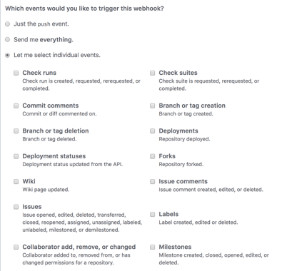
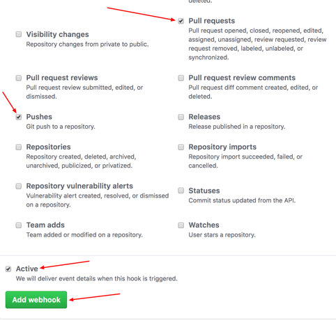

[//]: # (Copyright Jiaqi Liu)

[//]: # (Licensed under the Apache License, Version 2.0 &#40;the "License"&#41;;)
[//]: # (you may not use this file except in compliance with the License.)
[//]: # (You may obtain a copy of the License at)

[//]: # (    http://www.apache.org/licenses/LICENSE-2.0)

[//]: # (Unless required by applicable law or agreed to in writing, software)
[//]: # (distributed under the License is distributed on an "AS IS" BASIS,)
[//]: # (WITHOUT WARRANTIES OR CONDITIONS OF ANY KIND, either express or implied.)
[//]: # (See the License for the specific language governing permissions and)
[//]: # (limitations under the License.)

---
sidebar_position: 7
---

aergia::jenkins_github_webhook
==============================

Integrate **Jenkins** with **GitHub** through Webhooks

This approach works great for most enterprise GitHub repos (i.e. private repos), whose CI/CD logics are not publicly
visible

Recipe Details
--------------

### Configuring Webhook on GitHub

**Step 1**: go to a target GitHub repository and click on "**Settings**".


**Step 2**: Click on Webhooks and then click on "**Add webhook**".


**Step 3**: In the "**Payload URL**" field, paste your Jenkins environment URL. At the end of this URL add
**/github-webhook/**. In the "Content type" select: "application/json" and leave the "Secret" field empty.


**Step 4**: In the page "Which events would you like to trigger this webhook?" choose "_Let me select individual
events._" Then, check "Pull Requests" and "Pushes". At the end of this option, make sure that the "Active" option is
checked and click on "**Add webhook**".




We're done with the configuration on GitHub’s side! Now let's move on to Jenkins.

### Allow Access Private GitHub Repository From Jenkins/Chef Node

We can "git clone" a private repository on GitHub.com to our Jenkins Node server by using a **deploy key**, which is an
SSH key that grants access to a single repository. GitHub attaches the public part of the key directly to the private
repository instead of a personal account, and the private part of the key remains on the Jenkins Node server. For more
information, see "[Delivering deployments](https://docs.github.com/en/rest/guides/delivering-deployments)".

Deploy keys with write access can perform the same actions as an organization member with admin access, or a
collaborator on a personal repository.

Pros:

- Anyone with access to the repository and server has the ability to deploy the project.
- Users don't have to change their local SSH settings.
- Deploy keys are read-only by default, but we can give them write access when adding them to a repository.

Cons:

- Deploy keys only grant access to a single repository. More complex projects may have many repositories to pull to the
  same server.
- Deploy keys are usually not protected by a passphrase, making the key easily accessible if the server is compromised.

#### Generate and Load SSH Key Pair on Jenkins Agent Node

Since Jenkins agent runs under "jenkins" user, `jenkins_github_webhook` makes sure "jenkins" user exits on a Chef node
first. If it's not there, it will effectively execute

```bash
sudo su
useradd -d /var/lib/jenkins jenkins
sudo mkdir -p /var/lib/jenkins/.ssh
```

`jenkins_github_webhook` will then generate and load a key pair onto "jenkins" user:

```bash
ssh-keygen
```

:::info

Note that the key pair will always be "id_rsa" and "id_rsa.pub"; we will explain that later

:::

```bash
cd ~/.ssh
sudo cp id_rsa id_rsa.pub /var/lib/jenkins/.ssh/

sudo chown -R jenkins /var/lib/jenkins
sudo chown -R jenkins /var/lib/jenkins/.ssh
sudo chmod 700 /var/lib/jenkins/.ssh
```

#### Using Multiple Repositories on One Chef Node using Multiple Deploy Keys

If we use (i.e. 'git clone') multiple repositories on one server, we will need to generate a dedicated key pair for each
one. **GitHub does not allow reusing a deploy key for multiple repositories**.

:::caution

GitHub does not allow reusing a deploy key for multiple repositories

:::

In the chef node's SSH configuration file (i.e. `/var/lib/jenkins/.ssh/config`), add an alias entry for each repository.
For example:

```config
Host github.com-repo-0
        Hostname github.com
        IdentityFile=/var/lib/jenkins/.ssh/repo-0_deploy_key

Host github.com-repo-1
        Hostname github.com
        IdentityFile=/var/lib/jenkins/.ssh/repo-1_deploy_key
```

- `Host github.com-repo-0` - The repository's alias.
- `Hostname github.com` - Configures the hostname to use with the alias.
- `IdentityFile=/var/lib/jenkins/.ssh/repo-0_deploy_key` - Assigns a private key to the alias.

:::tip

The regular `ssh-keygen` command in the case of this example becomes

```bash
ssh-keygen -f ~/.ssh/repo-0_deploy_key
ssh-keygen -f ~/.ssh/repo-1_deploy_key
```

:::

We can then use the hostname's alias to interact with the repository using SSH, which will use the unique deploy key
assigned to that alias. For example:

```bash
git clone git@github.com-repo-1:OWNER/repo-1.git
```

### Add Public Key as Deploy Key to GitHub Private Repository

Navigate to the private repository UI on GitHub, from there, From the repository, click **Settings**.


In the sidebar, click **Deploy Keys**, then click **Add deploy key**.


Provide a title, paste in the public key (File content of `id_rsa.pub` we generated in previous step).


:::caution

Make sure the pasted content in the text box ends with
an empty line

Select **Allow write access** if we want this key to have write access to the repository. A deploy key with write access
lets a deployment push to the repository.

:::

Click **Add key**.

### Complete Key Verification on Agent Node

As the last step, we will manually verify ssh GitHub host keys using

```bash
sudo su -s /bin/bash jenkins
cd ~
ssh -T git@github.com
```

:::info

If we look at verbose output of the last command using `ssh -T git@github.com` we will see why the aforementioned
`ssh-keygen` command must be required to generate the fixed name of "id_rsa" and "id_rsa.pub", which turns out are
picked up as hard-coded name.

:::

### Configuring Jenkins Job

**Step 5**: In Jenkins, click on "**New Item**" to create a new project.


**Step 6**: Give your project a name, then choose "**Freestyle project**" and finally, click on "OK".


**Step 7**: Click on the "**Source Code Management**" tab.


<!-- markdown-link-check-disable -->
**Step 8**: Click on Git and paste your GitHub repository URL in the "**Repository URL**" field. The "Credentials" will
be used by "jenkins" to `git clone` source code, which will be compiled and deployed, from GitHub. We should
[add a new **Jenkins credential** of this **agent** node](jenkins-agent#configuring-jenkins-credential-on-controller-node-on-first-use)
as well
<!-- markdown-link-check-enable -->


**Step 9**: Click on the "**Build Triggers**" tab and then on the "_GitHub hook trigger for GITScm polling_". Or,
choose the trigger of your choice.


That's it! Our GitHub repository has integrated with our Jenkins project. With this Jenkins GitHub integration, we can
now use any file found in the GitHub repository and trigger the Jenkins job to run with every code commit.

Recipe Verification
-------------------
