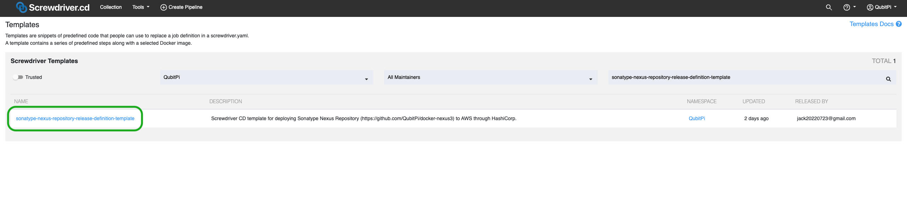
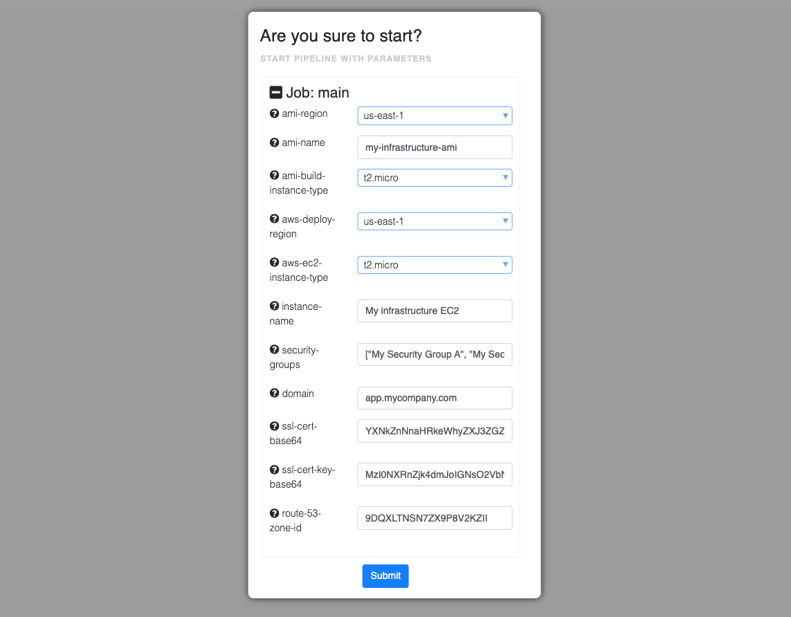

Sonatype Nexus Repository Release Definition Template
=====================================================

hashistack offer a [Screwdriver template][Screwdriver CD template] that deploys an
[immutable][Immutable Infrastructure] instance of [Sonatype Nexus Repository] to AWS. It uses the
[screwdriver-template-main npm package] to assist with template validation, publishing, and tagging. This template tags
the latest versions with the `latest` tag.

How to Use This Template
------------------------

Please follow the sections below to get started using this template

### Installing the Template

Please follow the [instructions](../adaptors/screwdriver-cd#installing-templates-and-commands) here and make sure, once
done, we are able to see the two following template shown in the templates page:

- __sonatype-nexus-repository-release-definition-template__

### Creating Pipeline from Template

[Create a Screwdriver pipeline](../adaptors/screwdriver-cd#1-creating-a-screwdriver-pipeline) with the __Repo Url__
being `https://github.com/QubitPi/docker-nexus3`

### Configuring Pipeline

The following [Screwdriver Secrets][Screwdriver CD Secrets] needs to be defined before running the pipeline:

- [AWS_ACCESS_KEY_ID](../setup#aws)
- [AWS_SECRET_ACCESS_KEY](../setup#aws)
- SSL_CERT_BASE_64: A base64 encoded string of the content of SSL certificate file for the SSL-enabled domain for the
  Sonatype Nexus Repository
- SSL_CERT_KEY_BASE_64: A base64 encoded string of the content of SSL certificate key file for the SSL-enabled domain
  for the Sonatype Nexus Repository

### Running Pipeline

To run the pipeline, fill in the AWS-related **parameters** first

Then hit "**Submit**" to start deploying.

[Immutable Infrastructure]: https://www.hashicorp.com/resources/what-is-mutable-vs-immutable-infrastructure

[Sonatype Nexus Repository]: https://github.com/QubitPi/docker-nexus3

[Screwdriver CD Secrets]: https://screwdriver-docs.qubitpi.org/user-guide/configuration/secrets
[Screwdriver CD template]: https://screwdriver-docs.qubitpi.org/user-guide/templates/job-templates
[screwdriver-template-main npm package]: https://github.com/QubitPi/screwdriver-cd-template-main
