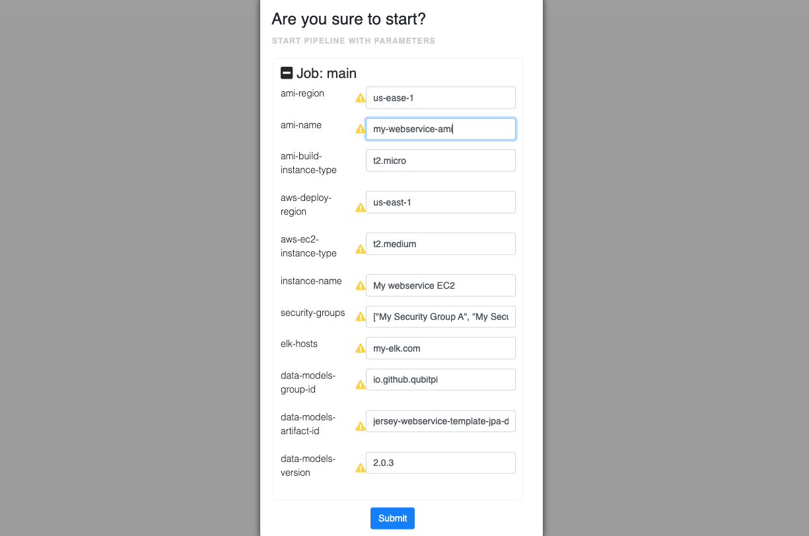

Jersey Webservice Release Definition Templates
==============================================

hashicorp-aws set of [Screwdriver template][Screwdriver CD template]s that deploys
[immutable][Immutable Infrastructure] instances of instantiated [Jersey Webservice Template]s to AWS. It uses the
[screwdriver-template-main npm package] to assist with template validation, publishing, and tagging.

This release definition contains the following templates, _each corresponding to a branch in
[Jersey Webservice Template] GitHub repo_:

- [Deploying the `master` branch without SSL/HTTPS or any other addons](https://github.com/QubitPi/hashicorp-aws/tree/master/adaptors/screwdriver-cd/templates/jersey-webservice-template-basic-sd-template.yaml)
- [Deploying the `jpa-elide` branch without SSL/HTTPS or any other addons](https://github.com/QubitPi/hashicorp-aws/tree/master/adaptors/screwdriver-cd/templates/jersey-webservice-template-jpa-sd-template.yaml)

All templates tag the latest versions with the `latest` tag.

How to Use Templates
--------------------

### Installing Template in Screwdriver

The template needs to be installed first in Screwdriver running instance. Installation has two parts:

1. the templates

   - [`master`](https://github.com/QubitPi/hashicorp-aws/tree/master/adaptors/screwdriver-cd/templates/jersey-webservice-template-basic-sd-template.yaml)
   - [`jpa-elide`](https://github.com/QubitPi/hashicorp-aws/tree/master/adaptors/screwdriver-cd/templates/jersey-webservice-template-jpa-sd-template.yaml)

2. Some [pre-defined Screwdriver commands][Screwdriver CD - commands] that this template uses

The template and the commands can be automatically installed using the regular [screwdriver.yaml] config file by
following the steps below:

1. [Create a Screwdriver pipeline][Screwdriver CD - creating a pipeline] with the repository link being
   `https://github.com/QubitPi/hashicorp-aws.git`
2. Trigger a pipeline run, which will install the templates and commands automatically. Wait the pipeline to finish
   running.
3. The installed template and commands can be found in [Templates page][Screwdriver CD - finding templates] and
   [Commands page][Screwdriver CD - finding commands], respectively

### Using the Templates

[Create a Screwdriver pipeline that uses one of the templates][Screwdriver CD - creating pipeline from template] with
the `screwdriver.yaml` file. Taking
[JPA webservice template](https://github.com/QubitPi/hashicorp-aws/tree/master/adaptors/screwdriver-cd/templates/jersey-webservice-template-jpa-sd-template.yaml)
as an example:

```yaml
---
jobs:
  main:
    requires: [~pr, ~commit]
    template: QubitPi/jersey-webservice-release-definition-jpa@latest
    secrets:
      - AWS_ACCESS_KEY_ID
      - AWS_SECRET_ACCESS_KEY
```

The following [Screwdriver Secrets][Screwdriver CD Secrets] needs to be defined before running the pipeline:

- [`AWS_ACCESS_KEY_ID`](https://qubitpi.github.io/hashicorp-aws/docs/setup#aws)
- [`AWS_SECRET_ACCESS_KEY`](https://qubitpi.github.io/hashicorp-aws/docs/setup#aws)

To run the pipeline, fill in the **parameters** first:



Then hit "**Submit**" to start deploying.

[Immutable Infrastructure]: https://www.hashicorp.com/resources/what-is-mutable-vs-immutable-infrastructure

[Jersey Webservice Template]: https://qubitpi.github.io/jersey-webservice-template/

[publishing a template in Screwdriver]: https://screwdriver-docs.qubitpi.org/user-guide/templates/job-templates#publishing-a-template

[screwdriver.yaml]: https://github.com/QubitPi/hashicorp-aws/tree/master/screwdriver.yaml
[Screwdriver CD - commands]: https://github.com/QubitPi/screwdriver-cd-commands
[Screwdriver CD - creating a pipeline]: https://qubitpi.github.io/screwdriver-cd-guide/user-guide/quickstart#create-a-new-pipeline
[Screwdriver CD - creating pipeline from template]: https://screwdriver-docs.qubitpi.org/user-guide/templates/job-templates#using-a-template
[Screwdriver CD - finding templates]: https://screwdriver-docs.qubitpi.org/user-guide/templates/job-templates#finding-templates
[Screwdriver CD - finding commands]: https://screwdriver-docs.qubitpi.org/user-guide/commands#finding-commands
[Screwdriver CD Secrets]: https://screwdriver-docs.qubitpi.org/user-guide/configuration/secrets
[Screwdriver CD template]: https://screwdriver-docs.qubitpi.org/user-guide/templates/job-templates
[screwdriver-template-main npm package]: https://github.com/QubitPi/screwdriver-cd-template-main
