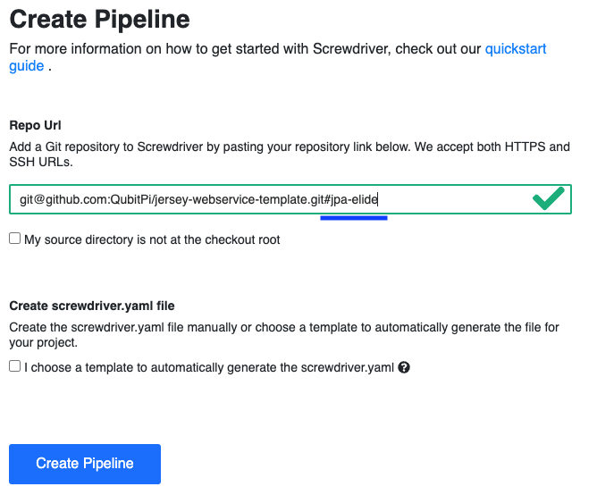

import Tabs from '@theme/Tabs';
import TabItem from '@theme/TabItem';

Jersey Webservice Release Definition Templates
==============================================

hashicorp-aws set of [Screwdriver template][Screwdriver CD template]s that deploys
[immutable][Immutable Infrastructure] instances of instantiated [Jersey Webservice Template]s to AWS. It uses the
[screwdriver-template-main npm package] to assist with template validation, publishing, and tagging.

This release definition contains the following templates, _each corresponding to a branch in
[Jersey Webservice Template] GitHub repo_:

- [Deploying the `master` branch](https://github.com/QubitPi/hashicorp-aws/tree/master/adaptors/screwdriver-cd/templates/jersey-webservice-template-basic-sd-template.yaml)
- [Deploying the `jpa-elide` branch](https://github.com/QubitPi/hashicorp-aws/tree/master/adaptors/screwdriver-cd/templates/jersey-webservice-template-jpa-sd-template.yaml)

All templates tag the latest versions with the `latest` tag.

:::note

- We take an opinionated webservice deployment, which goes without SSL, because all backend API should site behind a
  proxy or [gateway](../kong-api-gateway)
- All webservice executables are assumed to be WAR and will be generated in Screwdriver executor runtime (not in Packer
  or Terraform environment)

:::

How to Use This Template
------------------------

[Create a Screwdriver pipeline](../adaptors/screwdriver-cd#1-creating-a-screwdriver-pipeline) with the URL of the either
forked or instantiated repo of `https://github.com/QubitPi/jersey-webservice-template`

<Tabs>
  <TabItem value="basic" label="Basic Webservice Repo URL" default>
    
  </TabItem>
  <TabItem value="jpa" label="JPA Webservice Repo URL">
    
  </TabItem>
</Tabs>

In addition, the following [Screwdriver Secrets][Screwdriver CD Secrets] needs to be defined before running the pipeline:

- [`AWS_ACCESS_KEY_ID`](../setup#aws)
- [`AWS_SECRET_ACCESS_KEY`](../setup#aws)

To run the pipeline, fill in the AWS-related **parameters** first

Then hit "**Submit**" to start deploying.

[Immutable Infrastructure]: https://www.hashicorp.com/resources/what-is-mutable-vs-immutable-infrastructure

[Jersey Webservice Template]: https://qubitpi.github.io/jersey-webservice-template/

[Screwdriver CD Secrets]: https://screwdriver-docs.qubitpi.org/user-guide/configuration/secrets
[Screwdriver CD template]: https://screwdriver-docs.qubitpi.org/user-guide/templates/job-templates
[screwdriver-template-main npm package]: https://github.com/QubitPi/screwdriver-cd-template-main
